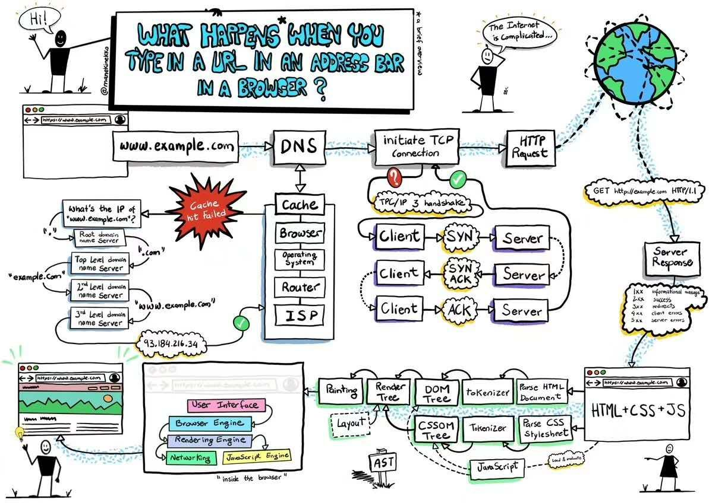

- 输入 url（www.example.com）
- 根据 url 信息，**查询缓存**。未命中缓存，则将请求发送到 dns 服务器
  - 先查询本地 dns 服务器，**是否有记录 url 对应的 ip 地址**。若没有记录，则把请求发送到根域名服务器
  - 根域名服务器**解析根域名部分**（com），把包含的**下一级域名**（example.com）dns 服务器的地址返回给客户端
  - 客户端的 dns 服务器根据返回的信息，访问下一级域名的 dns 服务器（www.example.com）。如此**递归**，最后在目标域名的服务器上得到相应的 ip 地址信息
- 客户端根据 dns 寻址结果：ip 地址，访问互联网服务提供商（**ISP**）
- 访问路由器（**Router**），通过有线或无线电信号连接到 Internet
- 回到本地操作系统（**Operation System**），浏览器客户端（**Browser**）
- 把 url 对应的 ip 地址信息缓存起来（**Cache**）
- 开始**TCP 三次握手**创建连接，
- 发送 HTTP 请求，经由**万维网**（HTTP 就是一种在万维网上发送和接收数据的超文本协议）
- 命中服务器（**Server Response**），并且返回**url 对应的响应体**（一个首页文件.html），响应状态码（1xx，2xx，3xx，4xx，5xx）
- 客户端 Browser 接收到首页文件后，**HTML 解析与 CSS 解析并行着进行，分词 - 词法分析 - 转换 - 生成对应树结构（AST 过程）**
- 解析 HTML 的过程中遇到的 script 与 link，发送异步请求获取脚本
- **DOM**与**CSSOM**构建完后，执行异步 Javascript 脚本（阻塞 Render Tree 的渲染）
- 构建**Render Tree**，重新计算尺寸大小引起**回流**，开始**重新绘制**页面
- 后面就是浏览器内部的行为：用户交互 ==> 浏览器引擎 ==> 渲染引擎 ==> 网络（或 Javascript 引擎）
- 最后才是一个完整的页面

