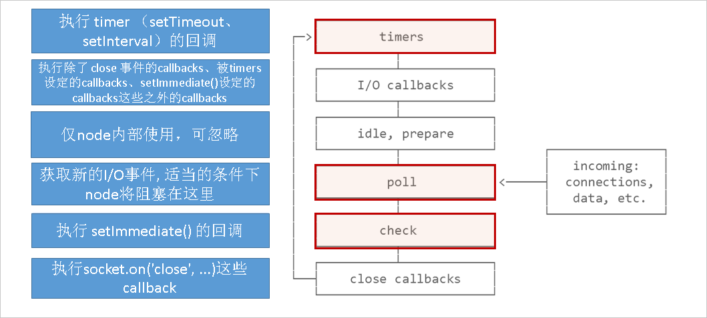
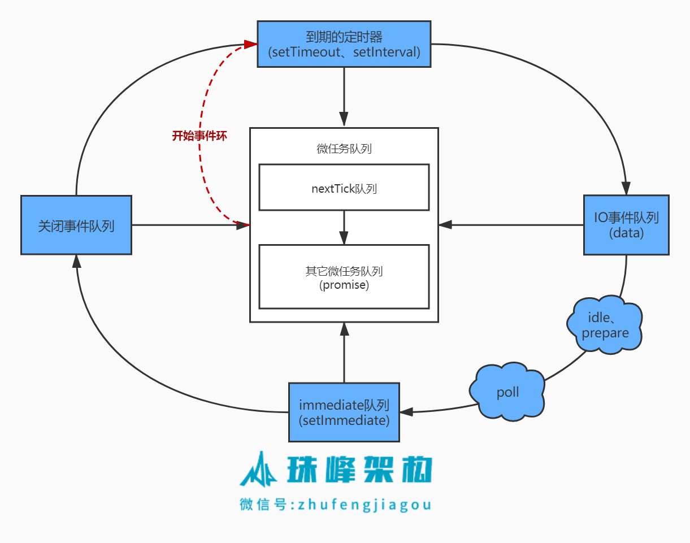

> - IPC(Inter-Process Communication) 进程间通信，提供了各种进程间通信的方法

### GUI 渲染线程

负责渲染浏览器界面

HTML 构建成 DOM，CSS 构建成 CSSOM

然后根据 DOM+CSSOM 来生成 Render Tree

然后进行**回流**计算布局，划分图层分开**绘制**到屏幕上（将图层分解成一个更小的块来降低回流和重绘的成本）

最终页面就被渲染出来了

### JS 引擎线程

只负责执行 JS 脚本，与 GUI 渲染线程是互斥的，所以页面上的`<script>`标签会阻塞 GUI 渲染线程，因此需要异步 defer/async 的脚本，可以加快渲染速度。

defer：等待页面 HTML 解析完成才运行加载回来的脚本

async：只要脚本加载回来了，阻塞当前 HTML 的解析，先执行脚本再进行 HTML 的解析

### 事件触发线程

浏览器内部的一个线程，控制事件循环（捕获/冒泡），管理着一个事件队列（宏任务队列）

当事件被触发时，此线程负责把事件回调添加到待处理事件队列的队尾，等待 JS 引擎的处理（一次事件循环处理一个宏任务）

### 定时器线程

`setTimeout`与`setInterval`所在的线程，浏览器中使用单独的线程来倒计时，计时完毕，会将事件回调添加到待处理事件队列（宏任务队列），等待 JS 引擎的处理

### http 请求线程

开启一个新的线程去发 http 请求，当状态变更时，将成功/失败回调添加到事件队列中（宏任务队列），等待 JS 引擎的处理

### 浏览器事件循环（Event Loop）

#### 宏任务

- JS 主执行栈
- setTimeout
- setInterval
- setImmediate - Node 环境
- requestAnimationFrame
- 渲染
- 事件
- 网络请求
- 文件读写 - Node 环境

#### 微任务

- promise.then - await 关键字效果类似，异步变同步。链式的 then 会创建一个新的 promise，而这个 promise 的 then（也就是下一个 then）会在当前轮事件循环中被清空
- process.nextTick - Node 环境，优先于 promise.then，不属于事件循环的一部分
- Object.observe
- MutationObserver - 指定 DOM 发生变化时触发回调

### Nodejs 事件循环（Event Loop）

process.nextTick

不管事件循环当前在哪个阶段，只要**当前操作完成后**都会去处理`nextTickQueue`，然而处理完`nextTickQueue`，继续进行事件循环（直接回到 timers 阶段），这样就可能会**在递归`process.nextTick`的过程中饿死你的`I/O`**，永远阻止事件循环到达轮询阶段

为什么这样设计？如果当前脚本执行栈运行未完成，就很有可能把一些未初始化的变量或函数，传递给了回调，那么就可能报错，而使用`process.nextTick`就可以避免这种情况，使用`process.nextTick`为了保证回调是在当前操作完成后，才会被调用