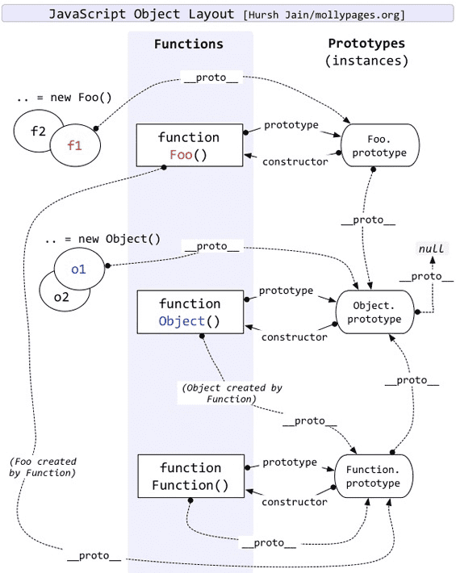

### 原型与原型链

- 万物皆对象，而对象皆出自构造（构造函数）
- `__proto__` - 原型隐式引用
- `_proto_`和`constructor`都是对象独有的，**`prototype`属性是函数独有的**，函数也是对象
- 通过`obj.__proto__ = obj2`直接设置原型
- 访问`obj.__proto__`属性，默认走的是`Object.prototype`对象的上的`_proto_`属性的 get/set 方法
- 原型链：`__proto__`指向他的原型对象，也就是父类对象，当访问一个对象属性的时候，如果内部不存在这个属性，那么就会去**它的`__proto__`属性所指向的父类对象上查找**，知道找到这个这个属性或者最后指向`null`
- 所有的函数都继承`Function`，所以所有函数的隐式原型都指向`Function.prototype`，例如`Function.__proto__ === Function.prototype;Object.__proto__ === Function.prototype`


### 构造函数

- **`constructor`存在函数`prototype`对象上**，`函数.prototype.constructor === 此函数本身`，故通过函数创建的对象即使自己没有`constructor`属性，它也能通过`_proto_`找到对应的`constructor`


### typeof 与 instanceof 的原理

typeof：通过变量的机器码的地位 1-3 位来判断类型信息

- 1：整数
- 110：布尔
- 100：字符串
- 010：浮点数
- 000：对象（`null`的值为 0x00，所以 typeof null === 'object'）

instanceof：判断`constructor.prototype`是否存在于参数`object`的原型链上

手写代码：

```js
function instance_of(l,R){ // l 表示左表达式，通常是一个对象变量，R 表示右表达式，通常是一个函数本身
    var O = R.prototype;// 需要判断 l 的原型链上有没有 O
    l = l.__proto__;
    while(true){
        if(l === null){ // l 指向 null，查找结束
            return false;
        }
        if(l === O){
            return true;
        }
        l = l.__proto__;
    }
}
```

### new 关键字

> 1. 创建一个空对象`obj`
> 2. 从参数列表中取出构造函数`Constructor`
> 3. 使`obj`指向真正的原型链，`Constructor.prototype`
> 4. 调用构造函数，传入`obj`作为上下文
> 5. 如果构造函数有返回值，就用返回值，否则返回`obj`

关键步骤在于 3 和 4，3 的作用是继承正确的原型链，4 的作用是使构造函数的类内部`this`指向这个创建的实例

```js
function newObject(){
    // 1
    let obj = new Object();
    // 2
    let Constructor = Array.prototype.shift.call(arguments);
    // 3 这里需要**借助一个空函数来修改原型的指向**，因为不能直接修改 Object 的原型，这也是原型继承的关键部分
    let F = function(){}
    F.prototype = Constructor.prototype;
    obj = new F();
    // 4
    let result = Constructor.apply(obj, arguments);
    // 5
    return type result === 'object' ? result : obj;
}
```

### 类式继承

> 子类的原型指向父类的实例（一个引用类型）
>
> **缺点**：
>
> 1. 一个子类的实例修改了从父类构造函数种继承的共有属性，就会影响到其他子类
> 2. 这种继承是指向父类实例，创建子类时无法给父类的构造函数传递参数
> 3. **子类不是父类的实例，而子类的原型是父类的实例**（类式继承无法解决这个问题，必须结合原型继承）

```js
SubClass.prototype = new SuperClass();
// subClassInstance instanceof SuperClass; 为 true
// SubClass instanceof SuperClass; // 为 false
```

### 构造函数继承

> 在子类构造函数中调用父类构造函数，并且把子类的当前上下文`this`作为父类的上下文，传入参数
>
> **好处**：子类继承父类的共有属性，一个子类实例修改了，并不会影响到其他子类，且可以传递参数，解决类式继承的缺点 1 和 2
>
> **缺点**：只能继承父类构造函数属性和方法，但无法继承父类原型上的属性和方法

```js
SubClass(...args){
    SupperClass.call(this, ...args); // this 硬绑定
}
```

### 组合式继承

> 类式继承和构造函数继承的结合
>
> **好处**：解决了构造函数继承的缺点
>
> **缺点**：父类`SuperClass`构造函数执行了两次，一次是实例化继承时，一次是子类实例化时

### 原型式继承

> `new`关键字的实现部分
>
> **缺点**：跟类式继承差不多，对于引用类型的变量，还是存在子类实例共享的情况

```js
function inheritObject(o){
    let F = function(){}
    F.prototype = o;
    return new F();
}
```

### 寄生式继承

> 对原型式继承进行二次封装，使用通过`new`原型式继承的结果，让新对象独享父类的属性和方法

```js
function createObject(o){
    let obj = new inheritObject(o); // 使用 new 关键字时，自动继承了 o 的 Constructor 的 prototype 对象，使新对象独享父类的属性和方法
    return obj;
}
```

### 寄生组合式继承

> 组合式继承中存在的问题：子类不是父类的实例，而子类的原型是父类的实例
>
> 原型式继承和寄生式继承的结合，**在类的继承中`_inherits`就是这种方式**
>
> 好处：
>
> 1. 子类原型指向==>继承了父类原型的一个新对象上，子类实例可以访问父类的属性和方法了（原型链），就不需要通过执行父类的构造函数来达到同样的效果（组合式继承）
> 2. 创建子类实例，是执行子类的构造方法。但子类的原型链上因为挂了一个继承了父类原型的新对象，所以子类的实例上能查找到父类的构造函数，子类实例也是父类的实例

```js
function inheritPrototype(SubClass, SuperClass){
    // 1.继承父类的原型
    let sp = inheritObject(SubperClass.prototype);
    // 2.修正因为重写子类原型，导致子类的构造函数属性被修改，这样 new 子类的时候，只会执行子类的构造函数而不执行是执行父类的构造函数
    sp.constructor = SubClass;
    // 3.子类原型指向父类原型
    SubClass.prototype = sp;
}
```


### ES6 类的实现原理

#### 基础类

```js
"use strict";
// 判断实例关系
function _instanceof(left, right) { if (right != null && typeof Symbol !== "undefined" && right[Symbol.hasInstance]) { return !!right[Symbol.hasInstance](left); } else { return left instanceof right; } }

// 判断 instance 是否是 Constructor 通过 new 关键字调用的，因为还可能是构造函数直接执行的返回值（class 在 ES5 中就是函数）
function _classCallCheck(instance, Constructor) { if (!_instanceof(instance, Constructor)) { throw new TypeError("Cannot call a class as a function"); } }

var A = function A() {
    // this 指向实例
    _classCallCheck(this, A);

    this.name = name;
};
```

#### 添加属性

```js
"use strict";
// 定义属性
function _defineProperty(obj, key, value) { if (key in obj) { Object.defineProperty(obj, key, { value: value, enumerable: true, configurable: true, writable: true }); } else { obj[key] = value; } return obj; }

var A = function A() {
    _classCallCheck(this, A);

    // 给实例添加一个 a 属性
    _defineProperty(this, "a", void 0);

    this.name = name;
};
_defineProperty(A, "a2", void 0); // 给 A 函数本身添加一个静态属性 a2
```

#### 添加方法

```js
"use strict";
// 定义属性，数组
function _defineProperties(target, props) { for (var i = 0; i < props.length; i++) { var descriptor = props[i]; descriptor.enumerable = descriptor.enumerable || false; descriptor.configurable = true; if ("value" in descriptor) descriptor.writable = true; Object.defineProperty(target, descriptor.key, descriptor); } }

// 创建一个定义了普通方法和静态方法的类，实际是改造其构造函数
function _createClass(Constructor, protoProps, staticProps) { 
    if (protoProps)
    // 普通方法，挂到构造函数的原型上
    _defineProperties(Constructor.prototype, protoProps); 
    if (staticProps) 
    // 静态方法，挂到构造函数本身上
    _defineProperties(Constructor, staticProps); return Constructor; }

var A = /*#__PURE__*/function () {
    function A() { // 原来的构造函数
        _classCallCheck(this, A);

        this.name = name;
    }

    _createClass(A, [{
        key: "funA",
        value: function funA() {}
    }, {
        key: "sA",
        get: function get() {},
        set: function set(value) {}
    }], [{
        key: "a",
        value: function a() {}
    }]);

    return A;
}();
```

#### extends 关键字

类的继承关系，必须按照以下的关联进行转化：


```js
"use strict";

function _typeof(obj) { "@babel/helpers - typeof"; if (typeof Symbol === "function" && typeof Symbol.iterator === "symbol") { _typeof = function _typeof(obj) { return typeof obj; }; } else { _typeof = function _typeof(obj) { return obj && typeof Symbol === "function" && obj.constructor === Symbol && obj !== Symbol.prototype ? "symbol" : typeof obj; }; } return _typeof(obj); }

function _inherits(subClass, superClass) { 
    if (typeof superClass !== "function" && superClass !== null) { // subClass 类型判断
        throw new TypeError("Super expression must either be null or a function"); 
    } 
	// **寄生组合式继承，子类原型指向父类原型，子类原型上的构造函数指向子类构造函数本身
    subClass.prototype = Object.create(superClass && superClass.prototype,{ 
        constructor: { value: subClass, writable: true, configurable: true } 
    }); 
    // 子类的__proto__指向父类
    if (superClass) _setPrototypeOf(subClass, superClass); 
}

function _setPrototypeOf(o, p) { _setPrototypeOf = Object.setPrototypeOf || function _setPrototypeOf(o, p) { o.__proto__ = p; return o; }; return _setPrototypeOf(o, p); }

function _createSuper(Derived) { var hasNativeReflectConstruct = _isNativeReflectConstruct(); return function _createSuperInternal() { var Super = _getPrototypeOf(Derived), result; if (hasNativeReflectConstruct) { var NewTarget = _getPrototypeOf(this).constructor; result = Reflect.construct(Super, arguments, NewTarget); } else { result = Super.apply(this, arguments); } return _possibleConstructorReturn(this, result); }; }

// 
function _possibleConstructorReturn(self, call) { if (call && (_typeof(call) === "object" || typeof call === "function")) { return call; } return _assertThisInitialized(self); }

function _assertThisInitialized(self) { if (self === void 0) { throw new ReferenceError("this hasn't been initialised - super() hasn't been called"); } return self; }

function _isNativeReflectConstruct() { if (typeof Reflect === "undefined" || !Reflect.construct) return false; if (Reflect.construct.sham) return false; if (typeof Proxy === "function") return true; try { Date.prototype.toString.call(Reflect.construct(Date, [], function () {})); return true; } catch (e) { return false; } }

function _getPrototypeOf(o) { _getPrototypeOf = Object.setPrototypeOf ? Object.getPrototypeOf : function _getPrototypeOf(o) { return o.__proto__ || Object.getPrototypeOf(o); }; return _getPrototypeOf(o); }

function _instanceof(left, right) { if (right != null && typeof Symbol !== "undefined" && right[Symbol.hasInstance]) { return !!right[Symbol.hasInstance](left); } else { return left instanceof right; } }

function _classCallCheck(instance, Constructor) { if (!_instanceof(instance, Constructor)) { throw new TypeError("Cannot call a class as a function"); } }

var B = function B(name) {
    _classCallCheck(this, B);

    this.name = name;
};

var A = /*#__PURE__*/function (_B) {
    // 寄生组合式继承
    _inherits(A, _B); 

    var _super = _createSuper(A);

    function A(name, age) {
        var _this;

        // 确定 A 是通过 new 关键字创建实例的
        _classCallCheck(this, A);

        // 调用父类的构造函数，返回 this。所以如果源码中不使用 super()，_this 就未被赋值，子类 A 内部就没有 this
        _this = _super.call(this, name);
        _this.age = age;
        return _this;
    }

    return A;
}(B);

var a = new A('1111');
```

### 面试题

面试官：**谈谈你对 JS 原型和原型链的理解？**


候选人：JS 原型是指为其它对象提供共享属性访问的对象。在创建对象时，每个对象都包含一个隐式引用指向它的原型对象或者 null。


原型也是对象，因此它也有自己的原型。这样构成一个原型链。


面试官：**原型链有什么作用？**


候选人：在访问一个对象的属性时，实际上是在查询原型链。这个对象是原型链的第一个元素，先检查它是否包含属性名，如果包含则返回属性值，否则检查原型链上的第二个元素，以此类推。


面试官：**那如何实现原型继承呢？**


候选人：有两种方式。一种是通过 Object.create 或者 Object.setPrototypeOf 显式继承另一个对象，将它设置为原型。


另一种是通过 constructor 构造函数，在使用 new 关键字实例化时，会自动继承 constructor 的 prototype 对象，作为实例的原型。


在 ES2015 中提供了 class 的风格，背后跟 constructor 工作方式一样，写起来更内聚一些。


面试官：**ConstructorB 如何继承 ConstructorA？**


候选人：JS 里的继承，是对象跟对象之间的继承。constructor 的主要用途是初始化对象的属性。


因此，两个 Constructor 之间的继承，需要分开两个步骤。


第一步是，编写新的 constructor，将两个 constructor 通过 call/apply 的方式，合并它们的属性初始化。按照超类优先的顺序进行。


第二步是，取出超类和子类的原型对象，通过 Object.create/Object.setPrototypeOf 显式原型继承的方式，设置子类的原型为超类原型。


整个过程手动编写起来比较繁琐，因此建议通过 ES2015 提供的 class 和 extends 关键字去完成继承，它们内置了上述两个步骤。


面试官：**看起来你挺了解原型，你能说一个原型里比较少人知道的特性吗？**


候选人：在 ES3 时代，只有访问属性的 get 操作能触发对原型链的查找。在 ES5 时代，新增了 accessor property 访问器属性的概念。它可以定义属性的 getter/setter 操作。


具有访问器属性 setter 操作的对象，作为另一个对象的原型的时候，设置属性的 set 操作，也能触发对原型链的查找。


普通对象的 __proto__ 属性，其实就是在原型链查找出来的，它定义在 Object.prototype 对象上。