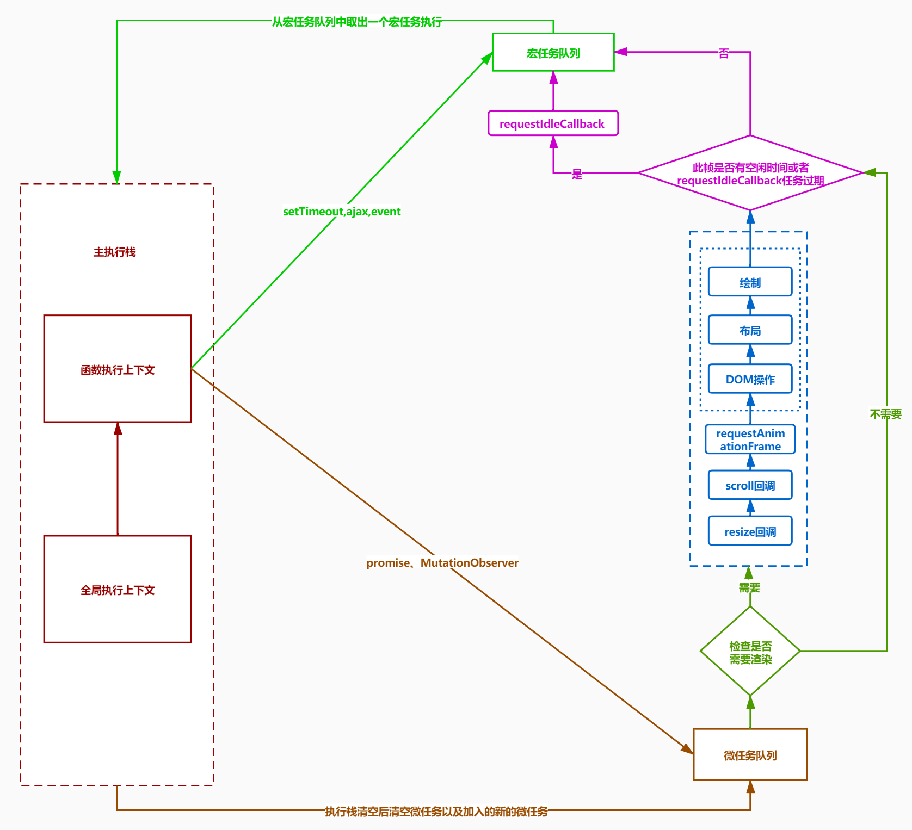

## react hooks

> 为了健壮函数组件，使他也能使用 state 以及其他 React 特性
>
> 提高组件的复用性
>
> 将组件拆分成更小的函数（订阅和请求数据）
>
> 解决 class 的性能问题，和 this 指向问题
>
> 不要在循环，条件判断或子函数中调用 hooks
>
> 每次渲染，hooks 内部都是一个独立的闭包

### useState

> 给函数组件添加一个内部 state
>
> 它会返回一对值：状态（state）以及更新状态（setState）的函数。与类组件的 setState 不同的是，这个 useState 返回的 setState 会把新 state 替换旧 state，而不是合并
>
> 初始渲染，返回的状态和传入的参数相同
>
> setState 函数会重新渲染一次组件

```js
const [state, setState] = useState(0);
```

- 每次渲染都是独立的闭包
  - 每渲染一次，组件函数就会被调用一次
  - 单次渲染，props 和 state 都是不变的，调用 setState 只有在下次渲染的时候才会改变 props 和 state

- 如果不想收闭包的特性影响，可以使用函数式更新

  ```js
  setState(state => state + 1)
  ```

- 惰性初始，传入函数式 initialstate

  ```js
  const [state, setState] = useState(()=>({name: 'timer', number: 0}))
  ```

- Hook 的更新函数内部是使用 Object.is 来比较新老 state，如果为 true，就不会重新渲染（同一个 state）

### useMemo

> 减少渲染次数。
>
> 使用 React.memo 包裹子组件，如果传给子组件的 props 没有变化，就不应该渲染
>
> 使用 React.useMemo 包裹的`状态`，会被缓存起来，如果下次渲染，会使用缓存，这样就不会重新渲染子组件。配置了依赖项为 []，永远不会重新渲染；配置了依赖项有值，值更新就会使用新的值刷新缓存进而重新渲染

```jsx | pure
const memoState = useMemo(()=({state}), [state])
```

### useCallBack

> 减少创建次数
>
> 缓存`更新状态函数`。原理类似 useMemo

```jsx | pure
const cbSetState = useCallback(()=>setState(state), [state]);
```

### useReducer

> 返回`[state, dispatch]`
>
> useState 的替代方案。state 逻辑较复杂且包含多个子值，或下一个 state 依赖于之前的 state 时
>
> 可以匹配`useReducer`+`useEffect`使用

```jsx | pure
const [state, dispatch] = useReducer(reducerFn, initialState, initFn)
```

### useContext

> 相当于 class 组件的`static contextType = MyContext`或者`MyContext.consumer`
>
> useContext 的上层组件树中需要使用`MyContext.provider`来为下层组件提供 context

```jsx | pure
const Context = React.createContext();
const {state, dispatch} = useReducer(Context);
```

### useRef

> 可以用来获取真实 DOM，并且操作 DOM
>
> 可以结合`forwardRef`使用，**ref 从父组件转发到子组件**
>
> 搭配`useInpreativeHandle`使用，避免子组件的真实 dom 完全交给父节点（被其修改或破坏）
>
> 可以通过`ref.current = state`，useEffect 的回调中获取到最新的值

```jsx | pure
// 1.使用
const ref = useRef();

// 2.forwardRef 与 useImperativeHandle
function Child(props, ref){
    const inputRef = useRef();
    useImperativeHandle(ref, ()=>{
        {
            // 可以在这里面向父组件暴露操作 DOM 的方法...
        }
    })
    return <input ref={inputRef}/>
}
Child = forwardRef(Child);
function parent(){
    const inputRef = useRef();
    // 可以通过 inputRef 操作子组件的真实 DOM...
    return <><Child ref={inputRef}/></>
}
```

### useEffect

> **浏览器渲染之后执行**，原理就是`setTimeOut`，不阻塞绘制
>
> 相当于 componentDidMount 和 componentDidUpdate
>
> 传递数组作为 useEffect 的第二个可选参数，通过 React 跳过对 effect 的调用。空数组`[]`则只运行一次（组件挂载和卸载时），否则会根据传递的依赖性来决定是否重新调用 useEffect 的回调
>
> 通过 useEffect 的回调函数返回一个函数（此函数会在组件卸载时被调用），执行下一个 effect 回调前会清楚上一个 effect 的副作用
>
> 可以匹配`useReducer`+`useEffect`使用，在 useEffect 内部调用 dispatch（useEffect 的依赖需要传入 dispatch 函数）
>
> 竞态：请求早但回来晚，而事实上应该使用最晚请求的结果，这个时候就可以通过返回函数，清掉前面早请求的副作用

```jsx | pure
const [state, setState] = useState(0);
useEffect(()=>{
    // 可以在这里面加一个副作用操作，如改变组件状态，调用 useReducer 的 dispatch 等
    setState(state);
}, [state])
```

### useLayoutEffect

> **DOM 更新完成之后，浏览器绘制之前执行**，原理就是 promise（微任务），阻塞绘制




### 自定义 Hooks

> 复用状态逻辑，并不是复用 state 本身
>
> 场景：定时器（useEffect），ajax 请求加载下一页（useEffect），实现动画（useEffect）