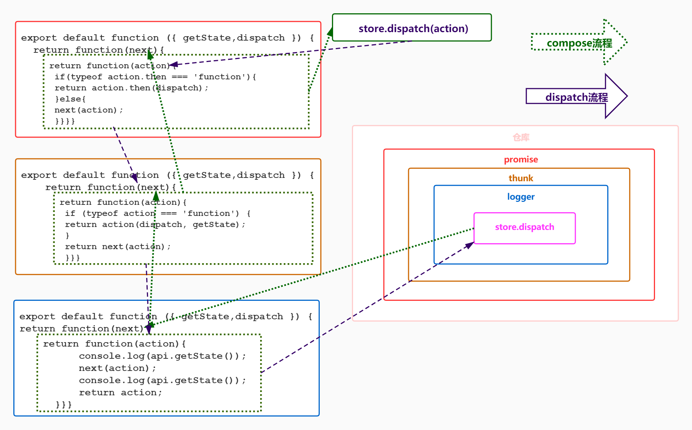

# react 中间件

> 强化 store.dispatch 的能力



## applyMiddleware

```js
// 以前创建 store 的写法
const store = createStore(reducers);
// 现在创建 store 的写法
const storeEnhancer = applyMiddleware(middlewares); // 
const storeEnhancerStoreCreator = storeenhancer(createStore); // 
const store = storeEnhancerStoreCreator(combinedReducers);
// middleware 的写法
const logger = ({getState, dispatch}) => (next) => (action) => {...}

// 返回一个增强版的 store
function applyMiddleware(...middlewares) {
  return function(createStore) {
    return function(reducer) {
      let store = createStore(reducer);
      let dispatch;
      let middlewareAPI = { getState: dispatch.getState, dispatch: action => dispatch(action) };
      // 这里规定了中间件的固定写法，先传 middlewareAPI ==> {getState, dispatch}，再传递 store.dispatch ==> next
      let chain = middlewares.map(middleware => middleware(middlewareAPI)); 
      // promise(thunk(logger(diaptch))) <==> (action) => any
      dispatch = compose(...chain)(store.dispatch);
      return {
        ...store,
        dispatch // 这是增强后的 dispatch
      };
    };
  };
}
```

## reduxThunk

> **派发的 action 是一个函数**

## reduxPromise

> **派发的 action 是一个 promise**
>
> 判断一个对象是否是 promise 的实例：这个对象是否有 then 属性且 then 属性是一个函数

## connected-react-router

> **使用 redux 来管理路由状态**，并且可以通过派发 action 来跳转路由
>
> - 封装动作，监听路由变化动作 onLocationChanged 和跳转路由动作 updateLocation
> - 基于 react-router/Router 封装 ConnectedRouter 高阶组件，内部需要监听路由 history 的变化，派发一个 onLocationChanged 动作（@@router/LOCATION_CHANGE）
> - 封装一个中间件 effect，如果遇到是跳转路由类型的动作，就归我处理了，否则就 next，交给下一个中间件
> - 封装一个 reducer，记录 router 状态的跳转 action 和位置 location 属性，如果遇到是路由变化类型，更新 router 状态

## redux-saga

> 可以为 redux 提供额外的功能，**为你的应用管理复杂的流程**
>
> 在 reducers 中的所有操作都是同步的并且是纯粹的，即 reducer 都是纯函数
>
> 纯函数是指一个函数的返回结果只依赖于它的参数，并且在执行过程中不会对外部产生副作用，即给它传什么，就吐出什么

### 工作原理

- saga 采用 generator 函数来 yield effects
- generator 函数的作用是可以停止执行，再次执行的时候从上次让停止的地方继续执行
- effect 是一个简单的对象，该对象包含了一些给 middleware 解析执行的信息（type，payload）
- 你可以通过使用 effects API 如 fork，call，take，put，cancel 等来创建 effect

### 分类

- `worker saga` - 做实际工作，如调用 API/异步请求/封装结果
- `watcher saga`- 监听 dispatch 的 actions，监听到 action 时，调用 worker 执行实际工作
- `root saga` - 启动 saga 的唯一入口

### effects.js

> 工作原理就是返回一个 action({type, payload}) 作为迭代器的返回值，然后在 saga/index.js 中处理这些 effects

- `take` - 接收一个 actionType，仅监听一次
- `put` - 派发一个 action
- `fork` - 接收一个 task，开启一个"子线程"
- `takeEvery` - 接收一个 actionType 和一个 task，开启一个子线程来循环监听某个动作，然后执行这个任务
- `call` - 接收一个 fn 和参数列表 args，支持 promise
- `cps` - 接收一个 fn 和参数列表 args，支持 node 回调风格的函数
- `delay` - 接收参数列表 args，延时功能
- `all` - 接收迭代器列表 fns，开启多个"子进程"执行这些 saga
- `cancel` - 接收一个 task，终止这个任务

## redux-dva

> 集成了 `react-redux` 、 `redux-saga`、`react-router-dom`、`connected-react-router`

## umi

> 全是 redux-dva 的用法。新增约定式路由和配置是路由
