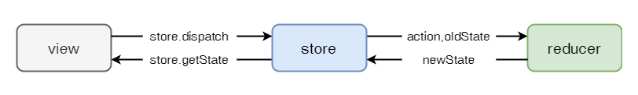
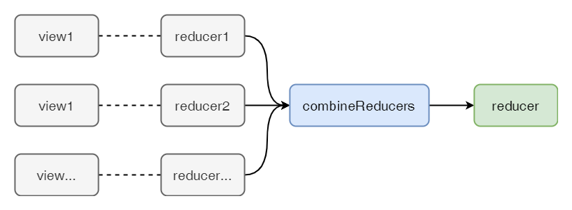
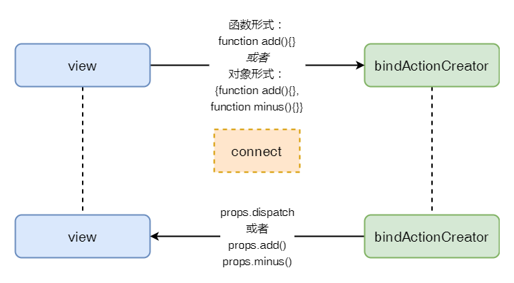
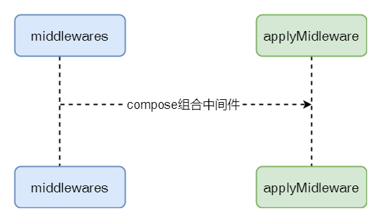
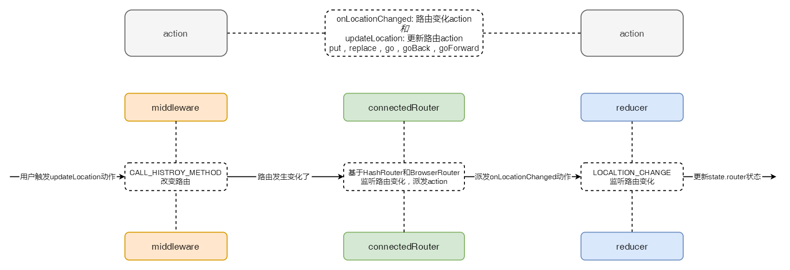
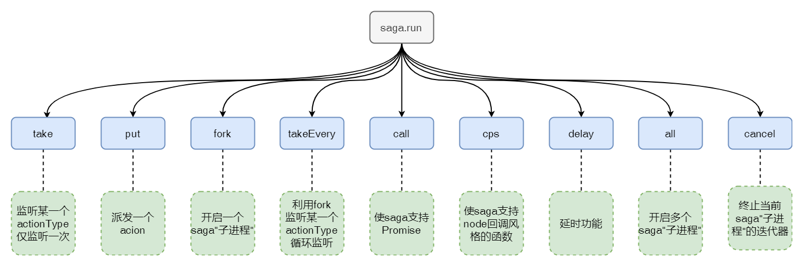
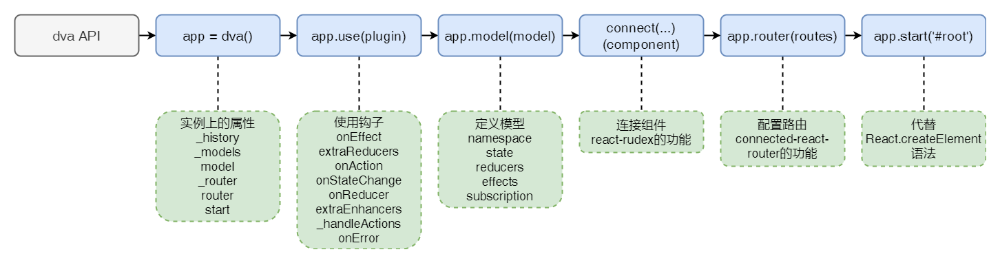

## 引言

> 为什么要整理这样的文档？答：纯粹是为了消化 redux 的源码
>
> 阅读这篇文章，你能了解啥？答：从 redux，react-redux，connected-react-router，saga，dva 的实现细节以及各自的能力
>
> 为什么是谈源码却没有代码？答：通过流程图，渗透到实现的每一个步骤
>
> _小生对 react 其实不是很了解，也是刚开始尝试画流程图，如有不足，请轻喷~_

## 基本的 Redux

### 场景一：一个企业级应用必然是多个 view，多个 reducer

> 1.  然而，规定一个 react 应用只有一个 store，一个 reducer
> 2.  通过 combineReducers 合并所有 reducers

### 场景二：如果可以省略 store 和 store.dispatch 和 store.getState 等冗余的逻辑就好啦！

> 1.  store 是整个应用共享的，可以使用 `React.createContext` 实现
> 2.  组件通过 props 派发 action 和订阅 state，使用高阶组件来实现增强原组件的 props

## 引入 React-Redux

为了解决场景二的问题，引入 `React-Redux`

原理：使用高阶组件，将全局 store 暴露到 Context 上，所有 React 组件共享一个 store。通过增强组件的 props，使其挂上 dispatch_action 函数和自己组件有关的 state

> 解决问题 1：`引入 store` 的冗余逻辑

使用 React.createContext，将 store 作为全局共享的属性

> 解决问题 2：`store.dispatch` 的冗余逻辑

> 解决问题 3：`store.getState` 的冗余逻辑

组件内部自定义选择器，`state => state.counter1`

### 场景三：上述只能进行派发对象形式的动作，如何支持函数形式、Promise 形式

> 1.  需要利用 redux 中间件能力
> 2.  `redux-thunk`中间件使支持函数形式的 action
> 3.  `redux-promise`中间件使支持 Promise 形式的 action

## 拥有集成中间件能力的 Redux

原理：类似 koa 的`compose`，其实就是迭代，**中间件可以使 store.dispatch 的功能更加强壮**

用法：`applyMiddleware(middlewares)(createStore)(reducer)`

### 场景四：使用 redux 管理 router 状态

> 1.  可以从 state 中获取 router 的 location 和 action 属性
> 2.  可以通过 redux 派发一个跳转路由的请求，并且更新 state.router

## 引入 connected-react-router

将这个库理解成一个完整的 rudex-store 就很明白了，该有的它也得有

- 创建 action
- 创建 reducer
- 创建 middleware（effect）
- 创建 connectedRouter（基于 react-router 实现的强化版 Router 组件）

### 场景五：上述只能派发同步动作，如何使用 redux 制定业务流程，并且支持异步动作

> 1.  提供更丰富的副作用能力，如：异步获取数据和从浏览器中读取缓存
> 2.  redux 代码应该是结合业务流程来写，而不是单纯地从 view 到 store
> 3.  对前端而言，主线程是单线程，除了同步代码，管理好异步逻辑特别重要
> 4.  可以随时开启一个任务，暂停或取消它

## 引入 redux-saga

就是一个使用了 ES6 的 Generator 功能的中间件，所以 saga 充分利用了 Generator 的特性，使得 redux 像注入了灵魂一样，无论是使用还是维护都很有章法

saga 可以是用户自定义的，用户使用 take、put、fork、takeEvery、call、ops、delay、all、cancel 等 effect 去组织自己的业务流程，saga 内部会进行迭代（实现思想类似 Promise.all）

> 场景五：前面引入的库实在太多，用起来不爽，有没有一个库集合了前面的全部功能，简化开发呢？

## 引入 dva

其实dva并没有多少自己的东西，源码也就百来行。它只是将之前所有的应用架构都集合到了一起，并且重新设计了自己的用法。还有增加了钩子和懒加载的能力...

dva API：

