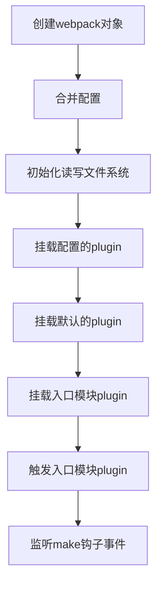
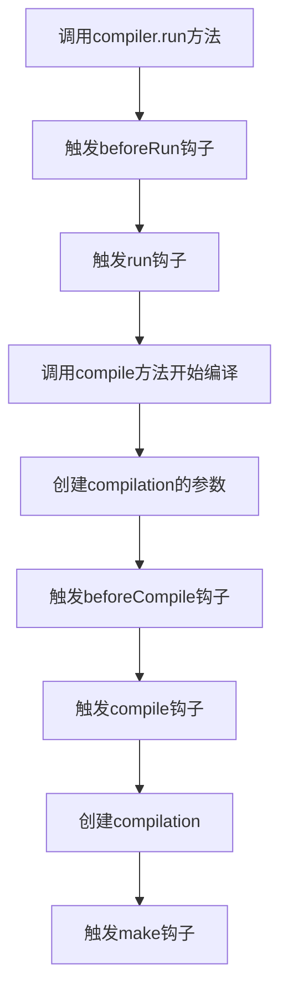
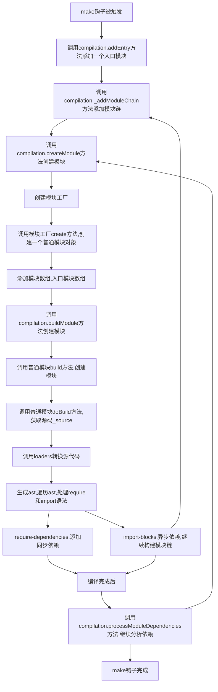
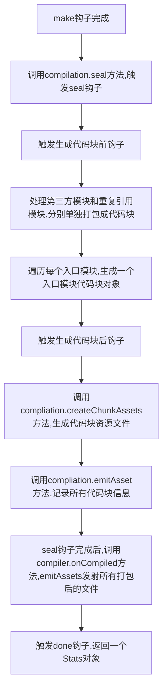

## webpack手写

### 第一步：初始化

> （合并配置，挂载插件，添加入口模块监听）

- 传入用户配置文件
- 创建compiler对象
- 合并配置（默认配置）
- 挂载用户插件
- 挂载默认插件，挂载compiler对象的读写文件方法
- 挂载入口模块插件，添加entryOption钩子监听函数
- 触发entryOption钩子，挂载单/多入口模块插件，添加make钩子监听事件

### 第二步：调用run开始编译

> （触发一系列编译钩子，获取compilation，触发make钩子）

- 用户调用run方法开始编译
- 定义完成编译的回调（根据assets属性发射文件）
- 触发beforeRun，run，beforeCompile，compile钩子
- 获取compilation参数，创建compilation对象
- 触发make钩子，定义make钩子完成回调（seal封装，入口模块/第三方模块/重复引用模块/计算assets和files属性）

### 第三步：make钩子被触发后

> （添加入口模块，构建模块，处理同步和异步依赖）

- make.callSync，执行行make钩子的监听函数，从入口模块开始编译
- addEntry，添加入口模块
- _addModuleChain，添加模块链
- NormalModuleFactory，创建模块工厂
- NormalModule，根据模块工厂对象创建普通模块
- 计算moduleId，\_modules，entries等属性
- afterBuild（processModuleDependencies），定义完成构建模块回调（如果有同步依赖，分析依赖）
- normalModule.build，开始构建
- normalModule.getSource，读取文件获取源码\_source，运行loaders转换源码
- normalModule.doBuild回调，生成\_ast，遍历\_ast，处理require和动态import语法
- 若是require，添加同步依赖模块dependencies，分析依赖（并行编译）
- 若是import，添加异步依赖模块blocks，添加模块链（并行编译）

### 第四步：make钩子完成

> （处理入口模块/第三方模块/重复引用模块，生成Chunk对象，赋值assets数组，发射文件，触发done钩子）

- make钩子完成后，执行回调
- 调用seal方法
- 触发seal钩子
- 触发beforeChunks钩子
- 遍历模块，单独提取第三方模块（vendor）/重复引用模块（commons），作为代码块
- 遍历entries（入口模块）/vendors/commons，生成Chunk对象，计算chunks数组
- createChunkAssets和emitAsset，遍历chunks，计算assets和files数组
- 执行onCompiled回调
- emitAssets，触发emit钩子，遍历assets数组发射文件
- 触发done钩子，返回一个Stats对象

### 分析使用到的类

- **Webpack**

  webpack入口类

  参数：传入用户配置options

  返回值：compiler

  主要功能：合并配置，挂载用户和默认插件，监听make钩子（执行compilation.addEntry方法）

- **Compiler**

  webpack编译对象，贯穿整个编译流程

  参数：传入用户配置或者默认的context（工作目录）

  返回值：无

  主要功能：

  - 初始化整个编译流程的钩子
    - entryOption，处理入口配置钩子，（单入口，多入口）
    - make，从入口模块开始编译钩子，（挂载默认插件SingleEntryPlugin时，添加监听）
    - beforeRun，运行前钩子，（用户调用run方法）
    - run，运行时钩子，（用户调用run方法）
    - beforeCompile，编译前钩子，（创建compilation参数）
    - compile，compile时钩子，（创建compilation对象）
    - thisCompilation，（创建compilation对象）
    - compilation，（创建compilation对象）
    - afterCompile，（make钩子成功回调后，调用compilation.seal方法，并且成功回调时，模块编译完成）
    - emit，（发射文件）
    - done，（编译整个流程已完成）
  - run方法，运行编译
  - compile方法，开始编译，**构建compilation对象**，**触发make钩子**
  - newCompilationParams方法，创建compilation参数
  - newCompilation方法，创建compilation对象

- **Compilation**

  代表一次编译对象

  参数：传入compiler对象

  返回值：无

  主要功能：

  - 初始化一次编译使用到的钩子
    - succeedModule，一个模块构建完成时钩子
    - seal，开始封装模块钩子，**make钩子完成后触发**
    - beforeChunks，生成代码块前钩子
    - afterChunks，生成代码块后钩子

  - addEntry方法，添加入口模块，从入口模块开始编译，**make钩子被触发时调用**
  - _addModuleChain方法，添加模块链，创建模块（模块工厂）
  - createModule方法，调用模块的build方法，构建模块（源码 --> ast --> 分析同步和异步依赖 --> 重复构建）
  - processModuleDependencies方法，并行分析同步依赖，重新创建模块
  - seal方法，模块构建完成后，处理入口模块 / 第三方模块 / 重复引用模块
  - createChunkAssets方法，生成chunk对象，使用ejs模块/字符拼接，产出最终代码块
  - emitAsset方法，compilation.assets身上赋值所有的静态资源（代码块）

- **NormalModuleFactory**

  模块工厂，返回一个普通模块

- **NormalModule**

  普通模块类

  参数：对象{ name, context, rawRequest, resource, parser, async, moduleId }

  返回值：无

  主要功能：

  - build方法，生成ast，遍历ast，处理require和import语法
    - require语法，添加同步依赖，等待调用processModuleDependencies方法
    - import语法，添加异步依赖，并行调用_addModuleChain方法
  - doBuild方法，调用getSource
  - getSource方法，获取源代码，调用loaders获取转换后的代码

- **RunLoaders**

  运行loaders的库

- **WebpackOptionsApply**

  挂载默认插件

- **EntryOptionPlugin**

  入口模块插件

- **SingleEntryPlugin**

  单入口模块插件

- **NodeEnvironmentPlugin**

  node环境（文件读写系统）插件

- **Parser**

  将源代码转成ast的库

- **Chunk**

  代码块类

- **Stats**

  合并module，_module，entries，chunks，assets，files等参数，返回给用户