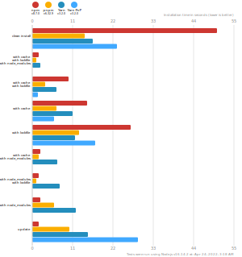

# monorepo 是什么

# monorepo 常见问题

Rush 官网介绍`幽灵依赖`问题：[Phantom dependencies](https://rushjs.io/pages/advanced/phantom_deps/)

Rush 官网介绍`NPM 分身`问题：[NPM doppelgangers](https://rushjs.io/zh-cn/pages/advanced/npm_doppelgangers/)

  

### Phantom dependencies

Phantom dependencies 被称之为幽灵依赖，解释起来很简单，即某个包没有被安装 (`package.json` 中并没有，但是用户却能够引用到这个包)。


### NPM doppelgangers

由于 hoist 导致的，这个问题可能会导致有大量的依赖的被重复安装。

```text
node_modules
  /a
  /a/node_modules/e1
  /b
  /b/node_modules/e1
  /c
  /c/node_modules/e2
  /d
  /d/node_modules/e2
```

NPM 会做一种 hoist 的优化，也就是把一些深度的依赖尽量弄成平的，例如将 e2 提到最外层的 node_modules

会变成

```text
node_modules
  /a
  /a/node_modules/e1
  /b
  /b/node_modules/e1
  /c
  /d
  /e2
```

这样只能提升一个依赖 e2，如果两个依赖都提升了会导致冲突。这样同样会导致一些不同版本的依赖被重复安装多次（e1），这里就会导致使用 npm 和 yarn 的性能损失。


# 包管理工具
## pnpm
pnpm 较 yarn/npm 这两种常用包管理工具在一些综合场景下性能比 npm/yarn 快了大概两倍，来自官方数据：



### hard link 机制

那么 pnpm 是怎么做到如此大的提升的呢？是因为计算机里面一个叫做 **Hard link** 的机制，`hard link` 使得用户可以通过不同的路径引用方式去找到某个文件。pnpm 会在全局的 store 目录里存储项目 `node_modules` 文件的 `hard links` 。

这里因为依赖始终都是存在 store 目录下的 hard links ，一份不同的依赖始终都只会被安装一次，因此是能够被彻彻底底消除`NPM doppelgangers`的。

### Store 目录

store 目录用于存储依赖的 hard links。

因为这样一个机制，导致每次安装依赖的时候，如果是个相同的依赖，有好多项目都用到这个依赖，那么这个依赖实际上最优情况 (即版本相同) 只用安装一次。

使用 pnpm 对项目安装依赖的时候，如果某个依赖在 sotre 目录中存在了话，那么就会直接从 store 目录里面去 hard-link，避免了二次安装带来的时间消耗，如果依赖在 store 目录里面不存在的话，就会去下载一次。

执行 `pnpm store prune` 就可以在 store 里面删掉某个依赖，使其成为不会被引用的包。

### node_modules 结构

介绍 pnpm 项目的 node_modules 结构:：[Flat node_modules is not the only way](https://pnpm.io/blog/2020/05/27/flat-node-modules-is-not-the-only-way)

本质上 pnpm 的 `node_modules` 结构是个网状 + 平铺的目录结构。这种依赖结构主要基于软连接 (即 symlink) 的方式来完成。

### symlink 和 hard link 机制

`node_modules` 中的原依赖目录会软连接到 .pnpm 这个目录下的真实依赖中，而这些真实依赖则是通过 hard link 存储到全局的 store 目录中。

# monorepo 常见方案

### pnpm workspaces

### yarn workspaces