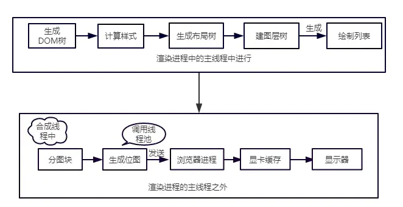
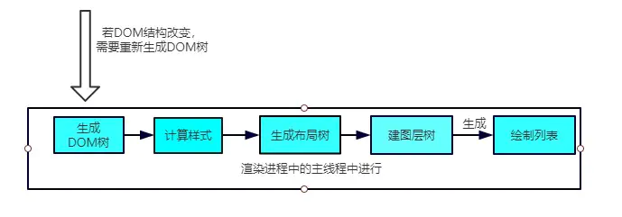

## 2020-08-03

> vue 的双向绑定的原理是什么?

数据劫持和依赖收集，依靠发布订阅模式。

1.vue2：通过使用 ES5 中`Object.definedProperty`语法（vue3 已经改用`proxy`），对视图绑定的属性进行劫持，用户在赋值或取值的时候会分别触发`set`和`get`方法。在属性取值触发`get`方法时（视图绑定属性），添加一个`Watcher`订阅者；在属性赋值触发`set`方法时，通知订阅者属性已变化（调用`Watcher.update`方法准备更新视图）。缺点：数据劫持劫持属性本身，如果属性是对象，则要深度遍历进行劫持；不完全的数组劫持...

2.vue3：vue3 中的`Reactivity`模块，通过使用 ES6 中`proxy`语法对对象进行劫持（劫持的是整个对象，包括他所有的属性），而这些对象都有一个比较有意思的名字，**响应式对象**。对响应式对象取值时，调用 track 方法收集依赖；修改响应式对象时，调用`trigger`方法触发更新。

### 参考答案

vue.js 是采用数据劫持结合发布者-订阅者模式的方式，通过 ES5 提供的 Object.defineProperty()方法来劫持(监视)各个属性的 setter,getter，在数据变动的时发布消息给订阅者，触发相应的监听回调。并且，由于是在不同的数据上触发同步，可以精确的将变更发送发送给绑定的视图，而不是对所有的数据都执行一次检测。

```
具体的步骤：
    1.需要observer的数据对象进行递归遍历，包括子属性对象的属性，都加上getter和setter这样的话，给这个对象的某个值赋值，就会触发setter，那么就能监听到了数据变化
    2.compile解析模板指令，将模板中的变量替换成数据，然后初始化渲染页面视图，并将每个指令对应的节点绑定更新函数，添加监听数据的订阅者，一旦数据有变动，收到通知，更新视图
    3.Watcher订阅者是Observer和compile之间通信桥梁，主要做的事情是：
       - 在自身实例化时往属性订阅器(dep)里面添加自己
       - 自身必须有一个update()的方法
       - 待属性变动dep.notice()通知的时候，能调用自身的update()方法，并触发compile中绑定的回调，则功成身退
       4.MVVM作为数据绑定的入口，整合observer、compile和watcher三者，通过observer来监听自己的model数据变化，通过compile来编译模板指令，最终利用watcher搭起的observer和compile之间的通信桥梁，达到数据变化---试图更新;视图交互变化(input)-->数据model变更的双向绑定效果
```

版本比较： vue 是基于依赖收集的双向绑定； 3.0 版本之前使用 Object.definePropetry,3.0 新版使用 Proxy

- 1.基于数据劫持/依赖收集 的双向绑定的优点
  - 不需要显示的调用，Vue 利用数据劫持+发布订阅，可以直接通知变化并且驱动视图
  - 直接得到精确的变化数据，劫持了属性 setter，当属性值改变，我们可以精确的获取变化的内容 newValue，不需要额外的 diff 操作
- 2.Object.defineProperty 的缺点
  - 不能监听数组：因为数组没有 getter 和 setter，因为数组长度不确定，如果太长性能负担太大
  - 只能监听属性，而不是整个对象，需要遍历循环属性
  - 只能监听属性变化，不能监听属性的删减
- 3.proxy 的好处
  - 可以监听数组
  - 监听整个对象不是属性
  - 13 种来截方法，强大很多
  - 返回新对象而不是直接修改原对象，更符合 immutable；
- 4.proxy 的缺点
  - 兼容性不好，而且无法用 polyfill 磨平；

## 2020-08-04

> Plugin 和 Loader 的区别是什么？

1.调用的时机不同。`Plugin`可以在 webpack 构建的整个流程中的钩子添加监听函数，当钩子触发时，这个监听函数也会被调用；而`Loader`的调用时机是固定的，在获取源代码后，按照`pre`、`normal`、`inline`、`post`的顺序依次执行。

2.能力不同。`Plugin`更多是文件内容以外的文件本身，以及可以贯穿整个构建过程的能力，如`HtmlWebpackPlugin`生成 html 文件并且自动引入所有脚本、`ZipPlugin`插件把所有文件压缩成一个项目包、`AutoExternalPlugin`插件支持外链模块等等。但是，`Loader`只关注文件内容，例如`babel-loader`对 js 文件内容的处理（兼容新语法新 API 等）、`css-loader`和`less-loader`等对样式文件内容的处理等等

3.使用方式不同。`Plugin`是添加了哪个钩子的监听函数，就会在相应的位置被调用，没有顺序关系；可以给一类文件配置多个`Loader`，并且上一个`Loader`和下一个`Loader`之间有传递效果，有顺序关系。

4.机制不同。`Plugin`只要配置上了，就会在构建过程中被调用（当前要是正常的插件）。而`Loader`由于`pitch`的特性，"后面"的`Loader`可能会被中断执行。

### 参考答案

- 1.作用不同：
  - Loader 直译为"加载器"。Webpack 将一切文件视为模块，但是 webpack 原生是只能解析 js 文件，如果想将其他文件也打包的话，就会用到 loader。 所以<u>Loader 的作用是让 webpack 拥有了加载和解析非 JavaScript 文件的能力</u>。
  - Plugin 直译为"插件"。<u>Plugin 可以扩展 webpack 的功能，让 webpack 具有更多的灵活性</u>。 在 Webpack 运行的生命周期中会广播出许多事件，Plugin 可以监听这些事件，在合适的时机通过 Webpack 提供的 API 改变输出结果。
- 2.用法不同：
  - Loader 在 module.rules 中配置，也就是说作为模块的解析规则而存在。 类型为数组，每一项都是一个 Object，里面描述了对于什么类型的文件（test），使用什么加载(loader)和使用的参数（options）
  - Plugin 在 plugins 中单独配置。 类型为数组，每一项是一个 plugin 的实例，参数都通过构造函数传入。

## 2020-08-05

> 请解释 React 中 props 和 state 的区别？

1. **含义**。`props`是组件属性，它包含了除用户可以自定义的属性类型之外，还有 DOM 元素自带的属性和事件等；`state`是组件状态，它是由用户自定义的属于组件的状态。
2. **不可变性**。理论上，`props`是不可变的，不会在组件内部直接修改。`state`由当前组件定义，可以根据需求更新和修改数据。如果向子组件传递了状态数据变了，`props`才可能会被更新，并且是批量往下重新渲染达到更新`props`的效果。
3. **共享性**。`props`只有父亲到孩子之间一层的数据传递，而 state 可以通过`contextType`共享状态机，父-子-孙可以直接取这里的数据。
4. **初始化的方式**。`props`是上层传递下来进行初始化的，也可以定义`defaultProps`和`propsType`;`state`是当前组件在构造函数中进行初始化的（只有这种方式）
5. 只有`state`有`useState`，`useCallback`，`useMemo`，`useContext`，`useReducer`等语法。

### 参考答案

- 1.props
  - 函数组件的 props 就是一个函数的入参组件
  - 类组件：this.props 包括被该组件调用或者定义的 props
- 2.state
  - 组件中的 state 包含了随时可以发生变化的数据
  - state 由用户定义，它是一个普通 javascript 对象
- 3.区别
  - props 是传递组件的(类似函数的形参)，而 state 是在组件内被组件自己管理的(类似在一个函数内声明变量)。
  - props 是不可修改的，所有 React 组件必须向纯函数一样保护它们的 props 不被更改
  - state 是在组件中创建的，一般在 constructor 中初始化 state
  - state 是多变的、可修改的，每次 setState 都异步更新的

## 2020-08-06

> 浏览器的本地存储(1)的 Cookie 了解多少？

1.  `Cookie`是为了辨别用户身份，由服务器派发（`Set-Cookie`字段），并存储在客户端的认证状态。
2.  客户端通过`document.cookie`可以获取 Cookie 数据，每次`http`请求的时候，如果有，浏览器会自动添加到`http header`的 Cookie 字段中。
3.  Cookie 的一些属性：
    - `name=value`（要保存的`key/value`）
    - `Domain`（域名，只有访问这些域名才会派发 Cookie）
    - `maxAge`（失效时间，多少 s 后会失效）
    - `secure`（为 true 时，`HTTPS`才有效）
    - `Path`（只有访问包含 Path 的路由才会派发 Cookie）
    - `Expires`（过期时间，时间点）
    - `httpOnly`（JS 脚本无法操作 Cookie，即 document.cookie 无效，防止`XSS`攻击）
4.  关于 Cookie 的补充：
    - 使用逗号、分号、空号等特殊符号隔开，服务器可以对 Cookie 使用`sha256`加密转成`base64`格式
    - JS 一次设多个 Cookie，只能通过调用多次`document.cookie = ?`
    - JS 只能新增和删除 Cookie，不能只修改某一个
    - 可以通过配置 withCredentials 为 true，解决跨域携带 Cookie 的问题
5.  注意事项：
    - 不宜存储敏感数据
    - 服务器接收到的 Cookie，可以进行二次校验，避免已经被篡改
    - 体积尽量小
    - 配置 httponly 保证安全，配置 Domain 和 Path 减少数据传输

### 参考答案

- Cookie 最开始被设计出来其实并不是做本地存储的，而是为了弥补 http 在状态管理上的不足
- http 协议是一个无状态协议，客户端向服务器发请求，服务器返回响应，这次事件就完成了，但是下次发请求如何让服务端直到客户端是谁呢？在这个需求下就产生了 Cookie
- Cookie 本质上就是浏览器里面存储的一个很小的文本文件，内部以键值对的方式来存储(在 chrome 开发者面版的 Application 这一栏可以看到)都会携带相同的 Cookie，服务器拿 Cookie 进行解析，便能拿到客户端的状态 Cookie 的作用就是用来做状态存储的，但是也有很多缺陷：

```
1.容量缺陷。Cookie的体积上限只有4KB，只能用来存储少量的信息
2.性能缺陷。Cookie紧跟域名，不管域名下面的某一个地址需不需要这个Cookie，请求都会携带上完整的Cookie，这样随着请求数的增多，其实会造成巨大的性能浪费的，因为请求携带了很多不必要的内容
3.安全缺陷。由于Cookie以纯文本的形式在浏览器和服务器中传递，很容易被非法用户截取，然后进行一系列的篡改，在Cookie的有限期内重新发送给服务器，这是很危险的。另外，在HttpOnly为false的情况下，Cookie信息能直接通过js脚本来读取。
```


## 2020-08-07

> 浏览器的本地缓存(2)的 WebStorage 了解多少

**sessionStorage** 1.会话缓存，键值对形式，限制 5M 2.只属于当前会话，当网页关闭的时候 sessionStorage 会被清空 3.重新加载（刷新）或恢复页面仍会保持原来的页面会话 4.打开新标签或窗口时，会复制顶级浏览会话的上下文（但不是共用），如 a 标签打开新页面 5.使用场景：缓存浏览足迹、保存表单信息等
**localStorage**

1.  浏览器持久化缓存，键值对形式，限制 5M（超出容量会报错）
2.  只要不手动清空浏览器的缓存，就会一直存在
3.  受端口和域名影响，同一端口、同一 http 协议、同一域名才会共享同一个
4.  同域下的页面，可以实现广播机制，使用`storage event`监听其他页面的`localhost.setItem`行为
5.  使用场景：缓存首页 base64 图片、偏好配置（语言）等

### 参考答案

WebStorage 又可以分为 localStorege 和 sessionStorage

**localStorage**

和 Cookie 异同：相同的一点是：针对一个域名，即在同一个域名下，会存储相同的一段 localStorage

区别：

- 1.容量：localStorage 的容量上限为 5M，相对于 Cookie 的 4K 大大增加。当然这个 5M 是针对一个域名的，因此对于一个域名是持久存储的
- 2.只存在客户端，默认不参与和服务端的通信。这样很好地避免了 Cookie 带来地性能问题和安全问题
- 3.接口封装。通过 localStorage 暴露在全局，并通过它的 setItem 和 getItem 等方法进行操作，非常方便。

看看如何具体操作 localStorage？

```
let obj={name:"zhufeng",age:10};
localStorage.setItem("name","zhufeng");
localstorage.setItem("message",JSON.stringify(obj));
//接着进入相同的域名时就能拿到相应的值：
let name=localStorage.getItem("name");
let info=JSON.parse(localStorage.getItem("info"))
```

在这里能得到，localStorage 其实存储的都是字符串，如果是存储对象需要调用 JSON 的 stringify 方法，并且用 JSON.parse 来解析成对象 应用场景：利用 localStorage 的较大容量和持久特性，可以利用 localStorage 存储一些内容稳定的资源，比如官网的 logo，存储 Base64 格式的图片资源，因此要好好利用 localStorage

**sessionStorage**

特点：sessionStorage 和 localStorage 是一致的

- 1.容量。容量上限为 5M
- 2.只存在客户端，默认不参与和服务端的通信
- 3.接口封装。除了 sessionStorage 名字有所变化，存储方式、操作方式均和 localStorage 一样

但是 sessionStorage 和 localStorage 有一个本质的区别：前者只是会话级别的存储，并不是持久化存储。会话结束后也就是页面关闭，这部分 sessionStorage 就不存在了

应用场景：1.可以用它对表单信息进行维护，将表单信息存储存储在里面，可以保证页面即使刷新也不会让之前的表单信息丢失。2.可以用它存储本次浏览记录。如果关闭页面后不需要这些记录，用 sessionStorage 就再合适不过了。事实上微博采取这样的存储方式。

## 2020-08-08

> 说一下 vue-router 的原理是什么?

SPA（单页面应用）的特点是，加载路由时，不会加载整个页面，只是加载指定容器中的内容。

vue-router 有三种模式：hash，history 和 abstract。

**hash（HashHistory）**

1.  利用 URL hash 作为路由
2.  仅用于使浏览器跳转，并不会影响服务器，hash 改变并不会重载页面
3.  可以使用 hashchange 监听 hash 路由的改变（window.history.hash）
4.  地址里面带"#"
5.  常用方法：push（给 loacation.hash 赋值，会添加一个新的浏览访问历史），replace（替换当前路由，访问历史不增）

**history（HTML5History）**

1.  使用 html5 History 作为路由
2.  可以使用 onpopstate 监听 history 的变化
3.  常用方法：back（后退），forward（前进），go（跳转到指定索引），pushState（添加访问历史），replaceState（修改访问历史），popState（删除访问历史）

**abstract（AbstractHistory）**

1.  使用数组模拟浏览器访问记录栈的功能

### 参考答案

实现原理：vue-router 的原理就是更新视图而不重新请求页面

vue-router 可以通过 mode 参数设置为三种模式：hash 模式、history 模式、abstract 模式。

- 1.hash 模式 默认是 hash 模式，基于浏览器 history api，使用 window.addEventListener('hashchange',callback,false)对浏览器地址进行监听。当调用 push 时，把新路由添加到浏览器访问历史的栈顶。使用 replace 时，把浏览器访问历史的栈顶路由替换成新路由 hash 的值等于 url 中#及其以后的内容。浏览器是根据 hash 值的变化，将页面加载到相应的 DOM 位置。锚点变化只是浏览器的行为，每次锚点变化后依然会在浏览器中留下一条历史记录，可以通过浏览器的后退按钮回到上一个位置
- 2.History history 模式，基于浏览器 history api ，使用 window.onpopstate 对浏览器地址进行监听。对浏览器 history api 中的 pushState()、replaceState()进行封装，当方法调用，会对浏览器的历史栈进行修改。从而实现 URL 的跳转而无需加载页面 但是他的问题在于当刷新页面的时候会走后端路由，所以需要服务端的辅助来兜底，避免 URL 无法匹配到资源时能返回页面
- 3.abstract 不涉及和浏览器地址的相关记录。流程跟 hash 模式一样，通过数组维护模拟浏览器的历史记录栈 服务端下使用。使用一个不依赖于浏览器的浏览器历史虚拟管理后台
- 4.总结 hash 模式和 history 模式都是通过 window.addEvevtListenter()方法监听 hashchange 和 popState 进行相应路由的操作。可以通过 back、foward、go 等方法访问浏览器的历史记录栈，进行各种跳转。而 abstract 模式是自己维护一个模拟的浏览器历史记录栈的数组

## 2020-08-09

> 防抖节流原理、区别以及应用，请用 js 实现。

节流（throttle）

1.  限制流的大小，但不会影响流的速度（意思是，指定时间内，只有一个流会被接收，并不会决定原来的流是产生以及往下传递的时机）
2.  传入参数是一个函数，times 时间
3.  返回一个函数
4.  times 秒内，无论被触发多少次，只执行一次，**时间不会被重置**
5.  应用场景：鼠标滚动 scroll 事件，鼠标移动 touchmove 事件，上拉加载长列表等等

```js
const throttle = (fn, times) => {
  let timer;
  let fnArr = [];
  return (...args) => {
    // fn的参数
    fnArr.push(fn);
    if (!timer) {
      timer = setTimeout(() => {
        clearTimeout(timer);
        timer = undefined;
      }, times);
      let [firstFn] = fnArr;
      firstFn && firstFn(...args);
      fnArr.length = 0;
    }
  };
};
```

防抖（debounce）

1.  既影响了流的大小，又影响了流的速度（意思是，指定时间内，所有产生的流都会被截掉，等待定时器完成，才将最后一个产生的流传递下去）
2.  传入参数是一个函数，times 时间
3.  返回一个函数
4.  times 秒内，只执行一次，倒计时期间被触发，**将会重新计时**
5.  应用场景：ajax 实时请求，窗口 resize 事件（只关心最后结果），按钮防连点等等

```js
const debounce = (fn, times) => {
  let fnArr = [];
  let timer;
  return (...args) => {
    fnArr.push(fn);
    timer && clearTimeout(timer); // 清空之前的计时器
    timer = setTimeout(() => {
      // 重新计时
      clearTimeout(timer);
      let [firstFn] = fnArr;
      firstFn && firstFn(...args);
      fnArr.length = 0;
    }, times);
  };
};
```

1.浏览器持久化缓存，键值对形式，限制 5M（超出容量会报错） 2.只要不手动清空浏览器的缓存，就会一直存在 3.受端口和域名影响，同一端口、同一 http 协议、同一域名才会共享同一个 4.同域下的页面，可以实现广播机制，使用`storage event`监听其他页面的`localhost.setItem`行为 4.使用场景：缓存首页 base64 图片、偏好配置（语言）等

### 参考答案

1)防抖

原理：在时间被触发 n 秒之后再执行回调，如果在这 n 秒内又被触发，则重新计时

适用场景：

- 按钮提交场景：防止多次提交按钮，只执行最后提交的一次

- 搜索框联想场景：防止联想发送请求，只发送最后一次输入

> ```js
>//简易版实现
> function debounce(func, wait) {
>  let timeout;
>   return function() {
>    const context = this;
>     const args = arguments;
>    clearTimeout(timeout);
>     timeout = setTimeout(() => {
>       func.apply(context, args);
>    }, wait);
>   };
> }
> //立即执行版实现：有时候希望立刻执行函数，然后等到停止触发n秒后，才可以重新执行。
> function debound1(func, wait, immediate) {
>   let timeout;
>   return function() {
>     const context = this;
>     const args = arguments;
>     if (timeout) clearTimeout(timeout);
>     if (immediate) {
>       const callNow = !timeout;
>       timeout = setTimeout(() => {
>         timeout = null;
>       }, wait);
>       if (callNow) func.apply(context, args);
>     } else {
>       timeout = setTimeout(() => {
>         func.apply(context, args);
>       }, wait);
>     }
>   };
> }
> 
> //返回值版实现
> //func函数可能会有返回值，所以需要返回函数结果，但是当immediate为false的时候，因为使用了setTimeout，我们将func.apply(context,args)的返回值赋给变量，最后在return的时候，值将会一直是undefined，所以只在immediate为true的时候返回函数的执行结果
> function debounce2(func, wait, immediate) {
>   let timeout, result;
>   return function() {
>     const context = this;
>     const args = arguments;
>     if (timeout) clearTimeout(timeout);
>     if (immediate) {
>       const callNow = !timeout;
>      timeout = setTimeout(() => {
>         timeout = null;
>       }, wait);
>       if (callNow) result = func.apply(context, args);
>     } else {
>       timeout = setTimeout(() => {
>         func.apply(context, args);
>       }, wait);
>     }
>     return result;
>   };
> }
> ```

2)节流：

原理： 规定在一个单位时间内，只能触发一次函数。如果这个单位时间内触发多次函数，只有一次生效

适用场景：

- 拖拽场景：固定时间内只执行一次，防止高频次触发位置变动
- 缩放场景：监控浏览器 resize

> ```js
>//使用时间戳实现:使用时间戳，当触发事件发生的时候，我们取出当前的时间戳，然后减去之前的时间戳（最开始设值为0），如果大于设置的时间周期，就执行函数，然后更新时间戳为当前时间戳，如果小于，就不执行
> 
>function throttle(func, wait) {
>   let context, args;
>  let previous = 0;
>   return function() {
>    let now = +new Date();
>     context = this;
>     args = arguments;
>    if (now - previous > wait) {
>       func.apply(context, args);
>       previous = now;
>     }
>   };
> }
> //使用定时器实现：当触发事件的时候，我们设置一个定时器，在触发事件的时候，如果定时器存在，就不执行，知道定时器执行，然后执行函数，清空定时器，这样就可以设置下定时器
> function throttle1(func, wait) {
>   let timeout;
>   return function() {
>     const context = this;
>     const args = arguments;
>     if (!timeout) {
>       timeout = setTimeout(() => {
>         timeout = null;
>         func.apply(context, args);
>       }, wait);
>     }
>   };
> }
> 
> //区别:节流不管事件触发多频繁保证在一定时间内一定会执行一次函数。防抖是只在最后一次事件触发后才会执行一次函数
> // flag版本
> const throttle2 = (func, wait) => {
>   let flag = true;
>   return function(...args) {
>     if (!flag) return;
>     flag = false;
>     setTimeout(() => {
>       func.apply(this, args);
>       flag = true;
>     }, wait);
>   };
> };
>```

## 2020-08-10

> 在 css 中 link 和@import 的区别是什么？

1. **含义不同**，`@import`是`css2.1`之后的语法，放在 style 标签里面使用；而`link`是`HTML`提供的标签
2. **兼容性不同**，`@import`需要`IE5+`；而`link`没兼容性问题（大多数属性）
3. **可控性不同**，`@import`无法使用 js 脚本插入到 DOM 中；而`link`可以。可以通过`css-loader`将`@import`语法先磨平，减少页面加载时的请求数
4. **能力范围不同**，`@import`只能用来引入 css；而`link`除了用来引入 css，还可以用来定义`RSS`，`icon`等
5. **加载时机不同**，（引入 css 中定义的）`@import`会在页面加载完成后被加载；而`link`将在页面加载的同时加载。如果两者都是在 HTML 中定义的，则按顺序加载
6. **加载时机并不能决定最后渲染结果**，（引入 css 中定义的）`@import`会最后加载，但如果`@import`所在的 css 文件被`link`引入到 HTML 顶部，则`@import`的样式会被下面的同名样式层叠，同理如果是被引入到 HTML 底部，`@import`的样式会层叠上面的同名样式

### 参考答案

- 1.从属关系区别：

  link 是属于 html 标签，而@import 是 css 提供的

- 2.加载顺序区别：

  页面被加载时，link 会同时加载，而@import 引用的 css 会等到页面被加载完再加载

- 3.兼容性区别：

  import 只在 IE5 以上才能识别，而 link 是 html 标签，无兼容问题

- 4.dom 可操作性的区别：

  可以通过 js 操作 dom，插入 link 标签来改变样式；由于 dom 方法是基于文档的，无法使用@import 的方式插入样式

- 5.权重区别：

  在.css 文件用 import 引入时，如果已经存在相同样式，@import 引入的这个样式将被该 css 文件本身的样式层叠掉，表现出 link 方式的样式权重高于@import 的权重这样的直观效果

简而言之：link 和@import，谁写在后面，谁的样式就被应用，后面的样式覆盖前面的样式

## 2020-08-11

> 常见的 loader 以及作用的总结？

**css 相关**

1.  `css-loader`: 作用是将 css 代码转成 js 模块，以及处理 url 和@import 语法
2.  `style-loader`: 作用是将 css 代码插入到 html 头部
3.  `less-loader`等: 作用是处理 css 的扩充语法，将 less 代码转成 css 代码。类似的还有`sass`、`scss`等
4.  `postcss-loader`: 作用是将 css 解析成 AST，可以进一步优化 css，减少多余的 css 代码

**静态资源相关**

1.  `file-loader`: 作用是拷贝静态资源到指定目录，如 dist，返回一个 js 模块代码（含静态资源 url）
2.  `url-loader`: 作用是处理 css 里面的 url 语法，根据设置的阀值，将图片转成 base64 作为 js 模块代码的返回值，或拷贝到指定目录（配合`file-loader`）

**javaScript 相关**

1.  `babel-loader`: 作用是将高级 js 语法转成低版本 js 语法。与其配合使用的有这些包，`@babel/core`、`@babel/preset-env`
2.  `eslint-loader`: 作用是对用户 js 代码进行语法检测，并且在打包或编译的时候提示错误
3.  `jsx-loader`: 作用是将 jsx 语法转成 js 语法，ReactJs 中

### 参考答案

- raw-loader：加载文件原始内容（utf-8）
- file-loader：把文件输出到一个文件夹中，在代码中通过相对 URL 去引用输出的文件
- url-loader:和 file-loader 类似，但是能在文件很小的情况下以 base64 的方式把文件内容注入到代码中
- source-map-loader:加载额外的 Source Map 文件，以方便断点调试
- svg-inline-loader：将压缩后的 SVG 内容注入代码中
- image-loader：加载并且压缩图片文件
- json-loader 加载 JSON 文件（默认包含）
- handlebars-loader: 将 Handlebars 模版编译成函数并返回
- babel-loader：把 ES6 转化成 ES5
- ts-loader: 将 TypeScript 转换成 JavaScript
- awesome-typescript-loader：将 TypeScript 转换成 JavaScript，性能优于 ts-loader
- css-loader：加载 css，支持模块化、压缩、文件导入等特性
- style-loader：把 css 代码注入到 js 中，通过 DOM 操作去加载 css
- eslint-loader：通过 ESLint 检查 JS 代码
- tslint-loader：通过 TSLint 检查 TypeScript 代码
- postcss-loader：扩展 CSS 语法，使用下一代 CSS，可以配合 autoprefixer 插件自动补齐 CSS3 前缀
- vue-loader：加载 Vue.js 单文件组件
- cache-loader: 可以在一些性能开销较大的 Loader 之前添加，目的是将结果缓存到磁盘里

## 2020-08-12

> vue 中计算属性 computer 和普通属性 method 的区别是什么？

计算属性（getter 或 setter），函数形式。当其依赖属性的值发生变化时，这个计算属性的值会自动更新，并且与其相关的 DOM 也会同步刷新。如果依赖属性的值未改变，则返回之前的计算结果，不会重新执行函数

普通属性 method，页面重新渲染时，会重新执行一遍这个普通属性（函数），如果计算量很大，可能会导致页面卡顿

### 参考答案

computed 属性是 vue 计算属性，是数据层到视图层的数据转化映射； 计算属性是基于他们的依赖进行缓存的，只有在相关依赖发生改变时，他们才会重新求值，也就是说，只要他的依赖没有发生变化，那么每次访问的时候计算属性都会立即返回之前的计算结果，不再执行函数；

- computed 是响应式的，methods 并非响应式。
- 调用方式不一样，computed 的定义成员像属性一样访问，methods 定义的成员必须以函数形式调用
- computed 是带缓存的，只有依赖数据发生改变，才会重新进行计算，而 methods 里的函数在每次调用时都要执行。
- computed 中的成员可以只定义一个函数作为只读属性，也可以定义 get/set 变成可读写属性，这点是 methods 中的成员做不到的
- computed 不支持异步，当 computed 内有异步操作时无效，无法监听数据的变化

如果声明的计算属性计算量非常大的时候，而且访问量次数非常多，改变的时机却很小，那就需要用到 computed；缓存会让我们减少很多计算量。

## 2020-08-13

> webpack 中 source map 是什么？生产环境怎么用？

含义：通过 map 文件映射到开发代码的具体行数，可以帮助开发者调试打包后的代码

**关键字**

1.  `eval` - 使用 eval 包裹模块代码
2.  `source-map` - 产出.map 文件
3.  `cheap` - 不包含列信息，以及 loader 的 sourcemap
4.  `module` - 包含 loader 的 sourcemap
5.  `inline` - 将.map 作为 DataURI 嵌入，不单独产出文件

### 参考答案

source map 是将编译、打包、压缩后的代码映射回源代码的过程。打包压缩后的代码不具备良好的可读性，想要调试源码就需要 soucre map。

map 文件只要不打开开发者工具，浏览器是不会加载的

- 线上环境一般有三种处理方案：
  - hidden-source-map：借助第三方错误监控平台 Sentry 使用
  - nosources-source-map：只会显示具体行数以及查看源代码的错误栈。安全性比 source map 高
  - source：通过 nginx 设置将.map 文件只对白名单开放(公司内网)

注意的是：避免在生产中使用 inline- 和 eval- ，因为它们会增加 bundle 体积大小，并降低整体性能。

## 2020-08-14

> 浏览器缓存机制(1)对开发很重要，强缓存的内容能了解多少呢？

响应头设置`Cache-Control`字段开启强缓存

1. `no-cache` - 开启强缓存，但每次都会发起请求
2. `no-store` - 所有缓存都不开启，每次都会发起请求
3. `max-age` - 开启强缓存，设置缓存最大过期时间，秒为单位，过期时间内，强缓存都有效
4. `public` - 浏览器和代理服务器都可以缓存资源
5. `private` - 浏览器可以缓存资源，代理服务器不能

响应头设置`Expires`字段开始强缓存，指定过期时间点，过期时间内，强缓存都有效。为了兼容老版本浏览器的写法

如果资源请求时，response header 命中缓存，开始读取缓存（内存或者硬盘），这一步完全是在浏览器中完成的，不会向服务器发起请求

### 参考答案

强缓存： 浏览器中的缓存作用分为两个情况，一种是需要发送 HTTP 请求，一种是不需要发送 首先是检查强缓存，这个阶段不需要发送 http 请求 如何来检查呢？通过相应的字段来进行，但是说起这个字段就有意思啦 在 http/1.0 和 http/1.1 当中，这个字段是不一样的。在早期，也就是 http/1.0 时期，使用的是 Expires，而 http/1.1 使用的是 Cache-Contronl

- Expires

Expries 即过期的时间，存在于服务端返回的响应头中，告诉浏览器在这个过期时间之前可以直接从缓存里面获取数据，无需再次请求

```
Expires: Wed, 22 Nov 2020 08:30:00 GMT
表示资源在2020年11月22号8点30分过期，过期了就得向服务端发送请求
这个方式看上去没什么问题，合情合理，但其实潜藏了一个坑，那就是服务器的时间和浏览器的时间可能并不一致，那服务器返回的这个过期时间可能就是不准确的，因此这种方式很快在后来的http/1.1版本就抛弃了。
```

- Cache-Control

在 http1.1 中，采用了一个非常关键的字段：Cache-Control。 它和 Expires 本质的不同在于它并没有采用具体的过期时间点这个方式，而是采用过期时长来控制缓存，对应的字段是 max-age，比如这个例子：

```
Cache-Control:max-age=3600
代表这个响应返回后在3600秒，也就是一个小时之内可以直接使用缓存
如果你觉得它只有max-age一个属性的话，那就想错了
它其实可以组合非常多的指令，完成更多的场景的缓存判断，将一些关键的属性列举如下：
public：客户端和代理服务器都可以缓存。因为一个请求可能要经过不同的代理服务器最后才到达目标服务器，那么结果就是不仅仅浏览器可以缓存数据，中间的任何代理节点都可以进行缓存
private：只有浏览器能缓存，中间的代理服务器不能缓存
no-cache：跳过当前的强缓存，发送http请求，即直接进入协商缓存阶段
no-store：非常简单粗暴，不进行任何形式的缓存
s-maxage：这和max-age长得非常像，但是区别在于s-maxage是针对代理服务器的缓存时间。
```

值得注意的是：当 Expires 和 Cache-Control 同时存在的话，Cache-Control 会优先考虑 还存在一种情况是：当资源缓存时间超时了，也就是强缓存失效了，接下就要进入第二部分--协商缓存

## 2020-08-15

> 介绍 js 全部数据类型，基本数据类型和引用数据类型的区别

js 的 6 种基本数据类型: `number`, `boolean`, `string`, `null`, `undefined`, `Symbol`
js 的 9 种引用数据类型: `Number`, `Boolean`, `String`, `Array`, `Date`, `Object`, `Function`, `RegExp`, `Error`

1.  基本数据类型是不可变的，改变基本数据类型的变量只是重新创建了一个新值
2.  引用数据类型，可以通过改变一个引用对象的属性来改变另一个引用对象的属性，但是改变一个引用对象的指向无法改变另一个引用的指向

### 参考答案

**JavaScript 全部数据类型**

- 内置类型
  - 空值 null
  - 未定义 undefined
  - 布尔值 boolean
  - 数字 number
  - 字符串 string
  - 对象 object
  - 符号 symbol
  - 长整型 bigInt
- 1.基本数据类型

undefined null number boolean string symbol

基本数据类型是按值访问的，就是说我们可以操作保存在变量中的实际的值

- 1.1 基本数据类型的值是不可变的
- 1.2 基本数据类型不可以添加属性和方法
- 1.3 基本数据类型的赋值是简单赋值
- 1.4 基本数据类型的比较是值的比较
- 1.5 基本数据类型是存放在栈区的
- 2.引用类型

JS 中除了上面的基本类型之外就是引用类型了，也可以说是对象，比如：object array function data 等

- 2.1 引用类型的值是可以改变
- 2.2 引用类型可以添加属性和方法
- 2.3 引用类型的赋值是对象引用
- 2.4 引用类型的标胶是引用的比较
- 2.5 引用类型是同时存在栈区和堆区的

**基本数据类型和引用数据类型的区别**

- 1.声明变量时不同的内存分配

`原始值：`存储在栈(stack)中的简单数据段，也就是说，它们的值直接存储在变量访问的位置。是因为这些原始类型占据的空间是固定的，所以可以将它们存储在较小的内存区域---栈中，这样存储便于迅速查询变量的值

`引用值：`存储在堆(heap)中的对象。也就是说，存储在变量处的值是一个指针(point)，指向存储对象的内存地址。是因为引用值的大小会改变，所以不能把它放在栈中，否则会降低变量查询的速度。相反，放在变量的栈空间中的值是该对象存储在堆中的地址。地址的大小是固定的，所以把它存储在栈中对变量性能无任何负面影响。

- 2.不同的内存分配机制也带来了不同的访问机制

在 js 中是不允许直接访问保存在堆内存中的对象的，所以在访问一个对象时，首先得到的是这个对象在堆内存中的地址，然后再按照这个地址去获得这个对象中的值，这就是传说中的按引用访问。而原始类型的值是可以直接访问到的。

- 3.复制变量时的不同

`原始值：`在将一个保存着原始值的变量复制给另一个变量时，会将原始值的副本赋值给新变量，此后这两个变量是完全独立的，它们只是拥有相同的 value 而已

`引用值：`在将一个保存着对象内存地址的变量复制给另一个变量时，会把这个内存地址赋值给新变量，也就是说这两个变量都指向了堆内存中同一个对象，他们中任何一个做出的改变都会反映在另一个身上。(需要理解的一点是：复制对象时并不会在堆内存中新生成一个一模一样的对象，只是多了一个保存指向这个对象指针的变量罢了)

- 4.参数传递的不同(把实参复制给形参的过程)

首先我们应该明确的一点是：ESCMAScript 中所有函数的参数都是按值来传递的。 但是为什么涉及到原始类型与引用类型的值时仍然有区别呢？这就是因为内存分配时的差别。

`原始值：`只是把变量里的值传递给参数，之后参数和这个变量互不影响

`引用值：`对象变量里面的值是这个对象在堆内存中的内存地址，这一点很重要！因此它传递的值也就是这个内存地址，这也就是为什么函数内部对这个参数的修改会体现在外部的原因，因为它们都指向同一个对象。

## 2020-08-16

> react-router里的Link标签和a标签有什么区别？（React内容）

react的Link标签是基于a标签来实现的，但是，Link标签的点击事件的默认效果已经被屏蔽，而采取前端路由的方式进行跳转，而页面不会刷新

a标签通过设置href属性来进行跳转，会触发页面进行刷新的跳转

### 参考答案

**区别**

从最终渲染的DOM来看，这两者都是链接，都是a标签，区别是： Link标签是react-router里实现路由跳转的链接，一般配合Route使用，react-router接下了其默认的链接跳转行为，区别于传统的页面跳转，Link标签的"跳转"行为只会触发相匹配的Route对应的页面内容更新，而不会刷新整个页面

Link标签做的三件事情：

- 1.有onclick那就执行onclick
- 2.click的时候阻止a标签默认事件
- 3.根据跳转href(即使是to)，用history(web前端路由两种方式之一，history&hash)跳转，此时只是链接变了，并没有刷新页面

而标签就是普通的超链接了，用于从当前页面跳转到href指向的里一个页面(非锚点情况)

a标签默认事件禁掉之后做了什么才实现了跳转？通过`location.href`达到跳转效果

`let domArr=document.getElementByTagName('a'); [...domArr].forEach(item=>{    item.addEventListener('click',function(){        location.href=this.href    }) })`

## 2020-08-17

> 能不能说一说 XSS 攻击？

跨站脚本攻击（Cross Site Scripting），通常是网页开发时留下的楼栋，往网页插入恶意 Script 代码，当用户真正浏览时，嵌入的 Script 代码就会被执行，从而达到恶意攻击用户的目的

- 流量劫持
- 获取用户 Cookie，盗取帐号
- 篡改，删除页面信息
- 配合 CSRF 攻击

**三种 XSS 攻击**

1.  反射型

    通过 URL 传播，在浏览器 URL 中加一段 Script，使得用户在访问到恶意 URL 时被恶意攻击，例如点击了恶意超链接跳转 URL

2.  存储型

    存储在服务器端，例如提交表单的时候输入恶意 Script 代码，刷新网页后，恶意 Script 代码会植入到原来正常的网页上

3.  DOM-based 型

    通过 DOM 上不可信的信息，对网页进行恶意修改

**XSS 攻击的预防**

1.  HRML 编码，对&< >" ' /等字符进行转义
2.  HTML Attribute 编码，对 HTML 的 attr 属性进行编码转义
3.  JavaScript 编码，将不可信数据放入事件处理参数时需要进行 js 编码
4.  URL 编码，对 URL 参数进行编码
5.  CSS 编码，将不可信数据作为 CSS 时需要进行 CSS 编码

### 参考答案

**什么是XSS攻击？**

`XSS`全称是`Cross Site Scripting[跨站脚本]`，为了和css区分，故叫它`xss`。XSS攻击是指浏览器中执行恶意脚本(无论是跨域还是同域)，从而拿到用户的信息进行操作。

这些操作一般可以完成下面这些事情 1.窃取Cookie 2.监听用户行为，比如输入账号密码后直接发送到黑客服务器 3.修改DOM伪造登录表单 4.在页面中生成浮窗广告

通常情况下，XSS攻击的实现有三种方式 --- 存储型、反射型和文档型。原理比较简单，一一介绍

**存储型**

存储型，将恶意脚本存储了起来，确实，存储型的XSS将脚本存储到了服务端的数据库，然后在客户端执行这些脚本，从而达到攻击的效果

常见的场景是留言评论区提交一段代码，如果前后端没有做好转义的工作，那评论内容存到了数据库，在页面渲染过程中直接执行，相当于执行一段位置逻辑的js代码，是非常恐怖的。这就是存储型的xss攻击

**反射型**

反射型xss指的是恶意脚本作为网络请求的一部分 比如我输入

```
http://baidu.com?q=<script>alert("你完蛋了")</script>
```

这样在服务端会拿到q参数，然后将内容返回给浏览器端，浏览器将这些内容作为HTML的一部分解析，发现是一个脚本，直接执行，这样被攻击了

之所以叫它反射型，是因为恶意脚本是通过作为网络请求的参数，经过服务器，然后在反射到HTML文档中，执行解析。和存储型不一样的是：服务器并不会存储这些恶意脚本

**文档型**

文档型的XSS攻击并不会经过服务端，而是作为中间人的角色，在数据传输过程劫持到网络数据包，然后修改里面的html文档 这样的劫持方式包括`wifi路由劫持`或者`本地恶意软件`等

**防范措施**

明白三种xss攻击的原理，发现一个共同点：都是让恶意脚本直接能在浏览器中执行 那么要防范它，就是要避免这些脚本代码的执行 为了完成这一点，必须做到一个信念，两个利用。

**一个信念**

千万不要相信任何用户的输入！ 无论是在前端和服务端，都要对用户的输入进行转码或过滤

如

```
<script>alert('你完了！')</script>
```

转码后变为：

```
&lt;script&gt;alert(&#39;你完蛋了&#39;)&lt;/script&gt;
```

这样的代码在html解析的过程中是无法执行的 当然也可以利用关键词过滤的方式，将script标签给删除。那么现在的内容只剩下

```

```

什么都没有

**利用CSP**

CSP，即浏览器中的内容安全策略，它的核心思想就是服务器决定浏览器加载哪些资源，具体来说可以完成以下功能： 1.限制其他域下的资源加载 2.禁止向其他域提交数据 3.提供上报机制，能帮助我们及时发现XSS攻击

- 利用HttpOnly

> 很多XSS攻击脚本都是用来窃取Cookie，而设置Cookie的HttpOnly属性后，JavaScript便无法读取Cookie的值，这样也很好的防范XSS攻击。

**总结**

xss攻击是指浏览器中执行恶意脚本，然后拿到用户的信息进行操作。主要分为存储型、反射型和文档型。防范的措施包括：

一个信念：不要相信用户的输入，对输入的内容转码或者过滤，让其不可执行 两个利用:利用CSP,利用Cookie的HttpOnly属性

## 2020-08-18

> 谈谈你对重绘和回流的理解？

**典型浏览器绘制页面的流程**

- 读取HTML文本
- 构建DOM树
- 构建Render Tree
- 构建CSSOM树（行内,嵌入,外部CSS）
- 开始绘制到屏幕

**绘制过程**

- 根据获得的Render Tree计算所有布局的大小
- 拿到页面的图层信息渲染每一个图层时，浏览器都会将元素任意的可见属性来填充各个像素，这个过程又称光栅化，每个图层的绘制都会是单独的子线程
- 为了回流或重绘不消耗浏览器太多的性能，浏览器会将每一个层分解成一块一块的pannel，每次独立绘制一个pannel

**回流或重绘**

- 回流发生在Render Tree计算布局大小的时候
- 重绘发生在单独pannel的CSS属性被修改后（除影响布局的属性），都会导致重绘

**回流必将引起重绘，重绘不一定会引起回流**

### 参考答案



**回流**

首先介绍回流，回流也叫重排

**触发条件**

简单来说：就是当我们对DOM结构的修改引发DOM几何尺寸变化的时候，会发生回流的过程，具体一点，有以下的操作会触发回流：

1. 一个DOM元素的几何属性变化，常见的集合属性有：`width height padding margin left top border`等等，这个很好理解
2. 使DOM节点发生增减或者移动
3. 读写`offset`族，`scroll`族，`client`族属性的时候，浏览器为了获取这个值，需要进行回流操作
4. 调用`window.getComputedStyle`方法

**回流过程**



依照渲染流水线，触发回流的时候，如果DOM结构发生变化，则重新渲染DOPM树，然后将后面的流程（包括主线程之外的任务）全部走一遍。相当于将解析和合成的过程重新又走了一遍，开销是非常的大的

**重绘**

**触发条件**

当DOM的修改导致了样式的变化，并且没有影响几何属性的时候，会导致重绘

**重绘过程**


由于没有导致DOM几何属性的变化，因此元素的位置信息不需要更新，从而省去布局的过程。跳过了生成布局树和建立图层树的阶段，直接生成绘制列表，然后继续进行分块，生成位图等后面一系列操作。可以看到，重绘不一定导致回流，但是回流一定发生了重绘。

**合成**

还有一种情况，是直接合成。比如利用CSS3`transform apacity filter`等属性就可以实现合成的效果，也就是大家所说的GPU加速

**GPU加速的原因**

在合成情况下，会直接跳过布局和绘制流程，直接进入`非主线程`处理的部分，即直接交给`合成线程`处理，交给它处理有两大好处：

1. 能够充分发挥GPU的优势。合成线程生成位图的过程中会调用线程池，并在其中使用GPU进程加速生成，而GPU是擅长处理位图数据的
2. 没有占用主线程的资源，即使主线程卡住啦，效果依然能够流程地展示

## 2020-08-19

> 简单说下你理解的语义化，怎样来保证你写的符合语义化？HTML5 语义化标签了解下？

**标签语义化**

- 正确的标签做正确的事情
- 页面内容结构化
- 即使页面没有 css，也容易阅读维护和理解
- 语义化标签有利于浏览器、引擎解析，有利于爬虫标记和 SEO

**语义化标签**

- 章节

| 标签名    | 描述                           |
| --------- | ------------------------------ |
| `body`    | HTML 文档的内容                |
| `section` | 定义文档的章节                 |
| `nav`     | 定义只包含导航链接的章节       |
| `article` | 完整独立内容块                 |
| `aside`   | 定义和页面内容关联度较低的内容 |
| `header`  | 页面或章节的头部               |
| `footer`  | 页面或章节的尾部               |
| `address` | 定义包含联系方式的一个章节     |
| `main`    | 定义文档重要或主要的内容       |
| `h1-h6`   | 标题                           |

- 组织内容

| 标签名       | 描述                                     |
| ------------ | ---------------------------------------- |
| `p`          | 定义一个段落                             |
| `hr`         | 章节、文章、其他长内容中段落之间的分隔符 |
| `pre`        | 内容已经预先排版过                       |
| `blockquote` | 引用其他来源的内容                       |
| `ol`         | 有序列表                                 |
| `ul`         | 无序列表                                 |
| `li`         | 列表项                                   |
| `dl`         | 一个定义列表                             |
| `dt`         | 由下一个定义`dd`的术语                   |
| `dd`         | 出现在它之前术语的定义                   |
| `figure`     | 一个和文档有关的视图                     |
| `figcation`  | 一个图例的说明                           |
| `div`        | 通用的容器                               |

- 文字形式

| 标签名       | 描述                             |
| ------------ | -------------------------------- |
| `a`          | 超链接                           |
| `em`         | 强调文字                         |
| `strong`     | 特别重要的文字                   |
| `small`      | 注释                             |
| `s`          | 不准确或不相关的内容             |
| `cite`       | 作品的标题                       |
| `q`          | 内联的引用                       |
| `dfn`        | 一个术语包含在最近祖先内容的定义 |
| `abbr`       | 省略或缩写                       |
| `data`       | 机器可读的等价形式               |
| `time`       | 日期和时间值                     |
| `code`       | 计算机代码                       |
| `var`        | 代码中的变量                     |
| `samp`       | 程序或电脑的输出                 |
| `kbd`        | 用户输入，键盘或其他输入         |
| `sub`、`sup` | 下标和上标                       |
| `i`          | 不同性质的文字，斜体             |
| `b`          | 需要被关注的文本，粗体           |
| `u`          | 下划线呈现的文本                 |
| `mark`       | 高亮的引用文本                   |
| `ruby`       | ruby 注释标记的文本              |
| `rt`         | ruby 注释                        |
| `rp`         | ruby 注释两边的额外插入文本      |
| `bdi`        | 脱离父元素文本方向的一段文本     |
| `bdo`        | 指定子元素的文本方向             |
| `span`       | 无特殊含义的文本                 |
| `br`         | 换行                             |
| `wbr`        | 建议换行                         |

- 编辑

| 标签名 | 描述             |
| ------ | ---------------- |
| `ins`  | 增加到文档的内容 |
| `del`  | 从文档移除的内容 |

- 嵌入内容

| 标签名   | 描述                           |
| -------- | ------------------------------ |
| `img`    | 图片                           |
| `iframe` | 内联的框架                     |
| `embed`  | 外部资源                       |
| `param`  | `object`插件参数               |
| `video`  | 视频流                         |
| `audio`  | 音频流                         |
| `track`  | 为`video`和`audio`指定文本轨道 |
| `canvas` | 位图区域                       |
| `map`    | 与`area`共同定义图像映射区域   |
| `area`   | 与`map`共同定义图像映射区域    |
| `svg`    | 嵌入式矢量图                   |
| `math`   | 一段数学公式                   |

- 交互元素

| 标签名     | 描述                                   |
| ---------- | -------------------------------------- |
| `details`  | 一个用户可以获取额外信息或组件的小部件 |
| `summary`  | `details`的综述或标题                  |
| `menuitem` | 用户可点击的菜单项                     |
| `menu`     | 菜单                                   |

### 参考答案

很多时候我们写HTML，为了方便都会直接使用div和span标签，在通过class来确定具体样式。网站哪一部分为标题，哪一部分为导航，哪一部分为头部和尾部，都只能通过class来进行确定。 但是class命名规范却又没有一套统一的标准，依次导致很多时候无法确定整体网站的结构 因此，在HTML5出现后，添加了关于页面布局结构的新标签。而在html书写过程中，**根据不同的内容使用合适的标签进行开发**，即为语义化。

在编程中，语义指的是一段代码的含义(这个HTML的元素有什么作用，扮演了什么样的角色)。**HTML语义元素清楚地向浏览器和开发者描述其意义**，例如form、table以及img等

- 优点：对搜索引擎友好，有了良好的结构和语义，网页内容自然容易被搜索引擎抓取
- HTML5新增语义元素 article aside details figcaption figure footer> header main mark nav section summary time

**为什么要语义化？语义化的优势主要在于以下几点**

```
  -  **其他开发者便于阅读代码**，通过不同标签明白每个模块的作用和区别
  -  **结构明确、语义清晰的页面能有更好的用户体验**，在样式(css)没有加载前也有较为明确的结构，更如img这一类的，在图片无法加载的情况下有alt标签告知用户此处图片的具体内容；
  -  利于seo，**语义化便于搜索引擎爬虫理解**，和搜索引擎建立良好的沟通，能让爬虫爬取更多关键有效的信息
  -  **方便其他设备阅读**(如屏幕阅读器，盲人设备和移动设备等)
```

**如何语义化**？

```
一般的网站分为头部、导航、文章(或其他模块)、侧栏、底部，根据不同的部位，使用不同的标签进行书写。
表示页面不同位置的标签：header、nav、article、section、footer、aside
表示具体元素的作用或者意义的标签：a、abbr、address、audio、blockquote、caption、code、datalist、del、detail、ol、ul、figure、figuration、img、input、mark、p等
- 尽可能少的使用无语义的标签div和span
- 在语义不明显时，既可以使用div或者p时，尽量用p，因为p在默认情况下有上下间距，对兼容特殊终端有利；
- 不要使用纯样式标签，如b、font、u等，改用css设置
- 需要强调的文本，可以包含在strong或者em标签中(浏览器预设样式，能用css指定就不用他们)，strong默认样式是加粗(不要加b)，em是斜体(不用i)
- 使用表格时，标题要用caption，表头用thead，主体部分用tbody包围，尾部用tfoot包围。表头和一般单元格要区分开，表头用th，，单元格用td
- 表单域要用fieldset标签包起来，并用legend标签说明表单的用途
- 每个input标签对应的说明文件都需要使用label标签。并且通过input设置为id属性，在label标签中设置for=someld来让说明文本和相对应的input关联起来
```

**注意点**

em、strong、dfn、code、samp、kbd、var、cite等，虽然这些标签定义的文本大多会呈现处特殊的样式，但实际上，这些标签都拥有确切的语义 我们并不反对使用它们，但是如果您只是为了达到某种视觉效果而使用这些标签的话，我们建议您可以使用样式表，那么做会达到更加丰富的效果。

## 2020-08-20

> 常见的plugin以及作用的总结(webpack部分)

**webpack插件**

> 自定义插件，是一个类，原型上有一个apply方法
>
> webpack启动时，创建一个compiler实例，逐个调用插件的apply方法
>
> 插件的原理：在整个webpack编译流程中，拿到编译对象，往某个钩子上添加一些监听函数，自定义行为

**DonePlugin**

> compiler创建完成后，调用done钩子的call方法，在此之前用户字节自定义注册方法
>
> compiler.hooks.done | state 获取一个state对象，所有编译完成时触发

**ChunkAssetPlugin**

> 生成chunk资源时，调用chunkAsset钩子的call方法
>
> compiler.hooks.compilation | SyncBailHook | compilation,params 获取compilation对象
>
> compiler.hooks.chunkAsset | SyncBailHook | chunk,filename 获取代码chunk资源对象

**ZipPlugin**

> 把所有产出文件压缩成一个压缩包，备份
>
> 引用库：jszip，webpack-sources
>
> emit是发射文件的最后一个钩子，可以在此前面修改目标代码
>
> compiler.hooks.emit | AsyncSeriesHook| compilation,callback 获取compilation对象，可以修改最终产出代码

**AutoExternalPlugin**

> 自动加载外部链的插件
>
> 引用库：html-webpack-plugin，webpack/lib/ExternalModule
>
> 功能：
>
>  1.向index.html（head，body）插入cdn脚本
>
>  2.require或import的外部资源不打包进来
>
>  3.如果引入模块配置过外链，就走外部模块的生成方式，如：module.exports = window['jQuery']
>
>  4.配置了外链，但实际没有使用require或者import，就不需要加载外部链模块了
>
webpack配置：
> 
>externals: {'jquery' : '$'}

### 参考答案

- define-plugin：定义环境变量(Webpack4 之后指定 mode 会自动配置)
- ignore-plugin：忽略部分文件
- commons-chunk-plugin：提取公共代码
- html-webpack-plugin：简化 HTML 文件创建 (依赖于 html-loader)
- web-webpack-plugin：可方便地为单页应用输出 HTML，比 html-webpack-plugin 好用
- uglifyjs-webpack-plugin：不支持 ES6 压缩 (Webpack4 以前)
- terser-webpack-plugin: 支持压缩 ES6 (Webpack4)
- mini-css-extract-plugin: 分离样式文件，CSS 提取为独立文件，支持按需加载 (替代extract-text-webpack-plugin)
- webpack-parallel-uglify-plugin: 多进程执行代码压缩，提升构建速度
- serviceworker-webpack-plugin：为网页应用增加离线缓存功能
- clean-webpack-plugin: 目录清理
- ModuleConcatenationPlugin: 开启 Scope Hoisting
- speed-measure-webpack-plugin: 可以看到每个 Loader 和 Plugin 执行耗时 (整个打包耗时、每个 Plugin 和 Loader 耗时)
- webpack-bundle-analyzer: 可视化 Webpack 输出文件的体积 (业务组件、依赖第三方模块)

## 2020-08-21

> 能不能说一说CSRF攻击？

CSRF(Cross-site request forgery), 即跨站请求伪造，指的是黑客诱导用户点击链接，打开黑客的网站，然后黑客利用用户目前的登录状态发起跨站请求。 CSRF攻击一般会有三种方式:

- 自动 GET 请求
- 自动 POST 请求
- 诱导点击发送 GET 请求

防范措施: 利用 Cookie 的SameSite 属性、验证来源站点和CSRF Token。

### 参考答案

**什么是CSRF攻击？**

CSRF(Cross-site request forgery)，即跨站请求伪造，指的是黑客诱导用户点击链接，打开黑客的网站，然后黑客利用用户目前的登录状态发起的跨站请求。 举个例子，你在某个网站点击了黑客精心挑选的图片，你点击后进入一个新的页面。那么，恭喜你被攻击啦！ 你可能对突然被攻击这件事很好奇，那么接下来就是进行拆解：当你点击了这个链接之后，黑客在背后做了哪些事情？ 可能会做三件事情：

- 1.自动发GET请求 黑客网页里面可能有一段这样的代码：

```

```

进入页面后自动发送get请求，值得注意的是，这个请求会自动带上关于xxx.com的cookie信息(假设你已经登录过xxx.com的网站) 假如服务器端没有相应的验证机制，它可能以为发请求的是一个正常的用户，因为携带了相应的cookie，然后进行相应的各种操作，可以是转账汇款以及其他的恶意操作

- 2.自动发POST请求 黑客可能自己填写了一个表单，写了一段自动提交的脚本。

```
<form id='hacker-form' action="https://xxx.com/info" method="POST">
  <input type="hidden" name="user" value="hhh" />
  <input type="hidden" name="count" value="100" />
</form>
<script>document.getElementById('hacker-form').submit();</script>
```

同样也会携带相应的用户cookie信息，让服务器误以为是一个正常的用户在操作，让各种恶意的操作变为可能

- 3.诱导点击发送GET请求 在黑客的网站上，可能会放上一个链接，驱使你来点击

```
<a href="https://xxx/info?user=hhh&count=100" taget="_blank">点击进入修仙世界</a>
```

点击后，自动发送get请求，接下来和自动发GET请求部分同理 这就是CSRF攻击的原理，和XSS攻击做对比，CSRF攻击并不需要将恶意代码注入用户当前页面的html文档中，而是跳转到新的页面，利用服务器的验证漏洞和用户之前的登陆状态来模拟用户进行操作

**防范措施**

- \>1.利用Cookie的SameSite属性 CSRF攻击中重要的一环就是自动发送目标站点下的 Cookie,然后就是这一份 Cookie 模拟了用户的身份。因此在Cookie上面下文章是防范的不二之选。 恰好，在 Cookie 当中有一个关键的字段，可以对请求中 Cookie 的携带作一些限制，这个字段就是SameSite。

> SameSite可以设置为三个值，Strict、Lax和None。
>
> - 1.在Strict模式下，浏览器完全禁止第三方请求携带Cookie。比如请求zhufeng.com网站只能在zhufeng.com域名当中请求才能携带 Cookie，在其他网站请求都不能。
> - 2.在Lax模式，就宽松一点了，但是只能在 get 方法提交表单况或者a 标签发送 get 请求的情况下可以携带 Cookie，其他情况均不能。
> - 3.在None模式下，也就是默认模式，请求会自动携带上 Cookie。

- > 2.验证来源站点 这就需要要用到请求头中的两个字段: Origin和Referer。 其中，Origin只包含域名信息，而Referer包含了具体的 URL 路径。 当然，这两者都是可以伪造的，通过 Ajax 中自定义请求头即可，安全性略差。

- \>3.CSRF Token `Django`作为 Python 的一门后端框架，如果是用它开发过的同学就知道，在它的模板(template)中, 开发表单时，经常会附上这样一行代码:

```

```

这就是CSRF Token的典型应用。那它的原理是怎样的呢？

首先，浏览器向服务器发送请求时，服务器生成一个字符串，将其植入到返回的页面中。 然后浏览器如果要发送请求，就必须带上这个字符串，然后服务器来验证是否合法，如果不合法则不予响应。这个字符串也就是CSRF Token，通常第三方站点无法拿到这个 token, 因此也就是被服务器给拒绝

**总结**

> CSRF(Cross-site request forgery), 即跨站请求伪造，指的是黑客诱导用户点击链接，打开黑客的网站，然后黑客利用用户目前的登录状态发起跨站请求。 `CSRF`攻击一般会有三种方式:
>
> - 自动 GET 请求
> - 自动 POST 请求
> - 诱导点击发送 GET 请求

防范措施: 利用 Cookie 的`SameSite 属性`、`验证来源站点`和`CSRF Token`。

## 2020-08-22

> CSS伪类和伪元素区别

- 伪类和伪元素都是用来表示文档树以外的"元素"。
- 伪类和伪元素分别用单冒号:和双冒号::来表示。
- 伪类和伪元素的区别，最关键的点在于如果没有伪元素(或伪类)，是否需要添加元素才能达到目的，如果是则是伪元素，反之则是伪类。

### 参考答案

- 1.伪类(pseudo-classes)
  - 其核心就是用来选择DOM树之外的信息，不能够被普通选择器选择的文档之外的元素，用来添加一些选择器的特殊效果
  - 比如 :hover :active :visited :first-child :focus :lang等
  - 由于状态的变化是非静态的，所以元素达到一个特定状态时，它可能得到一个伪类的样式；当状态改变时，它又失去这个样式
  - 由此看可以看出，它的功能和class有些类似，但是它是基于文档之外的抽象，所以叫伪类
- 2.伪元素(pseudo-elements)
  - DOM树没有定义的虚拟元素
  - 核心就是需要创建通常不存在于文档的元素
  - 比如::before ::after 选择的是元素指定内容，表示选择元素内容的之前的内容或之后内容
  - 伪元素控制的内容和元素是没有差别的，但是它本身只是基于元素的抽象，并不存在于文档中，所以称为伪元素。用于将特殊的效果添加到某些选择器
- 3.两者区别
- 表示方法
  - css2中伪类、伪元素都是单冒号：表示
  - css2.1后规定伪类用单冒号表示，伪元素用双冒号::表示
  - 浏览器同样接受css2时代已经存在的伪元素(:before :after :first :line :first-letter等)的单冒号写法
  - css2之后所有新增的伪元素(::selection)，应该采用双冒号的写法
  - css3中，伪类与伪元素在语法上也有所区别，伪元素修改以::开头。浏览器对以:开头的伪元素也继续支持，但建议规范书写为::开头
- 定义不同
  - 伪类即假的类，可以添加类来达到效果
  - 伪元素即假元素，需要通过添加元素才能到达效果
- 总结
  - 伪类和伪元素都是用来表示文档树之外的"元素"
  - 伪类和伪元素分别用单冒号:和双冒号::来表示
  - 伪类和伪元素的区别，关键点在于如果没有伪元素(或伪类)
  - 是否需要添加元素才能达到效果，如果是则是伪元素，反之是伪类
- 4.相同之处
  - 伪类和伪元素都不会出现在源文件和DOM树中。也就是说在html源文件中是看不到伪类和伪元素的
- 不同之处
  - 伪类其实就是基于普通DOM元素而产生的不同状态，他是DOM元素的某一特征
  - 伪元素能够创建在DOM树中不存在的抽象对象，而且这些抽象对象是能够访问到的

## 2020-08-23

> Vuex和localStorage的区别是什么？

**vuex和localStorage的区别**

1. vuex是内存存储，localStorage是本地文件存储
2. vuex多用于网页之间传值，localStorage可以在域名下的所有网页内共享
3. vuex因为是内存存储，应用关闭之后就会销毁，而local是存储到本地文件，除了清除缓存，否则不会丢失
4. vuex主要是针对vue来设计的一个状态管理机制，localStorage是浏览器本身就提供的，可以说两者没有任何关联，但是有些类似功能均可以使用他们来设计

### 参考答案

**1.最重要的区别**

- vuex存储在内存
- localstorage以文件的方式存储在本地

> localstorage只能存储字符串类型的数据，存储对象需要JSON的stringify和parse方法进行处理。读取内存比读取硬盘速度要快

**2.应用场景**

- vuex是一个转为为Vue.js应用程序开发的状态管理模式。它采用集中式存储管理应用的所有组件的状态，并以相应的规则保证状态以一种可预测的方式发生变化。vuex用域组件之间的传值
- localstorage是本地存储，是将数据存储到浏览器的方法，一般是在跨页面传递数据时使用的
- vuex能做到数据的响应式，localstorage不能做到

**3.永久性**

- 刷新页面时vuex存储的值会丢失，localstorage不会丢失

> 很多人觉得用localstorage可以代替vuex，对于不变的数据确实可以，但是是当两个组件公用一个数据源(对象或数组)时，如果其中一个组件改变了该数据源，希望另一个组件响应该变化时，localstorage无法做到，原因在区别1那里

## 2020-08-24

> 浏览器缓存机制(2)对于开发很重要，协商缓存的内容能了解多少呢？

**如何做协商缓存**

- **最后修改时间**：对比文件修改时间
- 服务器：`Last-Modified`，赋值文件修改时间
- 客户端：`If-Modified-Since`，第二次请求之后，客户端会回这样的头
- 如果`Last-Modified`和`If-Modified-Since`相等，返回304
- **内容唯一标识**：
- 获取文件摘要：`md5`，核心摸块crypto，crypto.createHash('md5').update('123444').digest('base64')
- 服务器：`ETag`，设置唯一标识
- 客户端：`If-None-Match`，第二次请求之后，客户端会返回这样的头
- 如果`ETag`和`If-None-Match`相等，返回304
- 优化：取文件开头结尾一部分+文件的总大小来作为hash戳

> 强制缓存结合协商缓存一起使用

- 强制缓存：`Cache-Control：max-age=10`，10秒过期
- 协商缓存：`Last-Modified`，`Etag`

### 参考答案

**协商缓存**

强缓存失效之后，浏览器在请求头中携带相应的缓存tag来向服务器发请求，由服务器根据这个tag来决定是否使用缓存，这就是协商缓存 具体来说，这样的缓存tag分为两种：Last-Modified和ETag。这两者各有优劣之分，并不存在谁对谁有绝对的优势

**Last-Modified**

最后的修改时间。在浏览器第一次给服务器发送请求时，服务器会在响应头中加上这个字段 浏览器接收到后，如果再次请求，会在请求头中携带if-Modified-Since字段，这个字段的值也就是服务器传来的最后修改时间 服务器拿到请求头中的If-Modified-Since的字段后，其实会和这个服务器中该资源的最后修改时间对比： 如果请求头中的这个值小于最后修改时间，说明是时候更新了。返回新的资源，跟常规的http请求响应的流程一样 否则返回304，告诉浏览器直接用缓存

**ETag**

ETag是服务器根据当前文件的内容，给文件生成的唯一标识，只要里面的内容有改动，这个值就会变。服务器通过响应头把这个值给浏览器。浏览器接收到ETag的值，会在下次请求时，将这个值作为If-None-Match这个字段的内容，并放到请求头中，然后发送给服务器 服务器接接收到If-None-Match后，会跟服务器上该资源的ETag进行对比： 如果两者不一样，说明要更新了。返回新的资源，跟常规的http请求响应的流程一样 否则返回304，告诉浏览器直接用缓存

```
两者对比：
1.在精准度上，ETag优于Last-Modified。优于ETag是按照内容给资源上标识，一次能准确感知资源的变化。而Last-Modified就不一样了，它在一些特殊的情况并不能准确感知资源变化，主要有两种情况
   编辑了资源文件，但是文件内容并没有更改，这样也会造成缓存失效
   Last-Modified能够感知的单位时间是秒，如果文件在1秒内改变了多次，那么这时候的Last-Modified并没有体现出修改了
2.在性能上，Last-Modified由于ETag，也很简单理解，Last-Modified仅仅只是记录一个时间点，而ETag需要根据文件的具体内容生成哈希值

另外，如果两种方式都支持的话，服务器优先考虑ETag
```

## 2020-08-25

> 说一下事件循环机制（node 浏览器）？

**浏览器事件循环机制**

- 流程： ··· 当前执行栈，将宏任务添加到宏任务队列，将微任务添加到微任务队列 --> 依次清空微任务 --> GUI 渲染任务 --> 从宏任务队列取一个任务到当前执行栈中执行 --> 当前执行栈 ···

**node 事件循环机制**

- 流程：··· 外部输入（incoming） --> 轮询阶段（poll） --> 检测阶段（check） --> 关闭事件回调阶段（close calback） --> 定时器阶段（timers） --> I/O 事件回调事件阶段（pending callback） --> 闲置阶段（ide prepare） --> 外部输入 ···

```tex
   ┌───────────────────────────┐
┌─>│           timers          │ 清空已完成的定时器回调函数列表,setTimeout,setInterval
│  └─────────────┬─────────────┘
│  ┌─────────────┴─────────────┐
│  │     pending callbacks     │ 处理I/O事件回调函数列表
│  └─────────────┬─────────────┘
│  ┌─────────────┴─────────────┐
│  │       idle, prepare       │ 等待外部输入
│  └─────────────┬─────────────┘      ┌───────────────┐
│  ┌─────────────┴─────────────┐      │   incoming:   │
│  │           poll            │<─────┤  connections, │ 外部输入
│  └─────────────┬─────────────┘      │   data, etc.  │
│  ┌─────────────┴─────────────┐      └───────────────┘
│  │           check           │ setImmediate,检测不到可执行脚本，开始下一次轮询；否则轮询结束
│  └─────────────┬─────────────┘
│  ┌─────────────┴─────────────┐
└──┤      close callbacks      │ 关闭事件回调函数，socket.on('close')
   └───────────────────────────┘
```

1.  宏任务：setTimeout，setInterval，event，ajax，requestAnimation，MessageChannel
2.  微任务：Promise.then，mutationObserver，process.nextTick

### 参考答案

- \1. 为什么会有Event Loop?

> JS的任务分为两种：同步和异步，他们的处理方式也各自不同，同步任务是直接放在主线程上排队依次执行，异步任务会放在任务队列中，若有多个异步任务则需要在任务队列中排队等待，任务队列类似于缓存区，任务下一步会被移到`调用栈`然后主线程执行调用栈的任务
>
> `调用栈：`调用栈是一个栈结构，函数调用会形成一个栈帧，帧中包含了当前执行函数的参数和局部变量等上下文信息，函数执行完后，它的执行上下文会从栈中弹出

JS是单线程的，单线程是指js引擎中解析和执行js代码的线程只有一个(主进程)，每次只能做一件事情，而ajax请求中，主线程在等待响应的过程中回去做其他事情，浏览器先在事件注册ajax的回调函数，响应回来后回调函数被添加到任务队列中等待执行，不会造成线程阻塞，所以说js处理ajax请求方式是异步的

综上所述，检查调用栈是否为空以及讲某个任务添加到调用栈中的过程就是event loop，这就是JS实现异步的核心

- \2. 浏览器中的Event Loop

Micro-Task 与 Macro-Task 浏览器端事件循环中的异步队列有两种：macro(宏任务)队列和micro(微任务)队列 常见的macro-task:setTimeout、setInterval、script(整体代码)、I/O操作、UI渲染等 常见的micro-task：new Promise().then(回调)、MutationObserve等

requestAnimationFrame requestAnimationFrame也属于异步执行的方法，但是该方法既不属于宏任务也不属于微任务，按照MDN定义：

> window.requestAnimationFrame()告诉浏览器---希望执行一个动画，并且要求浏览器在下次重绘之前调用指定的回调函数更新动画。该方法需要传入一个回调函数作为参数，该回调函数会在浏览器下一次重绘之前执行 requestAnimationFrame是GUI渲染之前执行，但是在Micro-Task之后，不过requestAnimationFrame不一定会在当前帧必须执行，由浏览器根据当前的策略自行决定在哪一帧执行

- \>Event Loop过程
- 1.检查macro-task是否为空，非空到达2，为空到达3
- 2.执行macro-task中的一个任务
- 3.继续检查micro-task队列是否为空，若是空到达4，否则是到达5
- 4.取出micro-task中的任务执行，执行完成返回到达3
- 5.执行试图更新

> 当某个宏任务执行完后,会查看是否有微任务队列。如果有，先执行微任务队列中的所有任务，如果没有，会读取宏任务队列中排在最前的任务，执行宏任务的过程中，遇到微任务，依次加入微任务队列。栈空后，再次读取微任务队列里的任务，依次类推。

- \3. node中的Event Loop

  node中的Event Loop和浏览器中的是完全不相同的东西。node.js采用v8作为js的解析引擎，而I/O处理方面使用了自己设计的libuv，libuv是一件基于事件驱动的跨平台抽象层，封装了不同操作系统一些底层特性，对外提供统一的API，事件循环机制也是这里面的实现

- 1.v8引擎解析JS脚本

- 2.解析后的代码，调用node API

- 3.libuv库负责node API的执行。它将不同的任务分配给不同的线程，形成一个Event Loop(事件循环)，以异步的方式将任务的执行结果返回给V8引擎

- 4.v8引擎在将结果返回给用户

**六大阶段**

其中libuv引擎中的事件循环分为六个阶段，它们会按照顺序反复运行。每当进入一个阶段的时候，都会从对应的回调队列中取出函数去执行。当队列为空或者执行的回调函数数量达到系统设定的阈值，就会进入下一个阶段

```
1.timer阶段：这个阶段执行timer(setTimeout、setInterval)的回调，并且是由poll阶段控制的
2.I/O callbacks阶段：处理一些上一轮循环中的少数未执行的I/O回调
3.idle,prepare阶段：仅node内部使用
4.poll阶段：获取新的I/O事件，适当的条件下node将阻塞在这里
5.check阶段：执行setImmediate()的回调
6.close callbacks阶段：执行socket的close事件回调
```

**poll阶段**

poll是一个至关重要的阶段，这一阶段中，系统会做两件事情 1.回到timmer阶段执行回调 2.执行I/O回调，并且在进入该阶段时如果没有设定timer的话，会发生以下两件事情

- \>如果poll队列不为空，会遍历回调队列并同步执行，直到队列为空或者到达系统限制
- \>如果 poll 队列为空时，会有两件事发生
  - 如果有 setImmediate 回调需要执行，poll 阶段会停止并且进入到 check 阶段执行回调
  - 如果没有 setImmediate 回调需要执行，会等待回调被加入到队列中并立即执行回调，这里同样会有个超时时间设置防止一直等待下去 当然设定了 timer 的话且 poll 队列为空，则会判断是否有 timer 超时，如果有的话会回到 timer 阶段执行回调。

**Micro-Task 与 Macro-Task**

> Node端事件循环中的异步队列也是这两种：macro（宏任务）队列和 micro（微任务）队列。
>
> - 常见的 macro-task 比如：setTimeout、setInterval、 setImmediate、script（整体代码）、 I/O 操作等
> - 常见的 micro-task 比如: process.nextTick、new Promise().then(回调)等

**setTimeout 和 setImmediate**

二者非常相似，区别主要在于调用时机不同。

- setImmediate 设计在poll阶段完成时执行，即check阶段
- setTimeout 设计在poll阶段为空闲时，且设定时间到达后执行，但它在timer阶段执行

```
setTimeout(function timeout () {
  console.log('timeout');
},0);
setImmediate(function immediate () {
  console.log('immediate');
});
```

1. 对于以上代码来说，setTimeout 可能执行在前，也可能执行在后。 
2. 首先 setTimeout(fn, 0) === setTimeout(fn, 1)，这是由源码决定的 进入事件循环也是需要成本的，如果在准备时候花费了大于 1ms 的时间，那么在 timer 阶段就会直接执行 setTimeout 回调 
3. 如果准备时间花费小于 1ms，那么就是 setImmediate 回调先执行了

**process.nextTick**

这个函数其实是独立于 Event Loop 之外的，它有一个自己的队列，当每个阶段完成后，如果存在 nextTick 队列，就会清空队列中的所有回调函数，并且优先于其他 microtask 执行

**node与浏览器的Event Loop差异**

- Node端，microtask 在事件循环的各个阶段之间执行
- 浏览器端，microtask 在事件循环的 macrotask 执行完之后执行

## 2020-08-26

> webpack 的构建流程是什么？

​	**第一步：初始化**
​	合并配置，挂载默认插件，添加入口模块监听

- 传入用户配置文件
- 创建 compiler 实例
- 挂载用户插件
- 挂载默认插件，往 compiler 实例上挂载读写文件方法
- 挂载入口模块插件，添加 entryOption 钩子函数监听回调事件
- 触发 entryOptions 钩子，挂载单/多入口模块插件，添加 make 钩子监听回调事件
  **第二步：开始编译**
  触发一系列编译钩子，获取 compilation 实例，触发 make 钩子
- 用户调用 run 方法开始编译
- 定义完成编译的回调（emitFile）
- 触发钩子：beforeRun、run、beforeCompile、compile
- 获取 compilation 参数，创建 compilation 实例
- 触发 make 钩子，定义 make 钩子完成回调（seal）
  **第三步：构建模块**
  添加入口模块，递归构建模块，处理同步和异步依赖
- 执行 make 钩子的监听回调事件，从入口模块开始构建的准备工作
- 根据用户配置添加入口模块
- 添加模块链
- 使用模块工厂类创建普通模块实例
- 计算模块属性 modelId、\_modules、entries 等
- 定义完成构建的回调函数
- 开始构建
- 读取源代码，运行 loaders 转换源码
- 获取源代码的 ast，分别处理 require 和 import 语法
- require 语法：同步依赖模块 dependencies，分析依赖
- import 语法：异步依赖模块 blocks，下载并且编译此模块
  **第四步：发射文件**
  处理入口模块/第三方模块/重复引用模块，生成 chunk 对象，赋值 assets 数组，发射文件，触发 done 钩子
- make 钩子完成后
- 执行回调函数（seal）
- 触发 seal 钩子
- 触发 beforeChunks 钩子
- 遍历模块，单独提取第三方模块（vendor）/重复引用模块（commons），作为代码块
- 遍历 entries（入口模块）/vendors/commons，计算并生成 chunk 数组
- createChunkAssets 和 emitAsset，遍历 chunks，计算并生成 assets 和 files 数组
- 执行 onCompiled 编译完成回调
- emitAssets，触发 emit 钩子，遍历 assets 数组发射所有文件
- 触发 done 钩子，返回一个 Stats 对象的实例

### 参考答案

webpack的运行流程是一个串行的过程，从启动到结束会依次执行以下流程

- 初始化参数：从配置文件和Shell语句中读取与合并参数，得出最终的参数
- 开始编译：用上一步得到的参数初始化Compiler对象，加载所有配置的插件，执行对象的run方法开始执行编译；
- 确定入口：根据配置中的entry找出所有的入口文件；
- 编译模块：从入口文件出发，调用所有配置的Loader对模块进行翻译，再找出该模块依赖的模块，在递归本步骤直到所有入口依赖的文件都经过了本步骤的处理；
- 完成模块编译：在经过第四步使用loader翻译完所有模块后，得到了每个模块被翻译后的最终内容以及它们之间的依赖关系
- 输出资源：根据入口和模块之间的依赖关系，组装成一个个包含多个模块的Chunk，再把每个Chunk转换成一个单独的文件加入到输出列表，这步是可以修改输出内容的最后机会；
- 输出完成：再确定好输出内容后，根据配置确定输出的路径和文件名，把文件内容写入到文件系统

> 在以上系统中，webpack会在特定的时间点广播出特定的事件，插件在监听到感兴趣的事件后会执行特定的逻辑，并且插件可以调用webpack提供的API改变webpack的运行结果

## 2020-08-27

> Import和CommonJs在webpack打包过程中有什么不同？

**commonjs 加载commonjs**

不需要改变

**commonjs加载esModule**

模拟esModule的实现

require.r方法和require.d方法

tip：export default 和export可以同时写到同一个文件，但export default只需要定义一次

**esModule 加载esModule**

模拟esModule的实现

**esModule加载commonjs**

require.r方法（自己的模块）和require.n方法（别的模块）

### 参考答案

**1.es6模块调用commonjs模块**

可以直接使用commonjs模块，commonjs模块将不会被webpack的模块系统编译而是原样输出，并且commonjs模块没有default属性

**2.es6模块调用es6模块**

被调用的es6模块不会添加{**esModule:true}，只有调用者才会添加{**esModule:true}，并且可以进行tree-shaking操作，如果被调用的es6模块只是import进来，但是并没有被用到，那么被调用的es6模块将会被标记为/* unused harmony default export */，在压缩时此模块将被删除(如果被调用的es6模块里有立即执行语句，那么这些语句将会被保留)

**3.commonjs模块引用es6模块**

es6模块编译后会添加{__esModule:true}。如果被调用的es6模块中恰好有export default语句，那么编译后的es6模块将会添加default属性

**4.commonjs模块调用commonjs模块**

commonjs模块会原样输出

## 2020-08-28

> dev-server是怎么跑起来的？(webpack部分)

webpack-dev-server其实是自己开启了一个expres应用，添加了对webpack编译的监听，添加了和浏览器的websocket长连接，当文件变化触发webpack进行编译并完成后，会通过sokcet消息告诉浏览器准备刷新。而为了减少刷新的代价，就是不用刷新网页，而是刷新某个模块，webpack-dev-server可以支持热更新，通过生成文件的hash值来比对需要更新的模块，浏览器再进行热替换

**服务器端**

1. 获取配置，创建webpack实例
2. 创建server实例
3. 添加webpack构建完成`done`钩子的回调函数，webpack编译完成后给浏览器发送消息
4. 创建express应用
5. 开启webpack编译监控模式，在webpack的watch模式下，文件系统中的一个文件发生改变，webpack监听到变化就会重新编译，并且把编译结果保存到内存中
6. 将webpack的文件系统改成内存文件系统
7. 给express应用添加webpack-dev-middleware中间件。作用是根据配置项输出路径获取生成的文件名，并且从内存文件系统中读取源码，返回给浏览器
8. 创建http服务器，并且启动监听用户配置端口
9. 使用socketjs在客户端和服务器端之间建立一个websocket长连接，将webpack编译打包的各阶段告诉浏览器，浏览器根据这些消息进行不同操作。主要信息还是新模块的`hash`值，进行模块的热更新

**客户端**

1. 创建对服务器端sokect监听，如`hash`消息
2. 客户端收到`ok`消息后执行`reloadApp`方法进行更更新
3. 是否支持热更新，如果支持则发射`webpackHotUppdate`事件，否则直接刷新浏览器
4. 监听到`webpackHotUpdate`事件后，调用`hotCheck`方法
5. 调用`hotDownloadManifest`方法，向服务器端发送Ajax请求，服务器端返回一个`Manifest`文件，包含了所有要更新的模块的`hash`值和`chunk`名
6. 调用`hotDownloadUpdateChunk`方法，通过JSONP请求获取到最新的模块代码
7. 补丁JS拉取回来后，调用`hotAddUpdateChunk`方法，用新的模块替换旧的模块，动态更新模块代码
8. 调用`hotApply`方法进行热更新

### 参考答案

**dev-server运行配置**

- 安装`webpack-dev-server`的npm包
- 在webpack.config.js进行配置

```
devServer中常用的配置对象属性如下：
```

- 1.contentBase:"./" 本地服务器在哪个目录搭建页面，一般在当前目录即可
- 2.historyApiFallback：true 搭建spa应用时会用到。它使用的时HTML5 History Api，任意的跳转或404响应可以指向index.html页面
- 3.inline：true 用来支持dev-server自动刷新的配置，webpack有两种模式支持自动刷新，一种是iframe模式，一种是inline模式；使用iframe模式是不需要在devServer进行配置的。只需使用特定的URL格式访问即可；不过我们一般还是常用inline模式，在devServer中对inline设置为true后，当启动webpack-dev-server时仍需要配置inline才能生效
- 4.hot:true 启动webpack热模块替换特性
- 5.port 端口号(默认8080)

**怎么跑起来的**

- 1.启动HTTP服务
- 2.webpack构建时输出Bundle到内存，HTTP服务从内存中读取Bundle文件
- 3.监听文件变化，重新执行第二个步骤

dev-server 实际上是一个HTTP服务器，所以还可以做静态资源的访问和API的Proxy代码

> 1.静态资源访问

```
{
    devServer:{
        contentBase:'public'
    }
}
```

> 2.Proxy代理

```
{
    devServer:{
        proxy:{
            '/api':{
                target:'http://api.target.com'
            }
        }
    }
}
```

## 2020-08-29

> 如何实现 webpack 持久化缓存?

通过hash的唯一性保证webpack持久化缓存

1. 文件hash值
2. 模块hash值
3. 块hash值

### 参考答案

**持久化缓存**

- 服务端设置HTTP缓存头(Cache-Control等)
- 打包依赖(dependencies)和运行时(runtime)到不同chunk(在webpack中，编译后的单独文件称为chunk)，即作splitChunk，因为它们几乎是不变的
- 延迟加载：使用import()方式，可以动态加载的文件分到独立的chunk，以得到自己的chunkhash
- 保证hash值稳定：编译过程和文件内容的更改尽量不影响其他文件hash的计算。对于低版本webpack生成的增量数字ID不稳定问题，可用HashedModuleldsPlugin基于文件路径生成解决

## 2020-08-30

> 谈谈关于对webpack热更新的原理。

webpack-dev-server其实是自己开启了一个expres应用，添加了对webpack编译的监听，添加了和浏览器的websocket长连接，当文件变化触发webpack进行编译并完成后，会通过sokcet消息告诉浏览器准备刷新。而为了减少刷新的代价，就是不用刷新网页，而是刷新某个模块，webpack-dev-server可以支持热更新，通过生成文件的hash值来比对需要更新的模块，浏览器再进行热替换

**服务器端**

1. 获取配置，创建webpack实例
2. 创建server实例
3. 添加webpack构建完成`done`钩子的回调函数，webpack编译完成后给浏览器发送消息
4. 创建express应用
5. 开启webpack编译监控模式，在webpack的watch模式下，文件系统中的一个文件发生改变，webpack监听到变化就会重新编译，并且把编译结果保存到内存中
6. 将webpack的文件系统改成内存文件系统
7. 给express应用添加webpack-dev-middleware中间件。作用是根据配置项输出路径获取生成的文件名，并且从内存文件系统中读取源码，返回给浏览器
8. 创建http服务器，并且启动监听用户配置端口
9. 使用socketjs在客户端和服务器端之间建立一个websocket长连接，将webpack编译打包的各阶段告诉浏览器，浏览器根据这些消息进行不同操作。主要信息还是新模块的`hash`值，进行模块的热更新

**客户端**

1. 创建对服务器端sokect监听，如`hash`消息
2. 客户端收到`ok`消息后执行`reloadApp`方法进行更更新
3. 是否支持热更新，如果支持则发射`webpackHotUppdate`事件，否则直接刷新浏览器
4. 监听到`webpackHotUpdate`事件后，调用`hotCheck`方法
5. 调用`hotDownloadManifest`方法，向服务器端发送Ajax请求，服务器端返回一个`Manifest`文件，包含了所有要更新的模块的`hash`值和`chunk`名
6. 调用`hotDownloadUpdateChunk`方法，通过JSONP请求获取到最新的模块代码
7. 补丁JS拉取回来后，调用`hotAddUpdateChunk`方法，用新的模块替换旧的模块，动态更新模块代码
8. 调用`hotApply`方法进行热更新

### 参考答案

**基础概念**

1.webpack compiler：将js编译成Bundle 2.Bundle Server：提供文件在浏览器的访问，实际上就是一个服务器 3.HMR Server：将热更新的文件输出给HMR Runtime 4.HMR Runtime：会注入到bundle.js中，与HRM Server通过webSocket链接，接收文件变化，并更新对应文件 5.bundle.js：构建输出的文件

**原理**

> 1.启动阶段

- webpack Compiler将对应文件打包成bundle.js(包含注入的HMR Server)，发送给Bundler Server
- 浏览器即可访问服务器的方式去获取bundle.js

> 2.更新阶段(文件发生变化)

- webpack compiler重新编译，发送给HMR Server
- HMR Server可以知道有哪些资源、哪些模块发生了变化，通知HRM Runtime
- HRM Runtime更新代码

**HMR原理详解**

使用webpack-dev-server去启动本地服务，内部实现只要使用了webpack、express、websocket

- 使用express启动本地服务，当浏览器访问资源时对此响应
- 服务端和客户端使用websocket实现长连接
- webpack监听源文件的变化，即当开发者保存文件时触发webpack的重新编译
  - 每次编译都会生成hash值，已改动模块的json文件、已改动模块代码的js文件
  - 编译完成后通过socket向客户端推送当前编译的hash戳
- 客户端的websocket监听到有文件改动推送过来的hash戳，会和上一次对比
  - 一直就走缓存
  - 不一致就通过ajax和jsonp向服务端获取最新资源
- 使用内存文件系统去替换有修改的内容实现局部刷新

1.server端

- 启动webpack-dev-server服务器
- 创建webpack实例
- 创建server服务器
- 添加webpack的done事件回调
- 编译完成向客户端发送消息
- 创建express应用app
- 设置文件系统为内存文件系统
- 添加webpack-dev-middleware中间件
- 中间件负责返回生成的文件
- 启动webpack编译
- 创建http服务器并启动服务
- 使用sockjs在浏览器端和服务端之间建立一个websocket长连接
- 创建socket服务器

2.client端

- webpack-dev-server/client端会监听到此hash消息（这个hash是最新值）
- 客户端收到ok消息后会执行reloadApp方法进行更新
- 在reloadApp中会进行判断，是否支持热更新，如果支持的话发生webpackHotUpdate事件，如果不支持就直接刷新浏览器
- 在webpack/hot/dev-server.js会监听webpackHotUpdate事件
- 在check方法里会调用module.hot.check方法
- HotModuleReplacement.runtime请求Manifest
- 通过调用JsonpMainTemplate.runtime的hotDownloadManifest方法（使用旧的hash值去请求需要更新的模块hash值）
- 调用JsonpMainTemplate.runtime的hotDownloadUpdateChunk方法通过JSONP请求获取最新的模块代码（根据服务器报告的需要更新的模块hash值，拉取最新的模块代码）
- 补丁js取回来或会调用JsonpMainTemplate.runtime.js的webpackHotUpdate方法（在window对象上的全局方法，在client.js中定义）
- 然后会调用HotModuleReplacement.runtime.js的hotAddUpdateChunk方法动态更新模块代码
- 然后调用hotApply方法进行热更新

## 2020-08-31

> 浏览器缓存机制(3)对于开发很重要，缓存位置的内容能了解多少呢？

缓存位置分为以下几种。

**Service Worker**

Service Worker 是运行在浏览器背后的独立线程。需要使用 HTTPS 协议来保障安全。

**Memory Cache**

表示缓存来自于内存，随着浏览器关闭而被清除，持久性一般

**Disk Cache**

表示缓存来自于硬盘，持久性好

**Push Cache**

会话缓存，一旦会话结束就被释放

### 参考答案

**缓存位置**

> 当强缓存命中或者协商缓存中服务器返回304的时候，我们直接从缓存中获取资源。那么这些资源究竟缓存在什么位置呢？
>
> - 浏览器中的缓存位置一共有四种：按优先级从高到第排列分别是：
>   - Service Worker
>   - MEmory Cache
>   - Disk Cache
>   - Push Cache

**Service Worker**

Service Worker借鉴了Web Worker的思路，既让js运行在主线程之外，由于它脱离了浏览器的窗体，因此无法直接访问DOM。虽是如此，但它仍然能帮助我们完成很多有用的功能，比如离线缓存、消息推送和网络代理等功能。其中的离线缓存就是Service Worker Cache

**Memory Cache和Disk Cache**

Memory Cache指的是内存缓存，从效率上讲它是最快的。但是从存活时间来讲又是最短的，当渲染进程结束后，内存缓存也就不存在了。 Disk Cache就是存储在磁盘中的缓存，从存取效率上讲是比内存缓存慢的，但是它的优势在于存储容量和存储时长。

```
那浏览器如何决定将资源放进内存还是硬盘呢？
比较大的js、css文件会直接被丢进磁盘，反之丢进内存
内存使用率比较高的时候，文件优先进入磁盘
```

**Push Cache**

推送缓存，是一种低级的网络功能-使用网络堆栈的任何东西都可以使用它，有用的关键是一致性和可预测性，这是浏览器缓存的最后一道防线，它是http/2中的内容，虽然现在应用的并不广泛，但随着http/2的推广，它的应用越来越广泛。

- 对浏览器的缓存机制来做个总结
- 首先强缓存可用，直接使用
- 否则进入协商缓存，即发送HTTP请求，服务器通过请求头中的If-Modified-Since或者If-None-Match字段检查资源是否更新
- 若资源更新，返回资源和200状态码
- 否则返回304，告诉浏览器直接从缓存获取资源

## 2020-09-01

> webpack打包时Hash码是怎样生成的？随机值存在一样的情况，如何避免?

- hash，每次webpack构建时都生成一个唯一的值，而且所有的文件都共用这个hash值
- chunkhash，根据入口模块生成的唯一的值，同一个入口模块的文件共用这个hash值
- contenthash，根据单个文件生成的唯一值，每个打包出来的文件hash值都不一样 ，文件内容变化，值才变化

### 参考答案

**Hash值**

webpack生态中存在多种计算hash的方式

- hash
- chunkhash
- contenthash

`hash`代表每次webpack编译中生成的hash值，所有使用这种方式的文件hash都相同。每次构建都会使webpack计算新的hash。 `chunkhash`基于入口文件及其关联的chunk生成，某个文件的改动只会影响与它有关联的chunk的hash值，不会影响其他文件 `contenthash`根据文件内容创建。当文件内容发生变化时，contenthash发生变化

**避免相同随机值**

webpack在计算hash后分割chunk。产生相同随机值可能是因为这些文件属于同一个chunk，可以将某一个文件提到独立的chunk(如放入entry)

## 2020-09-02

> 如何加快页面渲染速度，都有那些方式（js部分）

### 参考答案

1. 静态资源的优化，主要是减少静态资源的加载时间，主要包括html，js，css和图片
   1. 减少http请求数量：合并js，css，制作雪碧图以及使用http缓存
   2. 减少资源的大小：压缩图片，压缩文件，小图使用base64编码
   3. 异步组件和图片懒加载
   4. CDN加速和缓存（bootCDN）：客户端可通过最佳的网络链路加载静态资源，提高访问的速度和成功率。（CDN：通过再网络各处放置节点服务器构成的一层只能虚拟网络，可将用户的请求重新导向离用户最近的服务器节点上）
2. 接口访问的优化
   1. http持久连接（Connection：keep-alive）
   2. 后端优化合并请求（比如在进入一个商品详情页的时候后端会提供一个接口获取商品的基本信息，然后当用户点击加入购物车时）
   3. 数据接口缓存到localStorage，减少请求
3. 页面渲染速度的优化
   1. 由于浏览器的js引擎线程和GUI渲染线程是互斥的，所以在执行js的时候会阻塞ta的渲染，所以一般会将css放到顶部，优先渲染，js再底部
   2. 减少dom操作
   3. 使用虚拟dom渲染方案，做到最小化操纵真实的dom
   4. 事件代理：利用事件冒泡原理，把函数注册到父级元素上
   5. 减少页面的重绘和回流

## 2020-09-03

> HTTP请求特征是什么？

### 参考答案

- 支持客户-服务器模式
- 简单快速：客户向服务器请求服务时，只需传送方法和路径。请求方法常用的有GET，POST，HEAD。每种方法规定了客户端与服务器联系的类型不同。由于HTTP协议简单，使得HTTP服务器的规模小，因此通信速度很快
- 灵活：HTTP允许传输任意类型的数据对象，正在传输的类型由Content-Type加以标记
- 无连接：限制每次连接只处理一个请求。服务器处理完客户的请求，并受到客户端的应答后，即断开连接。采用这种方式可以节省传输时间
- 无状态：HTTP协议是无状态协议。无状态是指协议对事物处理没有记忆能力。缺少状态意味着如果后续处理需要前面的信息，则它必须重传，这样可能导致每次连接传送的数据量增大。另外一方面，再服务器不需要前面信息时应答会很快。

## 2020-09-04

> react里组件通信有几种方式，分别怎样进行通信？

1. 通过props，从父组件往子组件进行传递
2. 通过state，从仓库中获取或者派发最新的状态，组件之间都是使用最新的状态
3. 通过context，每个类组件都有一个静态数据contentType，所有组件都可以共享这个状态
4. 通过ref属性，可以获取子组件的dom实例，或者子组件自定义对外暴漏的方法

### 参考答案

react组件间通信常见的几种情况：

- 父组件向子组件通信
- 子组件向父组件通信
- 跨级组件通信
- 非嵌套关系的组件通信

1. 父组件向子组件通讯：父组件通过props向子组件传递需要的信息

   ```js
   //子组件Child
   const Child = props => {
       return <p> {props.name} </p>
   }
   //父组件Parent
   const Parent=()=>{
       return <Child name="zhufeng"></Child>
   }
   ```

2. 子组件向父组件通信：props+回调方式

   ```js
   //子组件Child
   const Child=props=>{
       const cb=msg=>{
           return ()=>{
               props.callback(msg)
           }
       }
       return (
           <button onClick={cb("你好世界")}>sunny</button>
       )
   }
   
   //父组件 Parent
   class Parent extends Component{
       callback(msg){
           console.log(msg);
       }
       render(){
           return <Child callback={this.callback.bind(this)}></Child>
       }
   }
   ```

3. 跨级组件通信：即父组件向子组件的子组件通信，向更深子组件通信

   ```js
   // 使用props，利用中间组件层层传递，但是如果父组件结构较深，那么中间每一层组件都要去传递props，增加了复杂度，并且这些props并不是中间组件自己需要的。
   //使用context,context相当于一个大容器，我们可以把要通信的内容放在这个容器中，这样不管嵌套多深，都可以随意取用，对于跨越多层的全局数据可以使用context实现
   
   
   //context方式实现跨级组件通信
   //context设计目的是为了共享那些对于一个组件而言是"全局"的数据
   const BatteryContext=createContext();
   //子组件的子组件
   class GrandChild extends Component{
       render(){
           return(
               <BatteryContext.Consumer>
                   {
                       color=><h1 style={{"color":color}}>红色的：{{color}}</h1>
                   }
               </BatteryContext.Consumer>
           )
       }
   }
   
   
   //子组件
   const Child=()=>{
       return(
           <GrandChild/>
       )
   }
   //父组件
   class Parent extends Component{
       state={
           color:'red'
       }
       render(){
           const {color}=this.state
           return(
               <BatteryContext.Provider value={color}>
                   <Child></Child>
               </BatteryContext.Provider>
           )
       }
   }
   ```

4. 非嵌套关系的组件通信：既没有任何包含关系的组件，包括兄弟组件以及不同父级中的非兄弟组件

   - 可以使用自定义事件通信（发布订阅模式）
   - 可以通过redux等进行全局状态管理
   - 如果是兄弟组件通信，可以找到这两个兄弟节点共同的父节点，结合父子间通信方式进行通信

## 2020-09-05

> 说一下栈和堆的区别，垃圾回收时栈和堆的区别？（js部分）

### 参考答案

**栈和堆的区别**

`栈:` 其操作系统自动分配释放，存放函数的参数值和局部变量的值等。其操作方式类似于数据结构中的栈。简单的理解就是当定义一个变量的时候，计算机会在内存中开辟一块存储空间来存放这个变量的值，这块空间叫做栈，然而**栈中一般存放的是基本数据类型，栈的特点就是先进后出(或者后进先出)**

`堆：`一般由程序员分配释放，若程序员不释放，程序结束时可能由OS回收，分配方式倒是类似于链表。其实在**堆中一般存放变量的是一些对象类型**

- 存储大小

栈内存的存储大小是固定的，**申请时由系统自动分配内存空间**，运行的效率比较快，但是因为存储的大小固定，所以容易存储的大小超过存储的大小，导致溢栈。

堆内存的存储的值是大小不定，**是由程序员自己申请并指明大小**。因为堆内存是new分配的内存，所以运行的效率会比较低

- 存储对象

**栈内存存储的是基础数据类型，并且是按值访问的**，因为栈是一块连续的内存区域，以`后进先出`的原则存储调用的，所以是连续存储的

**堆内存是向高地址扩展的数据结构，是不连续的内存区域**，系统也是用链表来存储空闲的内存地址，所以是不连续的。因为是记录的内存地址，所以**获取是通过引用**，存储的是对象居多

- 回收

栈的回收是系统控制实现的

堆内存的回收是人为控制的，当程序结束后，系统会自动回收

**垃圾回收栈和堆的区别**

`栈:`内存中的数据只要结束，则直接回收

`堆:`存中的对象回收标准是否可达，在V8中对象先分配到新生代的From中，如果不可达直接释放，如果可达，就复制到TO中，然后将TO和From互换。当多次复制后依然没有回收，则放入老生代中，进行标记回收。之后将内存碎片进行整合放到一端。

## 2020-09-06

> 布局都有什么方式，float和position有什么区别？

### 参考答案

**布局方式**

1.静态块级 2.弹性布局(flex) 3.网络布局(grid) 4.自适应布局(根据当前访问设备进行多套样式来适配) 5.响应式布局(通过媒体查询进行适配，rem/em) 6.浮动布局(float) 7.定位布局(position)

**float和position有什么区别？**

float：none left right inherit 有以下特性

- 浮动会脱离文档流，并且会随着分辨率和窗口尺寸的变化而变化
- 浮动后面的元素如果是块级元素，会占据块级元素的文本位置，但会与块级元素背景和边框重叠
- 多个浮动不会产生重叠现象
- 会将块级元素和行内元素变为行内块元素

position：relative absolute fixed static  有以下特性

- relative和static不会脱离文档流
- absolute和fixed会脱离文档流
- absolute根据relative定位。fixed根据body定位
- absolute和fixed会触发BFC
- 定位的优先级高于浮动

## 2020-09-07

> 请用JS代码实现事件代理

### 参考答案

**了解相关概念**

- 1.什么是事件代理？

事件委托或事件代理：根据红宝书来说：就是利用事件冒泡，只指定一个事件处理程序，就可以管理某一类型的所有事件。举例：dom需要事件处理程序，我们都会直接给它设置事件处理程序。但是在ul中1000个li全部需要添加事件处理程序，其具有相同的点击事件，那么可以根据for来进行遍历，也可以在ul上来进行添加。在性能的角度上来看，在ul建立事件会减少dom的交互次数，提高性能。

- 2.事件代理原理

事件委托就是利用事件的冒泡原理来实现的，就是事件从最深的节点开始，然后逐步向上传播事件。

举例：页面上有这么一个节点树，div>ul>li>a;比如给最里面的a加一个click点击事件，那么这个事件就会一层一层的往外执行，执行顺序a>li>ul>div,有这样一个机制，那么我们给最外面的div加点击事件，那么里面的ul、li、a做点击事件的时候，都会冒泡到最外层的div上，所以都会触发，这就是事件委托，委托它们父级代为执行事件

**代码实现**

- 1.实现ul中li的事件代理

```
window.onload=function(){
    var oBtn=document.getElementById('btn');
    var oUl=document.getElementById('ul1');
    var aLi=oUl.getElementsByTagName('li');
    var num=4;
    //事件委托，添加的子元素也有事件
    oUl.onmouseover=function(e){
        var e=e||window.event;
        var target=e.target||e.srcElement;
        if(target.nodeName.toLowerCase()==='li'){
            target.style.background="red";
        }
    };
    oUl.onmouseout=function(e){
        var e=e||window.event;
        var target=e.target||e.srcElement;
        if(target.nodeName.toLowerCase()==='li'){
            target.style.background="blue"
        }
    };
    //添加新节点
    oBtn.onclick=function(){
        num++;
        var oLi=document.createElement('li');
        oLi.innerHTML=111*num;
        oUl.appendChild(oLi)
    };
}
```

- 2.简单封装一个事件代理通用代码

```
!function(root,doc){
    class Delegator(selector){
        this.root=document.querySelector(selector);//父级dom
        this.delegatorEvents={}//代理元素及事件
        //代理逻辑
        this.delegator=e=>{
            let currentNode=e.target//目标节点
            const targetEventList=this.delegatorEvents[e.type];
            //如果当前目标节点等于事件目前所在的节点，不再往上冒泡
            while(currentNode !== e.currentTarget){
                targetEventList.forEach(target=>{
                    if(currentNode.matches(target.matcher)){
                        //开始委托并把当前目标节点的event对象传过去
                        target.callback.call(currentNode,e)
                    }
                })
                currentNode=currentNode.parentNode;
            }
        }
    }
    //绑定事件  event---绑定事件类型  selector---需要被代理的选择器  fn---触发函数
    on(event,selector,fn){
        //相同事件只能添加一次，如果存在，则在对应的代理事件里添加
        if(!this.delegatorEvents[event]){
            this.delegatorEvents[event]=[{
                matcher:selector,
                callback:fn
            }]
            this.root.addEventListener(event,this.delegator)
        }else{
            this.delegatorEvents[event].push({
                matcher:seletor,
                callback:fn
            })
        }
        return this;
    }
    // 移除事件
    destory(){
        Object.keys(this.delegatorEvents).forEach(eventName=>{
            this.root.removeEventListener(eventName,this.delegator)
        })
    }
    root.Delegator=Delegator;
}(window,document)
```

## 2020-09-08

> 对虚拟DOM的理解？虚拟DOM主要做了什么？虚拟DOM本身是什么？

### 参考答案

**什么是虚拟DOM?**

从本质上来说，Virtual Dom是一个JS对象，通过对象的方式来表示DOM结构。将页面的状态抽象为JS对象的形式，配合不同的渲染工具，使跨平台渲染成为可能。通过事务处理机制，将多次DOM修改的结果一次性的更新到页面上，从而有效的减少页面渲染的次数，减少修改DOM的重绘重排次数，提高渲染性能。

虚拟dom是对DOM的抽象，这个对象是更加轻量级的对DOM的描述。它设计的最初目的，就是更好的跨平台，比如node.js就没有DOM，如果想实现SSR，那么一个方式就是借助虚拟dom，因为学你dom本身就是js对象。在代码渲染到页面之前，vue或者react会把代码转换成一个对象(虚拟DOM)。以对象的形式来描述真实dom结构，最终渲染到页面。在每次数据发生变化前，虚拟dom都会缓存一份，变化之时，现在的虚拟dom会与缓存的虚拟dom进行比较。

在vue或者react内部封装了diff算法，通过这个算法来进行比较，渲染时修改改变的变化，原先没有发生改变的通过原先的数据进行渲染。

另外现代前端框架的一个基本要求就是无需手动操作DOM，一方面是因为手动操作DOM无法保证程序性能，多人协作的项目中如果review不严格，可能会有开发正写出性能较低的代码，另一方面更重要的是省略手动DOM操作可以大大提升开发效率

**为什么要用Virtual Dom？**

**1.保证性能下限，再不进行手动优化的情况下，提供能过得去的性能**

看一下页面渲染的一个过程

> 解析HTML --- 生成DOM --- 生成cssDom -- Layout -- Paint -- Compiler

下面对比一下修改DOM时真实DOM操作和Virtual Dom的过程，来看一下它们重排重绘的性能消耗

- 真实DOM：生成HTML字符串+重建所有的DOM元素
- Virtual Dom：生成VNode+DOMDiff+必要的dom更新 Virtual Dom的更新DOM的准备工作耗费更多的时间，也就是js层面，相对于更多的DOM操作它的消费是极其便宜的。尤大大曾说到：框架给你的保证时，你不需要手动优化的情况下，我依然可以给你提供过得去的性能

**2.跨平台**

Virtual Dom本质上时JS对象，可以很方便的跨平台操作，比如服务端渲染、uniapp等

**Virtual Dom真的比真实DOM性能好么？**

- 1.首次渲染大量DOM时，由于多了一层虚拟DOM的计算，比innerHTML插入慢
- 2.正如它能保证性能下限，在真实DOM操作的时候进行针对性的优化时，还是更快的。

## 2020-09-09

> 移动端需要注意什么问题？

### 参考答案

**1.添加禁止浏览器主动缩放功能**

涉及到网页开发历史遗留问题，最开始的手机浏览器网页时直接访问电脑网页或访问专门为诺基亚手机开发的WAP页面，对于电脑网页由于手机分辨率太低，浏览器会使用缩放页面的方式来展示原页面，这个也是为什么在手机页面上直接使用document.documentElement.clientWidth获取到值为980，所以为了避免浏览器的自动缩放，需要在手机端

```
<meta name="viewport" content="width=device-width,user-scalable=no, initial-scale=1.0,minimum=1.0">
```

**2.移动端字体放大问题**

当可视部分的宽度小于480px也就是iPhone横屏的时候，需要进行处理

- 禁用html节点的字号自动调整。默认情况下，iPhone会将过小的字号放大，我们可以通过`-webkit-text-size-adjust`属性进行调整
- 将main-nav中的字号设置为90%

```
@media screen and (max-width:480px){
    html{
        -webkit-text-size-adjust:none
    }
    .main-nav a{
        font-size:90%;
        padding:10px 6px;
    }
}
```

**3.移动端1px的问题**

在移动端web开发中，UI设计稿中设置边框为1px，前端在开发过程中如果出现：`border:1px`,测试会发现在某个机型上，1px会比较粗，即是经典的`移动端1px问题`。设备的物理像素(设备像素)和逻辑像素(css像素)可以使用`viewport+rem`或`transform:scale(0.5)`来实现。

## 2020-09-10

> 响应式布局用到的技术有几种方式？

### 参考答案

**响应式布局**

Responsive design，意在实现不同屏幕分辨率的终端上浏览网页的不同展示方式。通过响应式设计能使网站在手机和平板电脑上有更好的浏览阅读体验。

传统的开发模式是pc端开发一套，手机端在开发一套，而使用响应式布局只要开发一套就够，缺点是依赖css比较严重

**响应式布局实现方案**

- 1.媒体查询

> CSS3媒体查询可以让我们针对不同的媒体类型定义不同的样式，当重置浏览器窗口大小的过程中，页面也会根据浏览器的宽度和高度重新渲染页面

- 1.如何选择屏幕大小分割点 如何确定媒体查询的分割点也是一个开发中会遇到的问题，不同品牌和型号的设备屏幕分辨率一般都不一样

```
 选择600px,900px,1200px,1800px作为分割点，也可以选择480px,800px,1400px,1400px作为分割点
 如果自己确定分割点不好确定，可以参考经典的响应式布局框架，Bootstrap是如何进行断点的。
 超小屏幕手机          <768px
 小屏幕  平板          >=768px
 中等屏幕  桌面显示器  >=992px
 大屏幕 大桌面显示器   >=1200px
```

- 2.移动优先 or PC优先 不管是移动还是pc优先，都是依据当随着屏幕宽度增大或减少的时候，后面的样式会覆盖前面的样式。因此，移动端优先使用的是min-width,pc端优先使用的max-width

```
/* 移动优先 */

/* iphone6 7 8 */
body{
    background-color:red;
}
/* iphone5 */
@media screen and (max-width:320px){
    body{
        background-color:green
    }
}
/* iphoneX */
@media screen and (min-width:375px) and (-webkit-device-pixel-ratio:3){
    body{
        background-color:black;
    }
}
/* iphone6 7 8 plus */
@media screen and (min-width:414px){
    body{
        background-color:pink;
    }
}
/* ipad */
@media screen and (min-width:768px){
    body{
        background-color:blue;
    }
}
/* ipad pro */
@media screen and (min-width:1024px){
    body{
        background-color:orange;
    }
}
/* pc */
@media screen and (min-width:1100px){
    body{
        background-color:#333;
    }
}
/* pc优先  pc.width > 1024px*/

/* pc */
body{
    background-color:red;
}
/* iphone 6 7 8 */
@media screen and (max-width:375px) and (-webkit-device-pixel-ratio:2){
    body{
        background-color:green
    }
}
/* iphoneX */
@media screen and (max-width:375px) and (-webkit-device-pixel-ratio:3){
    body{
        background-color:black;
    }
}
/* iphone6 7 8 plus */
@media screen and (max-width:414px){
    body{
        background-color:pink;
    }
}
/* ipad */
@media screen and (max-width:768px){
    body{
        background-color:blue;
    }
}
/* ipad pro */
@media screen and (max-width:1024px){
    body{
        background-color:orange;
    }
}
/* iphone 5 */
@media screen and (max-width:320px){
    body{
        background-color:#333;
    }
}
```

- 2.百分比布局

> 通过百分比单位，可以使得浏览器中组件的宽和高随着浏览器的高度的变化而变化，从而实现响应式的效果。Bootstrap里面的栅格系统就是利用百分比来定义元素的宽高，CSS3支持最大最小高，可以将百分比和min(max)一起结合使用来定义元素在不同设备下的宽高。

如果使用百分比布局，我们必须弄清楚css中子元素的百分比到底是相对谁的百分比。

- 子元素的height或width中使用百分比，是相对于子元素的直接父元素，width相对于父元素的width，height相对于父元素的height
- 子元素的top和bottom如果设置百分比，则相对于非static定位(默认定位)的父元素的高度，同样子元素的left和right如果设置百分比，则相对于直接非static定位(默认定位)父元素的宽度
- 子元素的padding如果设置百分比，不论是垂直方向或者水平方向，都是相对于直接父元素的width，而与父元素的height无关
- 跟padding一样，margin也是如此，子元素的margin如果设置成百分比，不论是垂直方向或是水平方向，都相对于直接父元素的width
- border-radius不一样，如果设置border-radius为百分比，则是相对于自身的宽度
- 除了border-radius之外，还有比如translate、background-size等都是相对于自身的 所以百分比布局有明显的两个缺点：
- 计算困难，如果我们要定义一个元素的宽度和高度，所以按照设计稿，必须换算成百分比单位。
- 可以看出：各个属性中如果使用百分比，相对父元素的属性并不是唯一的。比如width和height相对于父元素的width和height，而margin和padding不管垂直还是水平方向都相对于父元素的宽度，border-radius则是相对于元素自身等等，造成我们使用百分比单位容易使布局问题变得复杂
- 3.rem布局 rem是CSS3新增的单位，并且移动端的支持度很高，Android2.x+，ios5+都支持，rem单位都是相对于根元素html的font-size来决定大小的，根元素的font-size相当于一个基准，当页面的size发生改变时，只需要改变font-size值，那么以rem为固定单位元素的大小也会发生响应的变化。因此，如果通过rem来实现响应式的布局，只需要根据视图容器的大小，动态的改变font-size即可(而em是相对于父元素的)
- 1.rem响应式的布局思想

```
 一般不要给元素设置具体的宽度，但是对于一些小图标可以设定具体宽度值
 高度值可以设置固定值，设计稿有多大，我们就严格有多大
 所有设置的固定值都用rem做单位(首先在html总设置一个基准值：px和rem的对应比例，然后在效果图上获取px值，布局的时候转化为rem值)
 js获取真实屏幕的宽度，让其除以设计稿的宽度，算出比例，把之前的基准值按照比例进行重新的设定，这样的项目就可以在移动端自适应了
```

- 2.rem布局的缺点

> 在响应式布局中，必须通过js来动态控制根元素font-size的大小，也就是说css样式和js代码有一定的耦合性，且必须将改变font-size的代码放在css样式之前

```
/* 这段代码是将视图容器分为10份，font-size用十分之一的宽度来表示
最后在header标签中执行这段代码，就可以动态定义font-size的大小
从而1rem在不同的视觉容器中表示不同的大小，用rem固定单位可以实现不同容器内布局的自适应 */

function refreshRem(){
    var docEl=doc.documentElement;
    var width=docEl.getBoundingClientRect().width;
    var rem=width/10;
    docEl.style.fontSize=rem+'px';
    flexible.rem=win.rem=rem;
}
win.addEventListener('resize',refreshRem)
```

> Rem布局也是目前多屏幕适配的最佳方式。默认情况下html标签的font-size为16px，我们利用媒体查询，设置在不同设备下的字体大小

```
/* pc优先  pc.width > 1100px*/

html{
    font-size:100%;
}
body{
    background-color:red;
    font-size:1.5rem;
}
/* ipad pro */
@media screen and (max-width:1024px){
    body{
        background-color:green;
        font-size:1.4rem;
    }
}
/* iphoneX */
@media screen and (max-width:375px) and (-webkit-device-pixel-ratio:3){
    body{
        background-color:black;
        font-size:1.125rem;
    }
}
/* iphone6 7 8 */
@media screen and (max-width:375px)and (-webkit-device-pixel-ratio:2){
    body{
        background-color:pink;
        font-size:1rem;
    }
}
/* iphone6 7 8 pkus */
@media screen and (max-width:414px){
    body{
        background-color:pink;
        font-size:1.25rem;
    }
}
/* ipad */
@media screen and (max-width:768px){
    body{
        background-color:blue;
        font-size:1.3rem;
    }
}
/* iphone 5 */
@media screen and (max-width:320px){
    body{
        background-color:#333;
        font-size:0.75rem;
    }
}
```

- 4.视口单位 CSS3中引入了一个新的单位vw/vh，与视图窗口有关，vw表示相对于视图窗口的宽度，vh表示相对于视图窗口的高度，除了vw和vh外，还有vmin和vmax两个相关的单位

```
vw:相对于视图的宽度，1vw等于视口宽度的1%，即视图宽度是100vw
vh:相对于视图的高度，1vh等于视口高度的1%，即视图高度是100vh
vmin:vw和vh中较小的值
vmax:vw和vh中较大的值
```

- 1.仅用vw作为css单位 对于设计稿的尺寸转换为单位，我们使用Sass函数进行编译

```
 /* 作为iphone6 尺寸作为设计稿基准 */
 $vm_base:375;
 @function vw($px){
     @return ($px/375)*100vw
 }
```

无论是文本还是布局宽度、间距等都使用vw作为单位

```
 .mod_nav{
     background:#fff;
     &_list{
         display:flex;
         padding:vm(15) vm(10) vm(10);//内间距
         &_item{
             flex：1;
             text-align:center;
             font-size:vm(10);//字体大小
             &_logo{
                 display:block;
                 margin:0 auto;
                 width:vm(40);
                 height:vm(40);
                 img{
                     display:block;
                     margin:0 auto;
                     max-width:100%;
                 }
             }
             &_name{
                 margin-top:vm(2);
             }
         }
     }
 }
```

- 2.搭配vw和rem 虽然采用vw适配后的页面效果很好，但是它是利用视口单位实现的布局，依赖视口大小而自动缩放，无论视口过大还是过小，它也随之过大或者过小，失去了最大最小宽度的限制，此时我们可以结合rem来实现布局

```
 给根元素大小设置随着视口变化而变化的vw单位，这样就可以实现动态改变其大小
 限制根元素字体大小的最大最小值，配合body加上最大宽度和最小宽度
 /* rem单位换算：定义75px  只是方便运算  750px-75px  640px-64px  1080px-108px 如此类推*/
 $vm_fontsize:75;//iPhone6尺寸的根元素大小基准值
 @function rem($px){
     @return ($px/$vm_fontsize)*1rem
 }
 //根元素大小使用vw单位
 $vm_design:750;
 html{
     font-size:($vm_fontsize/($vm_design/2))*100vw;
     //同时通过Media Queries限制根元素最大值最小值
     @media screen and (max-width:320px){
         font-size:64px
     }
    @media screen and (min-width:540px){
        font-size:108px
    }
 }
 //body 也增加最大最小宽度限制，避免默认100%宽度的block元素跟随body而过大过小
 body{
     max-width:540px;
     min-width:320px;
 }
```

- 5.图片响应式

> 图片响应式包括两个方面，一个就是大小自适应，这样能够保证图片在不同的屏幕分辨率下出现压缩、拉伸的情况；一个就是根据不同的屏幕分辨率和设备像素比来尽可能选择高分辨率的图片，也就是当在小屏幕上不需要高清图或大图，这样我们用小图代替，就可以减少网络宽带了。

- 1.使用max-width(图片自适应) 图片自适应意思是图片能随着容器的大小进行缩放

```
 img{
     display:inline-block;
     max-width:100%;
     height:auto;
 }
```

- 2.使用srcset

```
 
```

如果屏幕的dpi=1的话则加载1倍图，而dpi=2的话则加载2倍图，手机和mac基本上dpi都达到了2以上，这样子对于普通屏幕来说不会浪费，而对于视网膜屏来说又有高清的体验，如果浏览器不支持srcset，则默认加载src里面的图片

- 3.使用background-image

```
 .bar{
     background-image:url(/public/commonmax.jpg);
 }
 @media screen and (max-width:767px){
     background-image:url(/public/commonmin.jpg);
 }
```

- 4.使用picture标签 解决IE等浏览器不支持的问题，可以引入`picturefill.min.js`

```
//  picturefill.min.js
 <picture>
    <source srcset="banner_w100jpg" media="(min-width:801px)">
    <source srcset="banner_w80jpg" media="(max-width:800px)">
    
 </picture>
```

- 6.总结

```
响应式布局的实现可以通过媒体查询+px，媒体查询+百分比，媒体查询+rem+js，vw/vh，vw/vh+rem这几种方式来实现。但是每一种方式都是有缺点的
媒体查询需要选取主流设备宽度尺寸作为断点针对性写额外的样式进行适配，但是这样做会比较麻烦，只能在选取的几个主流设备尺寸下呈现完美匹配，另外用户体验也不友好，布局在响应断点范围内的分辨率下维持不变，而在响应断点切换的瞬间，布局带来断层式的切换变化，如同卡带的唱机般"咔咔咔"地一下
通过百分比来适配，首先式计算麻烦，第二各个属性中如果使用百分比，其相对的元素的属性并不是唯一的，这样就造成我们使用百分比单位容易使布局问题变得复杂
通过采用rem单位来动态计算弹性布局，则需要在头部内嵌一段脚本来进行监听分辨率的变化来动态改变根元素字体大小，使得css和js耦合了在一起
通过利用纯css视口单位实现适配的页面，是既能解决响应式断层问题，又能解决脚本依赖的问题，但是兼容性还没有完全接受
```

**响应式布局成型方案**

> 现在的css,ui框架等都已经考虑到了适配不同屏幕分辨率的问题，实际项目中我们可以直接使用这些新特性和框架来实现响应式布局，可以有以下方案解决:
>
> - 利用前面介绍的方法自己来实现，比如CSS3 media、rem等
> - flex弹性布局
> - Grid网格布局
> - Columns栅格系统，往往需要依赖某个ui库，Bootstrap

## 2020-09-11

> 词法作用域和this的区别？(js部分)

词法作用域：根据变量或者函数定义位置来形成的一个执行上下文，通常由函数作用域，块作用域等，特别的有，闭包机制，通过对引用类型的存储，使引用定义位置和执行位置不一致形成一个闭包

this词法：函数执行的时候的一个上下文，可以通过绑定来解决this的指向问题。this并不是词法作用域，两者也不是同一种概念，虽然可以使用词法作用域解决this的指向问题。

### 参考答案

词法作用域包含了执行上下文中的变量声明，this是执行上下文的一个可能为空值的属性，是对对象的引用

JS引擎执行一段和当前执行上下文(running execution context)无关的代码，会创建一个对应的执行上下文用于追踪代码执行过程，并将当前执行上下文指向该上下文。执行上下文的创建过程中会根据语法块(块级作用域)创建对应的环境记录

词法作用域会通过环境记录(Environment Record)来存储标识符与实际变量的映射关系，和一个外部环境(OuterEnv)来引用上级作用域

环境记录包括词法环境和变量环境，块级声明如let/function等存于词法环境，其他声明如var等存于变量环境

代码执行中，词法环境可能会建立环境记录与this的绑定。解析this时，从当前上下文中开始直到全局，返回最近可用的this绑定。

## 2020-09-12

> 介绍React高阶组件，适用于什么场景？

### 参考答案

**高阶组件**

> 官方解释:高阶组件(HOC)是React中用于复用组件逻辑的一种高级技巧。HOC自身不是React API的一部分，它是一种基于React的组合特性而形成的设计模式

- 高阶组件(HOC)就是一个函数，且该函数接受一个组件作为参数，并返回一个新的组件，他只是一个组件的设计模式，这种设计模式是由react自身的组合性质必然产生的。我们称他们为纯组件，因为它们可以接受任何动态提供的子组件，但它们不会修改或复制其输入组件的任何行为。

```
//hoc的定义
function withSubscription(WrappedComponent,selectData){
    return class extends React.Component{
        constructor(props){
            super(props);
            this.state={
                data:selectData(DataSource,props)
            }
        };
        // 一些通用的逻辑处理
        render(){
            // 使用新数据渲染被包装的组件
            return <WrappedComponent data={this.state.data} {...this.props} />;
        }
    };
    //使用
    const BlogPostWithSubscription=withSubscription(BlogPost,(DataSource,props)=>DataSource.getBlogPost(props.id))
}
```

- 1.hoc的优缺点
  - 优点：逻辑复用，不影响被包裹组件的内部逻辑
  - 缺点：hoc传递给被包裹组件的props容易和被包裹后的组件重名，进而被覆盖
- 2.适用场景：
  - 代码复用，逻辑抽象
  - 渲染劫持
  - State抽象和更改
  - Props更改

## 2020-09-13

> 说一下Vue的keep-alive是如何实现的，具体缓存的是什么？

### 参考答案

**keep-alive**

- props
  - include字符串或正则表达式，只有名称匹配的组件会被匹配
  - exclude字符串或正则表达式。任何名称匹配的组件都不会被缓存
  - max数字。最多可以缓存多少组件实例
  - \>keep-alive 包裹动态组件时，会缓存不活动的组件实例
- 主要流程
  - 1.判断组件`name`，不在`include`或者在`exclude`中，直接返回`vnode`，说明该组件不被缓存
  - 2.获取组件实例key，如果由获取实例的`key`，否则重新生成。
  - 3.key生成规则，`cid+"::"+tag`，仅靠cid是不够的，因为相同的构造函数可以注册为不同的本地组件
  - 4.如果缓存对象内存在，则直接从缓存对象中获取组件实例给vnode，不存在则添加到缓存对象中
  - 5.最大缓存数量，当缓存数量超过max值时，清楚keys数组内的第一个组件

**keep-alive的实现**

```
const patternTypes:Array<Function>=[String,RegExp,Array]//接收：字符串、正则、数组
export default{
    name:'keep-alive',
    abstract:true,//一个抽象组件，自身不会渲染一个DOM元素，也不会出现在父组件中
    props：{
        include:patternTypes,//匹配的组件，缓存
        exclude:patternTypes,//不去匹配的组件，你缓存
        max:[String,Number],//缓存组件的最大实例数量，由于缓存的是组件实例(vnode)，数量过多的时候，会占用过多的内存，可以用max指定上限
    },
    create(){
        //用于初始化缓存虚拟DOM数组和vnode的key
        this.cache=Object.create(null)
        this.keys=[]
    },
    destroyed(){
        //销毁缓存cache的组件实例
        for(const key in this.cache){
            pruneCacheEntry(this.cache,key,this.keys)
        }
    },
    mounted(){
        //监控include和exclude的改变，根据最新的include和exclude的内容，来实时削减缓存的组建的内容
        this.$watch('include',(val)=>{
            pruneCache(this,(name=>matches(val,name)))
        })
        this.$watch('exclude',(val)=>{
            pruneCache(this,(name)=>!matches(val,name))
        })
    },
}
```

- render函数
  - 1.会在keep-alive组件内部去写自己的内容，所以可以去获取默认slot的内容，然后根据这个去获取组件
  - 2.keep-alive只对第一个组件有效，所以获取第一个子组件
  - 3.和keep-alive搭配使用的一般由`动态组件`和`route-view`

```
render(){
    function getFirstComponentChild(children:?Array<VNode>):?VNode{
        if(Array.isArray(children)){
            for(var i=0;i< children.length;i++){
                const c=children[i]
                if(isDef(c)&&isDef(c.componentOptions)||isAsyncPlaceholder(c)){
                    return c
                }
            }
        }
        const slot=this.$slots.default//获取默认插槽
        const vnode:VNode=getFirstComponentChild(slot)//获取第一个子组件
        const componentOptions:?VNodeComponentOptions=vnode && vnode.componentOptions//组件参数
        if(componentOptions){//是否有组件参数
            const name:?string=getComponentName(componentOptions)//获得组件名字
            const {include,exclude}=this
            if(
                //not include
                (include && (!name || !matches(include,name))) ||
                //excluded
                (exclude && name && matches(exclude,name))
            ){
                //如果不匹配当前组件的名字和include以及exclude
                //那么直接返回组件的实例
                return vnode
            }
            const {cache,keys}=this
            //获取这个组件的key
            const key:?string=vnode.key == null?componentOptions.Ctor.cid + (componentOptions.tag ? `::${componentOptions.tag}`:''):vnode.key
            if(cache[key]){
                //LRU缓存策略执行
                vnode.componentInstance=cache[key].componentInstance//组件初次渲染的时候componentInstance为undefined
                remove(keys,key)
                keys.push(key)
                //根据LRU缓存策略进行，将key从原来的位置移除，然后将这个key值放到最后
            }else{
                //在缓存列表里没有的话，则加入，同时判断当前加入之后，是否超过了max所设定的范围，是的话那么就移除
                //使用时间间隔最长的一个
                cache[key]=vnode
                keys.push(key)
                if(this.max && keys.length >parseInt(this.max)){
                    pruneCacheEntry(cache,key[0],keys,this._vnode)
                }
            }
            //将组件的keepAlive属性设置为true
            vnode.data.keepAlive=true//判断是否执行组件的created、mounted生命周期函数
        }
    }
    return vnode||(slot && slot[0])
}
```

> keep-alive 具体是通过cache数组缓存所有组件的vnode实例。当cache内原有组件被使用时会将该组件key从keys数组中删除，然后push到keys数组最后面，方便清除最不常用组件
>
> - 步骤总结
> - 1.获取keep-alive下第一个子组件的实例对象，通过它去获取这个组件的名字
> - 2.通过当前组件名去匹配原来include和exclude，判断当前组件是否需要缓存，不需要缓存直接返回当前组件的实例vnode
> - 3.需要缓存，判断它当前是否在缓存数组里面，存在的话就将它原来的位置上的key给移除，同时将这个组件的key放到数组最后面
> - 4.不存在的话，将组件key放入数组，然后判断当前key数组是否超过max所设置的范围，超过的话那就削减没使用时间最长的一个组件的key值
> - 5.最后将这个组件的keepAlive设置为true
>
> #### keep-alive本身的创建过程和patch过程
>
> 缓存渲染的时候，会根据vnode.componentInstance(首次渲染 vnode.componentInstance为undefined)和keepAlive属性判断不会执行组件的created、mounted等钩子函数，而是对缓存的组件执行patch过程：直接把缓存的DOM对象直接插入到目标元素中，完成了数据更新情况下的渲染过程

- 首次渲染 组件的首次渲染：判断组件的abstract属性，才往父组件里面挂载DOM

```
function initLifecycle(vm:Component){
    const options=vm.$options
    let parent=options.parent
    if(parent && !options.abstract){//判断组件的abstract属性，才往父组件里面挂载DOM
        while(parent.$options.abstract && parent.$parent){
            parent=parent.$parent
        }
        parent.$children.push(vm)
    }
    vm.$parent=parent
    vm.$root=parent?parent:$root:vm
    vm.$children=[]
    vm.$refs={}
    vm._watcher=null
    vm._inactive=null
    vm._directInactive=false
    vm._isMounted=false
    vm._isDestroyed=false
    vm._isBeingDestoryed=false
}
```

判断当前keepAlive和componentInstance是否存在来判断是否要执行组件perpatch还是执行创建componentInstance

```
init(vnode:VNodeWithData,hydrating:boolean):?boolean{
    if(vnode.componentInstance && !vnode.componentInstance.__isDestroyed && vnode.data.keepAlive){//首次渲染 vnode.componentInstance为undefined
        const mounteNode:any=vnode
        componentVNodeHooks.prepatch(mountedNode,mountedNode)//prepatch函数执行的是组件更新的过程
    }else{
        const child=vnode.componentInstance=createComponentInstanceForVnode(vnode,activeInstance)
    }
    child.$mount(hydrating?vode.elm:undefined,hydrating)
}
```

prepatch操作就不会在执行组件的mounted和created声明周期函数，而是直接将DOM插入

**LRU(least recently used)缓存策略**

`LRU缓存策略:`从内存找出最久未使用的数据并置换新的数据 LRU(least recently used)算法根据数据的历史访问记录来进行淘汰数据，其核心思想是：如果数据最近被访问过，那么将来被访问的几率也更高。最常见的实现是使用一个链表保存缓存数据，详细算法实现如下

```
1.新数据插入到链表头部
2.每当缓存数据被访问，则将数据移到链表头部
3.链表满的时候，将链表尾部的数据丢弃
```

## 2020-09-14

> 请描述下css盒模型基本概念

### 参考答案

- margin，border，padding，content。在网页中，一个元素占有空间的大小由几个部分构成，其中包括元素的内容(content)、元素的内边距(padding)，元素的边框(border)、元素的外边距(margin)四个部分。这四个部分占有的空间中，有的部分可以显示其相应的内容，二有的部分只用来分割相邻的区域,这4个部分一起构成了css中元素的盒模型。
- 分类：标准模型、IE模型
  - 标准模型IE模型的区别：计算高度和宽度的不同，怎么不同，高度宽度是怎么计算的？

```
1.标准模型：
    div宽度=内容的宽度+border宽度+padding宽度//改变border宽度，div宽度就会变化
    box-sizing:content-box;//设置标准盒子模型
2.怪异盒子模型||IE模型
    div宽度=内容的宽度+border宽度+padding宽度//改变border宽度，div宽度不会变化
    box-sizing：border-box//IE模型
```

## 2020-09-15

> React组件中怎么做事件代理？它的原理是什么？

### 参考答案

**实现原理**

React基于Virtual DOM实现了一个SyntheticEvent(合成事件层)，定义的事件处理器会接收到一个合成事件对象的实例，它符合W3C标准，且与原生的浏览器事件拥有同样的接口，支持冒泡机制，所有的事件都自动绑定在最外层上

在React底层，主要对合成事件做了：事件委派和自动绑定

`事件委派：`React会把所有的事件绑定到结构的最外层，使用统一的事件监听器，这个事件监听器上维持了一个映射来保存所有组件内部事件监听和处理函数

`自动绑定：`React组件中，每个方法的上下文都会指向该组件的实例，即自动绑定this为当前组件

## 2020-09-16

> Promise 构造函数是同步还是异步执行，then呢？（js部分）

### 参考答案

**promise构造函数是同步执行的，then方法是异步执行的**

```
new Promise(resolve=>{
    console.log(1)
    resolve(3);
}).then(num=>{
    console.log(num)
})
console.log(2)
//输出结果是：123
```

**分析如下：**

```
//语法
new Promise (function(resolve,reject){...})
```

- 构建Promise对象时，需要传入一个executor函数，主要业务流程都在executor函数中执行
- Promise构造函数执行时立即调用executor函数，resolve和reject两个函数作为参数传递给executor，resolve和reject函数被调用时，分别将promise的状态改为fulfilled(完成)或reject(失败)。一旦状态改变，就不会再变，任何时候都可以得到这个结果
- 在executor函数中调用resolve函数后，会触发promise.then设置的回调函数，而调用reject函数后，会触发promise.catch设置的回调函数

> 值得注意的是：Promise是用来管理异步编程的，它本身不是异步的，new Promise的时候会立即把executor函数执行，只不过我们一般会在executor函数中处理一个异步操作。比如下面代码中，一开始先打印出2

```
let p1=new Promise(()=>{
    setTimeout(()=>{
        console.log(1)
    },1000)
    console.log(2)
})
console.log(3)
//输出结果是：231
```

Promise采用了回调函数延迟绑定技术，在执行resolve函数的时候，回调函数还没有绑定，那么只能推迟回调函数的执行

```
let p=new Promise((resolve,reject)=>{
    console.log(1)
    resolve('zhufeng')
    console.log(2)
})
//then设置成功或失败后的处理的方法
p.then(result=>{
    //p延迟绑定回调函数
    console.log('成功'+result)
},reason=>{
    console.log('失败'+reason)
})
console.log(3)
//输出结果是：1 2 3 "成功zhufeng"
```

new Promise的时候先执行executor函数，打印出1，2，Promise在执行resolve时，触发微任务，还是继续往下执行同步任务，执行p.then时，存储起来两个函数(此时两个函数还没有执行)，然后打印出3，此时同步任务执行完毕，最后执行刚刚的微任务，从而执行.then中成功的方法

## 2020-09-17

> 说一下mobx和redux有什么区别？(React)

### 参考答案

**Mobx和Redux**

**共同点**

- 为了解决状态管理混乱，无法有效同步的问题
- 统一维护管理应用状态
- 某一状态只有一个可信数据来源(通常命名为`store`,指状态容器)
- 操作更新状态方式统一，并且可控(通常以action方式提供更新状态的途径)
- 支持将store与React组件连接，如`react-redux`，`mobx-react`

**Redux**

Redux更多的是遵循Flux模式的一种实现，是一个JavaScript库，它所关注的主要是以下几个方面：

- `Action`:一个JavaScript对象，描述动作相关信息，主要包含type属性和payload属性：
  - `type`:action类型
  - `payload`:负载数据
- `Reducer`:定义状态如何响应不同动作(action)，如何更新状态
  - `Store`:管理action和reducer及相关的对象
  - 维护应用状态并支持访问状态(getState())
  - 支持监听`action`的分发，更新状态(dispatch(action))
  - 支持订阅`store`的变更(subscribe(listener))

- 异步流：由于Redux所有对Store状态的变更，都应该通过action触发，异步任务(通常都是业务或获取数据任务)也不例外，而为了不将业务或数据相关的任务混入React组件中，就需要使用其他框架配合管理异步任务流程，如`redux-thunk`，`redux-saga`等

**Mobx**

Mobx是一个透明函数响应式编程的状态管理库，使得状态管理简单可伸缩：

- `Action`：定义改变状态的动作函数，包括如何变更状态
- `Store`：集中管理模块状态(State)和动作(action)
- `Derivation`(衍生):从应用状态中派生而出，且没有任何其他影响的数据

**对比总结**

- 1.redux将数据保存单一的store中，mobx将数据保存在分散的多个store中
- 2.redux使用plain object保存数据，需要手动处理变化后的操作；mobx适用observable保存数据，数据变化后自动处理响应的操作
- 3.redux使用不可变状态，这意味着状态是只读的，不能直接去修改它，而是应该返回一个新的状态，同时使用纯函数；mobx中的状态是可变的，可以直接对其进行修改
- 4.mobx相对来说比较简单，在其中有很多的抽象，mobx更多的使用面向对象的编程思维；redux会比较复杂，因为其中的函数式编程思想掌握起来不是那么容易，同时需要借助一系列的中间件来处理异步和副作用
- 5.mobx中有更多的抽象和封装，调试比较困难，同时结果也难以预测；而redux提供能够进行时间回溯的开发工具，同时其纯函数以及更少的抽象，让调试变得更加的容易

## 2020-09-18

> CSS预处理器的概念

### 参考答案

**CSS预处理器**

- 为css增加编程特性的扩展性语言，可以使用变量、见简单逻辑判断、函数等基本编程技巧
- CSS预处理器编译输出还是标准的CSS样式
- Less、Sass都是动态的样式语言，是CSS预处理器，CSS上的一种抽象层。他们是一种特殊的语法/语言而编译成CSS
- Less的变量符号是@，Sass变量符号是$

**解决的问题**

- CSS语法不够强大，因为无法嵌套导致很多重复的选择器
- 没有变量和合理的样式复用机制，导致逻辑上相关的属性值只能以字面量的形式重复输出，难以维护

**常用规范**

变量、嵌套语法、混入、@import、运算、函数、继承等

## 2020-09-19

> shouldComponentUpdate是为了解决什么问题？(React问题)

### 参考答案

#### shouldComponentUpdate

`shouldComponentUpdate(nextProps,nextState)`是为了解决重复渲染的问题

适用shouldComponentUpdate()以让React知道当前状态或属性的改变是否不影响组件的输出，默认返回true，返回false时不会重写render，而且该方法并不会在初始化渲染或当使用forceUpdate()时被调用，我们做的是这样

```
sholudComponentUpdate(nextProps,nextState){
    return nextState.someDate !== this.state.someDate
}
```

## 2020-09-20

> React里setState到底是异步还是同步？

### 参考答案

答案是：两种情况都有

- 1.setState只在合成事件和钩子函数中是"异步"的，在原生时间和setTimeout中是同步的
- 2.setState的"异步"并不是说内部由异步代码实现，其实本身执行的过程和代码都是同步的，只是合成事件和钩子函数的调用顺序在更新之前，导致在合成事件和钩子函数中没法立马拿到更新后的值，形成了所谓的"异步"，当然可以通过第二个参数setState(partialState,callback)中callback拿到更新后的结果。 partialState-->局部状态
- 3.setState的批量更新优化也是建立在"异步"(合成事件、钩子函数)之上的，在原生事件和setTimeout中不会批量更新，在"异步"中如果对同一个值进行多次setState,setState的批量更新策略会对其进行覆盖，取最后一次的执行，如果是同时setState多个不同的值，在更新是会对其进行合并批量更新

## 2020-09-21

> react-redux的工作流程是什么？(React部分)

### 参考答案

- 1.Provider：Provider的作用是从最外部封装了整个应用，并向connect模块传递Store

- 2.connect：负责连接React和Redux

  > 获取state:connect通过context获取Provider中的store，通过stroe.getState()获取整个store tree上所有state 包装原组件:将state和action通过props的方式传入到原组件内部wrapWithConnect返回一个ReactComponent对象Connect，Connect重新render外部传入的原组件WrappedComponent，并把connect中传入的mapStateToProps，mapStateToProps与组件上原有的props合并后，通过属性的方式传给WrappedComponent
  >
  > 监听store tree的变化:connect缓存了store tree中的state的状态，通过当前state状态和变更前state状态进行比较，从而确定了是否调用this.setState()方法触发Connect及其子组件的重新渲染

## 2020-09-22

> 添加原生事件不移除为什么会内存泄漏，还有哪些地方会存在内存泄漏？(js部分)

### 参考答案

**添加原生事件的问题**

```
var button=document.getElementById('button');
function onClick(event){
    button.innerHTML="text";
}
button.addEventListener('click',onClick);
```

- 给元素button添加了一个事件处理器onClick，而处理器里面使用了button的引用。而老版本的IE是无法检测DOM节点与JS代码之间的循环引用，因此会导致内存泄漏
- 如今，现代的浏览器(包括IE和Microsoft Edge)使用了更先进的垃圾回收算法，已经正确检测和处理循环引用了。换言之，回收节点内存时，不必非要调用removeEventListener了。

**其他内存泄漏**

- **意外的全局变量**(如果必须使用全局变量存储大量数据时，确保用完以后把它设置为null或者重新定义。与全局变量相关的增加内存消耗的一个主因时缓存。缓存数据是为了重用，缓存必须有一个大小上限才有用)
- **被遗忘的计时器**，尽管这个定时器不再需要，里面的回调也不再需要，可是计时器回调函数并没有被回收，这样someResource如果存储了大量的数据，也是无法被回收。因此需要把定时器清除。
- **脱离DOM的引用**，当你保存了一个dom的引用，然后将该dom从html中删除后，你应该将这个引用赋值为null，否则GC不会回收，这个dom仍然在内存中。保存DOM元素引用的时候，要小心谨慎
- **闭包**，闭包包含外面函数的活动对象，无法被GC回收

## 2020-09-23

> 怎么处理项目中的异常捕获行为？（js部分）

### 参考答案

一、代码执行的错误捕获 1.try…………catch

能捕获到代码执行的错误 捕获不到语法的错误 无法处理异步中的错误 使用try……catch包裹，影响代码可读性 2.window.onerror

无论是异步还是非异步错误，onerror都能捕获到运行时错误 onerrer主要是来捕获预料之外的错误，而try……catch则是用来在可预见情况下监控特定的错误，两者结合使用更高效 window.onerror函数只有在返回true的时候，异常才不会向上抛出，否则即使是知道异常的发生控制台还是会显示：Uncaught Error:xxxxx 当我们遇到报404网络请求异常的时候，onerror是无法帮助我们捕获到异常的 缺点：监听不到资源加载的报错error，事件处理函数只能声明一次，不会重复执行多个回调

3.window.addEventListener('error',function,boolean)

可以监听到资源加载报错，也可以注册多个事件处理函数

window.addEventListener("error",(msg,url,row,col,error)=>{},true)

但是这种方式虽然可以捕捉到网络请求的异常，却无法判断HTTP的状态是404还是其他比如500等等，所以还需要配合服务端日志才进行排查分析才可以

4.window.addEventListener('unhandledrejection')

捕获Promise错误，当Promise被reject处理器的时候，会触发unhandledrejection事件；这可能发生在window下，但也可能发生在Worker中。这对于调试回退错误处理非常有用

二、资源加载的错误捕获 1.imgObj.onerror()，图片不存在的时候就会触发onerror事件 2.performance.getEntries()，获取到成功加载的资源，对比可以间接的捕获错误 3.window.addEventListener('error',function,true)，会捕获但是不冒泡，所以window.onerror不会触发，捕获阶段可以触发

## 2020-09-24

> 点击一个按钮，浏览器会做些什么事情【呈现效果时流程】？(js部分)

### 参考答案

- 1.点击按钮后创建一个Event实例
- 2.然后把事件放到事件队列中，让它等候处理
- 3.Event循坏线程处理这个事件
- 4.沿着DOM路径找到触发事件的元素
- 5.如果这个元素上有处理这个事件的默认行为，并且要在DOM事件阶段周期之前执行，就执行它的默认行为
- 6.捕获阶段
- 7.目标阶段
- 8.冒泡阶段
- 9.如果这个元素上有处理这个事件的默认行为，并且要在DOM事件处理阶段周期之后执行，就执行它的默认行为

## 2020-09-25

> promise有没有解决异步的问题？

### 参考答案

> Promise对象是JS的异步操作解决方案，为异步操作提供统一接口。它起到代理作用(proxy)，充当异步操作与回调函数之间的中介，使得异步操作具备同步操作的接口。Promise可以让异步操作写起来，就像在写同步操作的流程，而不必一层层地嵌套回调函数。
>
> Promise解决了callback回调地狱的问题，async、await是异步的终级解决方案。

**1.回调函数 callback**

```
setTimeout(()=>{
    //callback函数体
},1000)
```

`缺点：`回调地狱，不用try catch捕获错误，不能return

- 回调地狱的根本问题在于：
  - 缺乏顺序性：回调地狱导致的调试困难，和大脑的思维方式不符合
  - 嵌套函数存在耦合性，一旦有所改动，就会牵一发而动全身
  - 嵌套函数过多的话，很难处理错误

```
ajax("xxx1",()=>{
    //callback函数体
    ajax("xxx2",()=>{
        //callback函数体
        ajax("xxx3",()=>{
            //call函数体
        })
    })
})
```

`优点：`解决了同步的问题---只要有一个任务耗时很长，后面的任务都必须排队等着，会拖延整个程序的执行

**2.Promise**

> Promise就是为了解决callback的问题而产生的。Promise实现了链式调用，也就是说每次then后返回的都是一个全新的Promise，如果我们在then的return，return的结果会被Promise.resolve()包装

`优点：`解决了回调地狱的问题

```
ajax('xxx1').then(res=>{
    //操作
    return ajax('xxx2')
}).then(res=>{
    //操作
    return ajax('xxx3')
}).then(res=>{
    //操作
})
```

`缺点：`无法取消Promise，错误需要通过回调函数来捕获

**3.Generator**

`特点：`可以控制函数的执行，可以配合co函数库使用

```
function *fetch(){
    yield ajax('xxx1',()=>{})
    yield ajax('xxx2',()=>{})
    yield ajax('xxx3',()=>{})
}
let it=fetch()
let result1=it.next()
let result2=it.next()
let result3=it.next()
```

**4.Async/await**

`优点：`代码清晰，不用像Promise写一堆then链，处理了回调地狱的问题

`缺点：`await将异步代码改造成同步代码，如果多个异步操作没有依赖性而使用await会导致性能上的降低。

```
async function test(){
    //以下代码没有依赖性的话，完全可以使用Promise.all的方式
    //如果有依赖性的话，其实就是解决回调地狱的例子了
    await fetch('xxx1')
    await fetch('xxx2')
    await fetch('xxx3')
}
```

## 2020-09-26

> CSS预处理器的好处？

### 参考答案

**CSS预处理带来的好处**

- css代码更加整洁，更易维护，代码量更少
- 修改很快，基础颜色使用变量，一处动牵全身
- 常用代码使用代码块，节省大量代码
- CSS嵌套减少了大量的重复选择器，避免一些低级错误
- 变量、混入大大提升了样式的复用性
- 额外的工具类似颜色函数(lighten/darken/transparentize等等)，mixins，loops，这些方法使css更像一个编程语言，让开发者能够有能力生成更加复杂的css样式。

## 2020-09-27

> 与HTTP相关的协议有哪些？TCP/IP DNS URI/URL HTTPS

### 参考答案

**与HTTP相关的协议有哪些？TCP/IP DNS URI/URL HTTPS**

在互联网中，任何协议都不会单独的完成信息交换，HTTP也一样。虽然HTTP属于应用层的协议，但是它仍然需要其他层次的协议的配合完成信息的交换，那么在完成一次HTTP请求和响应的过程中，需要哪些协议呢？一起来观看下

**TCP/IP**

`TCP/IP`协议一定听说过，TCP/IP我们称之为`协议簇`，什么意思呢？就是TCP/IP协议簇中不仅仅只有TCP协议和IP协议，它是一系列网络通信协议的统称。而其中最核心的两个协议就是TCP/IP协议，其他的还有UDP、ICMP、ARP等等，共同构成了一个复杂但有层次的协议栈

TCP协议的全称是`Transmission Control Protocol`的缩写，意思是`传输控制协议`，HTTP使用TCP作为通信协议，这是因为TCP是一种可靠的协议，而可靠能保证数据不丢失。

IP协议的全称是`Internet Protocol`的缩写，它主要解决的是通信双方寻址的问题。IP协议使用`IP地址`来标识互联网上的每一台计算机，可以把IP地址想象成你的手机号码，你要与别人通话必须要知道他人的手机号码，计算机网络中信息交换必须先要知道对方的IP地址

**DNS**

有没有想过为什么你可以输入www.baidu.com就能获取到你想要的网站？是因为计算机网络中的每个端系统都有一个IP地址存在，而把IP地址转换为便于人类记忆的协议的就是`DNS 协议`

DNS的全称是`域名系统(Domain Name System)`,它作为将域名和IP地址相互映射的一个分布式数据库，能够使人更方便地访问互联网

**URI/URL**

我们可以输入www.baidu.com地址来访问百度官网，那么这个地址有什么规定么？可以随意输入么？我们输入的地址格式必须要满足`URI`的规范

`URI`的全称`Uniform Resource Identifier`，中文名称是统一资源标识符，使用它就能够唯一地标记互联网上的资源

`URL`的全称是`Uniform Resource Locator`，中文名称是统一资源定位符，也就是我们俗称的`网址`，实际上就是URI的一个子集

URI不仅包括URL，还包括URN(统一资源名称)

**HTTPS**

HTTPS一般是明文传输，很容易被攻击者窃取重要信息，鉴于此，HTTPS应运而生。HTTPS的全称为`Hyper Text Transfer Protocol over SecureSocket Layer`，HTTPS和HTTP有很大的不同在于HTTPS是以安全为目标的HTTP通道，在HTTP的基础上通过传输加密和身份认证保证了传输过程的安全性。HTTPS在HTTP的基础上增加了`SSL层`，也就是说`HTTPS = HTTP + SSL`

## 2020-09-28

> CDN有哪些优化静态资源加载速度的机制？

### 参考答案

**优化机制**

- 资源调度：CDN会根据用户接入网络的ip寻找距离用户最优路径的服务器。调度的方式主要有DNS调度、http 302调度、使用HTTP进行的DNS调度(多用于移动端)
- 缓存策略和数据检索：CDN服务器使用高效的算法和数据结构，快速的检索资源和更新读取缓存；
  - 网络优化：从OSI七层模型进行优化，达到网络优化的目的
  - L1物理层：硬件设备升级提高速度
  - L2数据链路层：寻找最快的网络节点，确保Lastmile尽量短
  - L3路由层：路径优化，寻找两点间最优路径
  - L4传输层：协议TCP优化，保持长连接、TCP快速打开
  - L7应用层：静态资源压缩，请求合并

## 2020-09-29

> 说说你理解的node 中间层怎样做的请求合并转发？

### 参考答案

说说你理解的node 中间层怎样做的请求合并转发？

- \1. 什么是中间层？

  - 就是前端---请求---> nodejs ----请求---->后端 ----响应--->nodejs--数据处理---响应---->前端。这么一个流程，这个流程的好处就是当业务逻辑过多，或者业务需求在不断变更的时候，前端不需要过多当去改变业务逻辑，与后端低耦合。前端即显示，渲染。后端获取和存储数据。中间层处理数据结构，返回给前端可用可渲染的数据结构。
  - nodejs是起中间层的作用，即根据客户端不同请求来做相应的处理或渲染页面，处理时可以是把获取的数据做简单的处理交由底层java那边做真正的数据持久化或数据更新，也可以是从底层获取数据做简单的处理返回给客户端。
  - 通常我们把Web领域分为客户端和服务端，也就是前端和后端，这里的后端就包含了网关，静态资源，接口，缓存，数据库等。而中间层呢，就是在后端这里再抽离一层出来，在业务上处理和客户端衔接更紧密的部分，比如页面渲染（SSR），数据聚合，接口转发等等。
  - 以SSR来说，在服务端将页面渲染好，可以加快用户的首屏加载速度，避免请求时白屏，还有利于网站做SEO，他的好处是比较好理解的

- \2. 中间层可以做的事情

  - 代理：在开发环境下，我们可以利用代理来，解决最常见的跨域问题；在线上环境下，我们可以利用代理，转发请求到多个服务端。
  - 缓存：缓存其实是更靠近前端的需求，用户的动作触发数据的更新，node中间层可以直接处理一部分缓存需求。
  - 限流：node中间层，可以针对接口或者路由做响应的限流。
  - 日志：相比其他服务端语言，node中间层的日志记录，能更方便快捷的定位问题（是在浏览器端还是服务端）。
  - 监控：擅长高并发的请求处理，做监控也是合适的选项。
  - 鉴权：有一个中间层去鉴权，也是一种单一职责的实现。
  - 路由：前端更需要掌握页面路由的权限和逻辑。
  - 服务端渲染：node中间层的解决方案更灵活，比如SSR、模板直出、利用一些JS库做预渲染等等。

- \3. node转发API（node中间层）的优势

  - 可以在中间层把java|php的数据，处理成对前端更友好的格式
  - 可以解决前端的跨域问题，因为服务器端的请求是不涉及跨域的，跨域是浏览器的同源策略导致的
  - 可以将多个请求在通过中间层合并，减少前端的请求

- \4. 如何做请求合并转发

  - 使用express中间件multifetch可以将请求批量合并
  - 使用express+http-proxy-middleware实现接口代理转发

- \5. 不使用用第三方模块手动实现一个nodejs代理服务器，实现请求合并转发

  - \>1.实现思路

  ```
  ①搭建http服务器，使用Node的http模块的createServer方法
  ②接收客户端发送的请求，就是请求报文，请求报文中包括请求行、请求头、请求体
  ③将请求报文发送到目标服务器，使用http模块的request方法
  ```

  - \>2.实现步骤
  - 第一步：http服务器搭建

  ```
  const http = require("http");
  const server = http.createServer();
      server.on('request',(req,res)=>{
      res.end("hello world")
  })
  server.listen(3000,()=>{
      console.log("running");
  })  
  ```

  - 第二步：接收客户端发送到代理服务器的请求报文

  ```
  const http = require("http");
  const server = http.createServer();
  server.on('request',(req,res)=>{
      // 通过req的data事件和end事件接收客户端发送的数据
      // 并用Buffer.concat处理一下
      let postbody = [];
      req.on("data", chunk => {
          postbody.push(chunk);
      })
      req.on('end', () => {
          let postbodyBuffer = Buffer.concat(postbody);
          res.end(postbodyBuffer)
      })
  })
  server.listen(3000,()=>{
      console.log("running");
  })
  ```

  > 这一步主要数据在客户端到服务器端进行传输时在nodejs中需要用到buffer来处理一下。处理过程就是将所有接收的数据片段chunk塞到一个数组中，然后将其合并到一起还原出源数据。合并方法需要用到Buffer.concat，这里不能使用加号，加号会隐式的将buffer转化为字符串，这种转化不安全。
  >
  > - 第三步：使用http模块的request方法，将请求报文发送到目标服务器
  >   - 第二步已经得到了客户端上传的数据，但是缺少请求头，所以在这一步根据客户端发送的请求需要构造请求头，然后发送 ```js const http = require("http"); const server = http.createServer();

  ```
  server.on("request", (req, res) => {
      var { connection, host, ...originHeaders } = req.headers;
      var options = {
          "method": req.method,
          // 随表找了一个网站做测试，被代理网站修改这里
          "hostname": "www.nanjingmb.com",
          "port": "80",
          "path": req.url,
          "headers": { originHeaders }
  }
      //接收客户端发送的数据
      var p = new Promise((resolve,reject)=>{
      let postbody = [];
      req.on("data", chunk => {
          postbody.push(chunk);
      })
      req.on('end', () => {
          let postbodyBuffer = Buffer.concat(postbody);
          resolve(postbodyBuffer)
      })
  });
      //将数据转发，并接收目标服务器返回的数据，然后转发给客户端
      p.then((postbodyBuffer)=>{
          let responsebody=[]
          var request = http.request(options, (response) => {
              response.on('data', (chunk) => {
                  responsebody.push(chunk)
              })
              response.on("end", () => {
                  responsebodyBuffer = Buffer.concat(responsebody)
                  res.end(responsebodyBuffer);
              })
          })
          // 使用request的write方法传递请求体
          request.write(postbodyBuffer)
          // 使用end方法将请求发出去
          request.end();
      })
  });
  server.listen(3000, () => {
      console.log("runnng");
  })
  ```

## 2020-09-30

> webpack做了什么？使用webpack构建是有无做了一些自定义操作？

### 参考答案

**webpack做了什么？**

- 1.webpack本质上只是一个js引用程序的静态打包器，它能够基于文件的依赖，递归的构建一个文件依赖关系图，最终将文件打包称为一个或多个bundle；
- 2.webpack基于entry识别哪个/哪些模块是构建打包的入口
- 3.webpack基于output，将构建打包的文件输出到指定的目录
- 4.从入口文件出发，调用所有配置的Loader对模块进行翻译，再找出该模块依赖的模块，再递归本步骤知道所有入口依赖的文件都经过了本步骤的处理
- 5.经过Loader翻译完所有模块后，得到了每个模块被翻译后的最终内容以及它们之间的依赖关系。根据入口和模块之间的依赖关系，组装成一个个包含多个模块的chunk，再把每个chunk转换成一个单独的文件加入到输出列表

**webpack构建时有无做一些自定义操作**

做的一些自定义操作：

- 1.alias：指定别名，能在一定程度上降低开发对文件路径的输入难度，缓存路径能提升些打包速度
- 2.module对loader处理添加fallback，能在loader处理中，依次进行指定的预处理或后处理，自定义loader组件也可以在此进行特殊替换
- 3.optimization-splitChunks-cacheGroups自定义打包中的性能优化部分，对共用模块的拆分、识别以及提取后的指定部分
- 4.自定义的plugins配置：CopyWebpackPlugin对静态文件的拷贝，ProgressBarPlugin打包进度的监控，HappyPack多线程打包等等
- 5.stats调整打包过程中控制台的输出，详细到每个文件的大小、耗时及打包状态等各种显示优化
- devServer-before:添加打包前的优化，可以实现较为简洁的mock数据