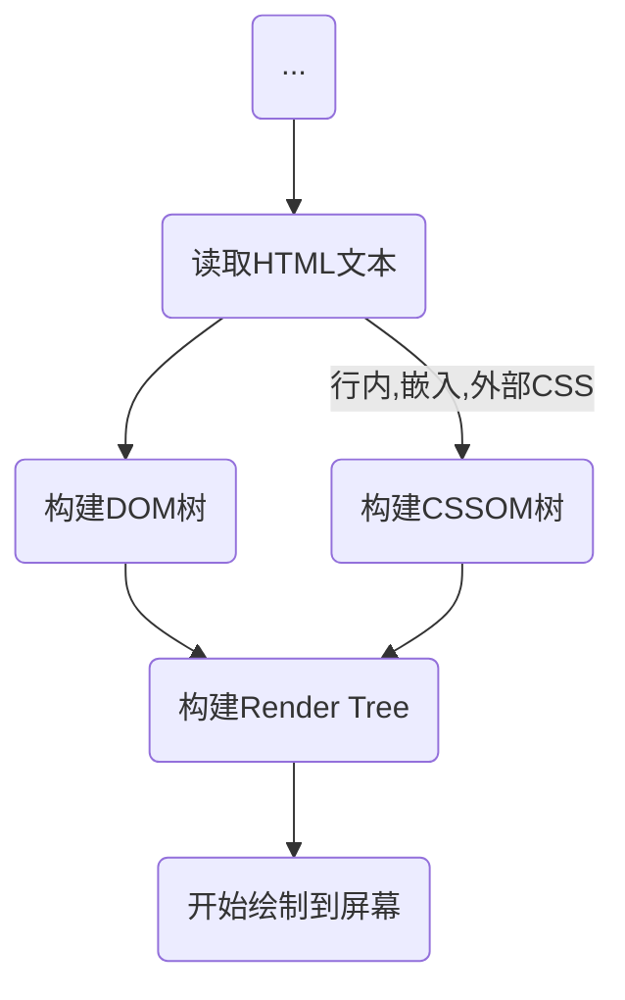

## DOM（Document Object Model）

> **DOM AST （DOM抽象语法树）**
>
> - 不同的elements有不同的JS对象，如`div`会被编译成`HTMLDivElement`
> - DOM API并不是JavaScript的标识符，通过DOM API（低级的，Render Tree中的DOM才是高级的），用户可以增加/删除HTML elements，改变它们的外表或者监听他们的事件

## CSSOM（CSS Object Model）

> 可以给HTML elements设置样式，也可以通过CSS选择器选中DOM，并且修改DOM的样式等
>
> **CSSOM AST（CSSOM抽象语法树）**
>
> - 在构建DOM之后，浏览器会读取所有CSS资源，构建CSSOM
> - 浏览器会使用开发者的样式覆盖用户代理样式`user agent stylesheet`（会由W3CCSS提供默认值）

## Render Tree

> 一棵结合了DOM和CSSOM的树
>
> - 浏览器使用这个Render Tree，计算所有可见elements的layout布局，并且开始绘制到屏幕上，如果Render Tree未构建，在屏幕上是看不到任何东西的
> - Render Tree代表了最终绘制到屏幕上的内容，所以**不包含像素矩阵中的任何区域的节点将不会包含在Render Tree中**，如`display: none`，`尺寸0px * 0px`的elements（这样的孩子节点也同样不会被包含在Render Tree中）。但是设置`visibility: hidden`，`opacity: 0`的elemnts依然会出现在Render Tree中，它们会占有屏幕的一部分区域
> - CSSOM默认是不会暴露给用户API的，但是通过Render Tree是结合DOM和CSSOM的特性，将会为DOM提供更多高级的API，这些API就包含了可以通过修改DOM的CSS属性来修改CSSOM

## How to load a website

### Layout operation

> 根据Render Tree计算每个节点的layout布局大小（最终绘制到屏幕上的），这个过程也可以成为**回流**，触发回流的情况有以下：滚动，缩放窗口，编辑DOM elements

### Paint operation

> 用户可以使用Render Tree中的DOM elements频繁修改外观、位置或图形属性，为此浏览为其创建了一个**图层**，使网页更高效地执行绘画操作。如滚动时，使用层可以帮助浏览器按照希望的方向（Z轴）正确绘制元素
>
> 拿到图层，开始绘制到屏幕上，每个图层并非绘制到单个图像上，而是分开被绘制，而在每一层上，浏览器会用元素的任何可见属性来填充各个像素，这个过程成为**光栅化**，为了提高性能，光栅化过程使用了不同线程来执行

### Compositing operation

> 在这个阶段，拿到所有的图层，让GPU来进行绘制。然而，尽管绘制以一个图层为单元，但也不会整个图层进行一次性绘制，因为每次回流或重绘都需要消耗很多性能，所以需要把图层分解成一个一个更小的块（pannel），**每次只需要单独绘制一个`pannel`**

以上就是典型的渲染流程

...

更好的用户体验

## Render blocking CSS & DOMContentLoaded

> - 浏览器接收到HTML文本后，开始从上到下构建DOM
>
>
> - 如果遇到`嵌入JavaScript`，**会同步进行解析，DOM解析被阻塞**
> - 如果遇到`嵌入CSS`，**不会阻塞DOM解析**
> - 如果遇到`<link ref="stylesheet">`元素，浏览器会发一个**异步请求加载外部CSS，非阻塞，外部CSS解析也不会阻塞DOM解析**
> - 如果遇到`link中使用了@import`语法，将在页面加载完成后被加载
> - 如果遇到`style中使用了@import`语法，和`link`一样
>
>
> - 如果遇到`<script src="">`元素，浏览器会请求加载外部JavaScript，**DOM解析被阻塞，直至这段外部JavaScript代码被下载并解析完成**
>
>
> - 如果遇到`<script async src="">`元素，浏览器会发起一个异步请求加载外部JavaScript，**下载过程非阻塞**。如果外部JavaScript加载回来了，则会**立即开始执行，阻塞DOM解析**
>
>
> - 如果遇到`<script defer src="">`元素，浏览器会发起一个异步请求加载外部JavaScript，**下载过程非阻塞**。即使外部JavaScript已经加载回来了，也会**等待DOM解析完毕再执行**
>
>
> - 注意：CSS本来不会阻塞DOM解析，但是**CSS的下载和解析都会阻塞其后同步script和普通script的JavaScript**，而这些JavaScript阻塞后面的DOM解析，**这种情况CSS加载间接影响了DOM解析**
> - CSSOM必需等待外部CSS下载并解析完成才能被构建完成，所以外部CSS会阻塞CSSOM的构建（**外部CSS下载是异步非阻塞，但解析是阻塞**），而CSSOM未能构建完成，意味着`onload`事件也会延迟被触发
>
> - `DOMContentLoaded [DCL]`事件在当初始的 **HTML** 文档被完全加载和解析完成之后（此时嵌入和外部js都已经加载完成），`DOMContentLoaded`事件被触发，而无需等待样式表、图像和子框架的完全加载。
>
> - `window.onload [L]`事件在文档装载完成后会触发。此时，在文档中的所有对象都在DOM中，所有图片，脚本，链接以及子框都完成了装载。 

## 参考

[DOM与CSSOM](https://medium.com/jspoint/how-the-browser-renders-a-web-page-DOM-cssom-and-rendering-df10531c9969)

