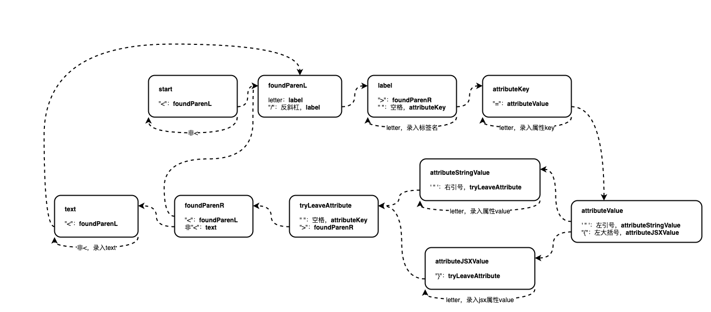
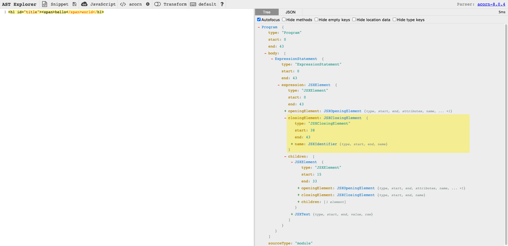
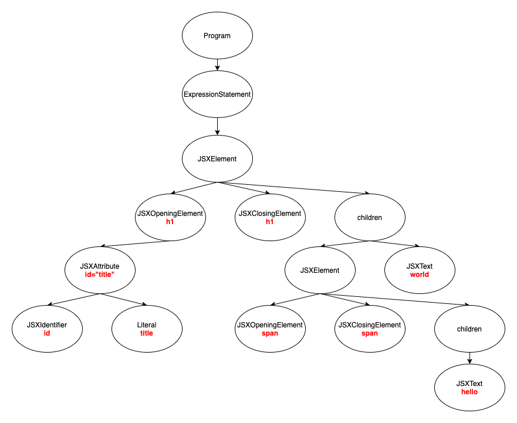
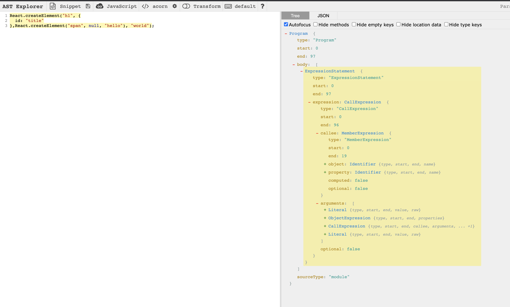

# 了解前端编译原理 - 编译器


## 前言

### 什么是编译器

> 可以把编译器理解成为一个语言翻译器。当中国人去英国旅游的时候，中国人说中文，但是，英国当地说英文，中文没办法使用，这个时候就需要翻译器，将中文转成英文，这样当地人就明白中国语言的意思了。有了翻译器，中国人就可以去任何语言的国家旅游了，很方便吧？！当然编译器的能力并不仅如此。
>
> 以下是本次分享的 Git 代码仓库：https://github.com/AngelPP52/tiny-compiler

为了方便理解编译器工作原理，这里用一张图直观地展现了编译器的整个生命周期。


1. 前端：指通用/高级语言，与端接触最紧密的程序代码。需要知道的是，前端代码只是给编译器读的，经过分词、语法分析、`AST`、遍历等一些系列编译行为可以转成结构化的信息，供后端使用。
2. 后端：生成目标代码，与目标机器有关。

前端涉及到编译原理的地方实在太多了，ES6 转 ES5，TS 转 JS，小程序端开发，安卓端开发等等...

编译原理无处不在，正如尤大所说，懂编译原理真的可以为所欲为。前端学习编译原理刻不容缓！


实际上，如果掌握了编译器原理，所有工程师都能随便写出一门语言的扩展语法！

### 简易的编译器

在 React 中，一段 JSX 代码，会被编译成`React.createElement(component, props, ...children) `函数的语法糖，再通过调用 React 内部 API 生成真实 DOM，最终渲染到页面上。

于是，为了搞明白编译器的工作原理，干脆自己实现一个简版的，一个将 JSX 代码转成纯 JS 代码的编译器。

> 前端代码：JSX 代码

```jsx
<h1 id="title"><span>hello</span>world</h1>
```
> 后端代码：JS 代码

```js
React.createElement("h1", {
  id: "title"
},React.createElement("span", null, "hello"), "world");
```
## 有限状态机

### 什么是有效状态机

有限状态机（英语：finite-state machine，缩写：FSM）又称有限状态自动机（英语：finite-state automation，缩写：FSA），简称状态机，是表示有限个状态以及在这些状态之间的转移和动作等行为的数学计算模型。


如图所示，用户从其他状态机进入 S1 状态机，如果用户输入 1，则继续进入 S1 状态机，如果用户输入了 0，则进入下一个状态机 S2。在 S2 状态机中，如果用户继续输入 1，则继续进入 S2 状态机，如果用户输入了 0，则回到 S1 状态机。这是一个循环的过程。

原理：根据输入状态决定下一个状态。程序从开始状态开始，进入下一个状态机，每个状态机可以决定进入的下一个状态机以及退出当前状态机的行为。由于这种约定好的行为特征都能通过特定代码来标识，所以只要事先与机器约定好状态，就能对输入的 A 语言字符拆分成目标分词结果。

状态机的特点：**退出状态机时，必须是进入下一个状态机，或者重复调用自己，或者结束状态机工作**。

### 分析状态机

在分析状态机之前，先整体观察一遍我们的 JSX 代码，得到一些特征：**单闭合标签、双闭合标签、解析标签属性**。

> 单闭合标签


单闭合标签的特征：中间没有孩子节点，以 < .. /> 的形式直接结束，如：

```html
<input id="input"/>
```

> 双闭合标签


双闭合标签的特征：中间有孩子节点，可以有文本普通节点、其他标签、JSX 表达式等，如：

```html
< button id="button" style={{width: 100}}>click me</button>
```

> 解析标签属性


表示 `key value`（属性名-属性值）的键值对。

回看我们的源代码，摘取了以下关键的信息：

```js
label：h1, span
attribute: id="title"
attribute key: id
attribute value: title
text: hello world
```

_通过正则表达式也能表实现分词的效果_

## 词法分析

编译器第一步：词法分析。

在这个阶段，我们的目标是将代码文本转化一个个 Token。**通过有限状态机的算法对源代码的每一个字符进行遍历，采集有效的 Token 和摒弃无效的 Token。**

### 如何识别 Token？

一串符合某种语言语法的字符串或操作符，都可以称为 `Token`。

可以将 Token 分为两部分，有效 Token 和无效 Token，与 AST 阶段关心的 Token 则认为是有效 Token，分词阶段需要借助无效 Token 来识别状态机，但最终会把无效 Token 剔除，留下有效 Token 到语法分析阶段。

针对上述 JSX 代码，大致可以区分一下：

- 有效 Token：标签名，属性名，属性值，Text。
- 无效 token：<、>、=、{、}、"、"等符号。

原理：运用有限状态机的原理，JSX 语法代码字符串逐个字符输入到功能状态机，由具体的功能状态机根据输入决定下一个状态。最终将所有结果 emit 出去（保存到 Token 数组）。

### 定义状态机

划分好了状态机，可以从状态机分析图直观统计出每个状态机的输入与输出关系，代码中就是用一些 `if else` 来表示。每个节点为一个有效状态机，根据状态的切换可以很容易得到具体的代码实现。




**start 状态机**

入口函数，只接收字符：<，进入 `foundParenL` 状态机。

```js
function start(char) {
    if (char === "<") {
        emit({ type: "parenLeft", value: "<" });
        return foundParenL;
    }
    return start;
}
```

**foundParenL 状态机**

开始解析 < 后面的字符。`letter` 作为标签名，/则作为闭合标签名，均进入 `label` 状态机。

```js
function foundParenL(char) {
    if (LETTERS.test(char)) {
        currentToken.value = char;
        currentToken.type = "label";
        return label;
    } else if (char === "/") {
        emit({ type: "backSlash", value: "/" });
        return foundParenL;
    }
    throw new TypeError("Error");
}
```

**label 状态机**

解析标签名后的字符。> 作为闭合标签标记，进入 `foundParenR` 状态机；空格作为属性标记，进入 `attributeKey` 状态机。

```js
function label(char) {
    if (LETTERS.test(char)) {
        currentToken.value += char;
        return label;
    } else if (char === " ") {
        // 空格不输出
        emit(currentToken);
        return attribute;
    } else if (char === ">") {
        emit(currentToken);
        emit({ type: "parenRight", value: ">" });
        return foundParenR;
    }
    throw new TypeError("Error");
}
```

**attributeKey 状态机**

解析标签名 + 空格后的字符。=作为属性名结束标记，进入 `attributeValue` 状态机。

```js
function attributeKey(char) {
    if (LETTERS.test(char)) {
        currentToken.value += char;
        return attributeKey;
    } else if (char === "=") {
        emit(currentToken);
        // emit({type: "equalSign", value: "="})
        return attributeValue;
    }
    throw new TypeError("Error");
}
```

**attributeValue 状态机**

解析属性名 + 等号后的字符。"作为普通属性值开始标记，进入 `attributeStringValue` 状态机；{作为 JSX 属性值开始标记，进入 `attributeJSXValue` 状态机。

```js
function attributeValue(char) {
    if (char === '"') {
        // emit({type: "quoMarkLeft", value: "\""});
        currentToken.value = "";
        currentToken.type = "attributeStringValue";
        return attributeStringValue;
    } else if (char === "{") {
        // emit({type: "bracketL", value: "{"});
        currentToken.value = "";
        currentToken.type = "attributeJSXValue";
        return attributeJSXValue;
    }
    throw new TypeError("Error");
}
```

**attributeStringValue 状态机**

解析属性名="后的字符。`letter` 作为属性值，进入 `attributeStringValue` 状态机；"作为属性值结束标记，进入 `tryLeaveAttribute` 状态机。

```js
function attributeStringValue(char) {
    if (LETTERS.test(char)) {
        currentToken.value += char;
        return attributeStringValue;
    } else if (char === '"') {
        emit(currentToken);
        // emit({type: "quoMarkRight", value:"\""})
        return tryLeaveAttribute;
    }
    throw new TypeError("Error");
}
```

**attributeJSXValue 状态机**

解析属性名={后的字符。`letter` 作为属性值，进入 `attributeJSXValue` 状态机；}作为 JSX 属性值结束标记，进入 `tryLeaveAttribute` 状态机。

```js
function attributeJSXValue(char) {
    if (LETTERS.test(char)) {
        currentToken.value += char;
        return attributeJSXValue;
    } else if (char === "}") {
        emit(currentToken);
        // emit({type: "bracketR", value:"}"})
        return tryLeaveAttribute;
    }
    throw new TypeError("Error");
}
```

**tryLeaveAttribute 状态机**

准备退出 `attribute` 的解析。

```js
function tryLeaveAttribute(char) {
    if (char === " ") {
        return attribute;
    } else if (char === ">") {
        emit({ type: "parenRight", value: ">" });
        return foundParenR;
    }
    throw new TypeError("Error");
}
```

**text 状态机**

解析普通文本。

```js
function text(char) {
    if (char === "<") {
        emit(currentToken);
        emit({ type: "parenLeft", value: "<" });
        return foundParenL;
    } else {
        // 文本内容
        currentToken.value += char;
        return text;
    }
}
```

分词结果：

```js
{ type: 'parenLeft', value: '<' }
{ type: 'label', value: 'h1' }
{ type: 'attributeKey', value: 'id' }
{ type: 'attributeStringValue', value: 'title' }
{ type: 'parenRight', value: '>' }
{ type: 'parenLeft', value: '<' }
{ type: 'label', value: 'span' }
{ type: 'parenRight', value: '>' }
{ type: 'text', value: 'hello' }
{ type: 'parenLeft', value: '<' }
{ type: 'backSlash', value: '/' }
{ type: 'label', value: 'span' }
{ type: 'parenRight', value: '>' }
{ type: 'text', value: 'world' }
{ type: 'parenLeft', value: '<' }
{ type: 'backSlash', value: '/' }
{ type: 'label', value: 'h1' }
{ type: 'parenRight', value: '>' }
```

## 语法分析

经过词法分析阶段，我们拿到了一个有效 Token 数组。

语法阶段需要完成的任务：**将一个数组转换成一棵有意义的树（`AST` ）**。

> 抽象语法树（Abstract Syntax Tree，AST），或简称语法树（Syntax tree），是源代码语法结构的一种抽象表示。它以树状的形式表现编程语言的语法结构，树上的每个节点都表示源代码中的一种结构。之所以说语法是“抽象”的，是因为这里的语法并不会表示出真实语法中出现的每个细节。

配合 [astexplorer](https://astexplorer.net/)，这是一个在线生成 AST 的工具。可以较准确看到源代码 JSX 对应的 AST 树，参考结果，我们可以实现自己的词法分析函数。



通常，数组结构转成树结构，是一个递归的过程，而递归需要关心两个条件：下一个递归的入口 + 退出当前递归的条件。

在这里，AST 树结构需要关心的节点有：顶层节点（`Program`）、标签节点（`h1`、`span`）、叶子/孩子节点（`id`、`title`、`hello`、`world`）。



总的来说，节点类型有，`JSXElement`（JSX 元素）、`JSXOpeningElement`（开标签，可能包含标签名和标签属性）、`JSXClosingElement`（闭合标签）、`JSXAttribute`（标签属性）、`JSXIdentifier`（JSX 标识符）、`JSXText`（文本节点）。

当遇到<且下一个为标签，记录一个 **JSXOpeningElement** 类型的节点。具体的处理程序：

```js
if (token.type === 'parenLeft' && token.value == '<' && next.type === 'label') {
  let node = {
    type: 'JSXElement',
    openingElement: null,
    closingElement: null,
    children: []
  }
  token = tokens[++current]; // 标签
  let labelName = token.value; // 标签名

  node.openingElement = {
    type: 'JSXOpeningElement',
    name: {
      type: "JSXIdentifier",
      name: token.value
    },
    attributes: []
  }

  token = tokens[++current]; // 跳过标签

  while (token.type != 'parenRight' && token.type === "attributeKey") { // walk 所有属性
    node.openingElement.attributes.push(walk());
    token = tokens[current];
  }

  token = tokens[++current]; // 跳过>单词
  next = tokens[current+1]; // 下一个单词，反斜杠
  next_next = tokens[current+2]; // 下一个单词，标签

  // 根据结束标签的标签名一致，中间的内容都是孩子节点
  while (token.type !== 'parenLeft' || token.type === 'parenLeft' && next.type !== 'backSlash' && next_next.value !== labelName) { // walk 所有孩子
    node.children.push(walk());
    token = tokens[current];
    next = tokens[current+1]; // 下一个单词，反斜杠
    next_next = tokens[current+2]; // 下一个单词，标签
  }

  node.closingElement = walk(node); // walk 闭合标签

  return node;
} 
```

当遇到<且下一个为/，记录一个 **JSXClosingElement** 类型的节点。具体的处理程序：

```js
else if(parent && token.type === 'parenLeft' && token.value == '<' && next.type === 'backSlash'){
  current++; // 跳过<单词
  token = tokens[++current]; // 闭合标签，跳过反斜杠
  current++; // 跳过标签
  current++; // 跳过>单词
  return parent.closingElement = {
    type: "JSXClosingElement",
    name: {
      type: "JSXIdentifier",
      name: token.value
    }
  }
}
```

当遇到 attributeKey，记录一个 **JSXAttribute** 类型的节点。具体的处理程序：

```js
else if(token.type === "attributeKey"){
  let next = tokens[++current]; // attributeValue // 只处理了 attributeStringValue 的情况
  let node = {
    type: "JSXAttribute",
    name: {
      type: "JSXIdentifier",
      name: token.value
    },
    value: {
      type: "StringLiteral",
      value: next.value
    }
  }
  current++; // 跳过 attributeValue
  return node
}
```

当遇到 text，近距离一个 **JSXText** 类型的节点。具体的处理程序：

```js
 else if(token.type === "text"){
   current++; // 跳过>单词
   return {
     type: "JSXText",
     value: token.value
   }
 }
```

## 访问器

**在遍历抽象语法树时，完成某种类型节点的"进入"或"退出"两个步骤则为一次访问**。

通常，访问器由用户自定义。例如压缩 `CSS` 时，可以对重复的样式节点进行删减，然后重新生成新的 `AST` 树。

访问器的形式可以是函数或是一个{`enter` ，`exist` }对象。

example：

```js
let code = '<h1 id="title"><span>hello</span>world</h1>';

let ast = parser(code);
traverse(ast, {
    JSXOpeningElement: {
        enter: function (node, parent) {
            console.log('进入开标签', node);
        },
        exit: function (node, parent) {
            console.log('退出开标签', node);
        }
    }
})
```

_访问器并非编译器中必须的一环，主要是为了对外开发一些操作 AST 树的能力_

## 遍历器

遍历 AST 树是编译器中最基本且至关重要的一环，也其中最需要考虑性能的一环。

递归遍历抽象语法树，树的遍历有几种方式，先序、中序、后序。

大多数场景下，在遍历 AST 树时，用户都希望能够先访问到父节点，所以这里采取了先序遍历方式，即先访问自己再依次访问孩子。

访问器的作用就表现在这一个阶段，在访问节点的前面调用 `enter` 函数，和结束访问节点的后面调用 `exist` 函数。

遍历器的实现：

```js
// 遍历器（JSX 语法树和 ReactJS 语法树）
// 访问器是用户自定义的

const { parser } = require('./parser');

function traverse(ast, visitor) {
    function traverseArray(array, parent) {
        array.forEach(function (child) {
            traverseNode(child, parent);
        });
    }

    function traverseNode(node, parent) {
        if(node && typeof node.replaceWith !== 'function'){ // 给每一个 node 添加一个 replaceWith 方法，用于替换父节点中的 node
            // 替换逻辑
            node.replaceWith = (newNode)=>{
                if(parent){
                    for (const key in parent) {
                        if (parent.hasOwnProperty(key)) {
                            if(parent[key] === node){
                                parent[key] = newNode;
                            }
                        }
                    }
                }
            }
        }
        var method = visitor[node.type];
        if (method) {
            node.node = node; // 添加一个 node 属性指向自己，转换器中是这样使用的 nodePath.node
            if (typeof method === 'function') {
                method(node, parent)
            } else if (method.enter) {
                method.enter(node, parent);
            }
        }
        switch (node.type) {
            case 'Program':
                traverseArray(node.body, node);
                break;
            case 'ExpressionStatement': // 表达式
                traverseNode(node.expression, node);
                break;
            // JSX 标签的遍历
            case 'JSXElement': // JSX 标签
                traverseNode(node.openingElement, node);
                traverseNode(node.closingElement, node);
                traverseArray(node.children, node);
                break;
            case 'JSXOpeningElement': // 开标签
                traverseNode(node.name, node); // 标签名
                traverseArray(node.attributes, node);
                break;
            case 'JSXAttribute': // 属性
                traverseNode(node.name, node); // 属性名
                traverseNode(node.value, node); // 属性值
                break;
            case 'JSXClosingElement': // 闭合标签
                traverseNode(node.name, node); // 标签名
                break;
            case 'JSXIdentifier': // 属性名
                break;
            case 'StringLiteral': // 字符串属性值，字符串参数
                break;
            case 'JSXText': // 文本
                break;
        }
        if (method && method.exit) {
            node.node = node; // 同样，也需要添加一个 node.node 属性
            method.exit(node, parent);
        }
    }

    // 开始遍历 ast
    traverseNode(ast, null);
}
```

## 转换器

实际上，遍历阶段并不能对 AST 树产生任何副作用，它只有遍历访问的作用。

如果想要将一段 JSX 代码转成纯 JS 代码，必须依靠转换器，所以转换器的职责就是：**将已有的一棵 AST 树转成一颗目标 JS 代码的 AST 树**。

我们先通过 `astexplorer` 网站看一下最终要生成的 AST 树长什么样：



对比之前的节点，新的 AST 树中的节点类型都发生了明显的变化，如变成了以下几种：`nullLiteral`（null 对象）、`memberExpression`（函数参数）、`identifier`（某些特征值）、`stringLiteral`（字符串类型）、`objectExpression`（对象表达式）、`objectProperty`（对象属性）、`callExpression`（函数类型）。

为了能让我的转换器运行起来，模仿 `babel` 编译的方式，需要自定义一些接口和类，如：节点替换函数 `replaceWith`，节点类型判断类 `t`。由于篇幅问题，具体请看 `Git` 仓库。

转换器的实现：

```js
// 转换器（loader 的作用）

const { traverse } = require('./traverse');
const { parser } = require('./parser');
...
function transformer(ast) {
    traverse(ast, {
        JSXElement(nodePath) {
            const next = (node) => {
                if (!node) return t.nullLiteral();
                // JSX 标签节点
                if (t.isJSXElement(node)) {
                    // React.createElement 函数
                    let memberExpression = t.memberExpression(
                        t.identifier("React"),
                        t.identifier("createElement")
                    );
                    // 函数参数列表
                    let _arguments = [];
                    // 标签
                    let stringLiteral = t.stringLiteral(node.openingElement.name.name);
                    // 属性
                    let objectExpression = node.openingElement.attributes.length
                        ? t.objectExpression(
                            node.openingElement.attributes.map((attr) =>
                                t.objectProperty(t.identifier(attr.name.name), attr.value)
                            )
                        )
                        : t.nullLiteral();
                    _arguments = [stringLiteral, objectExpression];
                    // 递归处理子节点
                    _arguments.push(...node.children.map((item) => next(item)));
                    return t.callExpression(memberExpression, _arguments);
                } else if (t.isJSXText(node)) {
                    // JSX 文本节点
                    return t.stringLiteral(node.value);
                }
            };
            let targetNode = next(nodePath.node);
            nodePath.replaceWith(targetNode);
        },
    });
}
```

## 生成器

还记得，在词法分析阶段中，我们把代码转成了 `Token` 数组，在语法分析阶段中，我们把 `Token` 数组转成了 `AST` 树，在转换器阶段，我们把一颗旧的 `AST` 树转成了新的 `AST` 树。

为了最终拿到的是一串纯 JS 代码字符串，而不是一个 JS 对象，在生成器阶段，我们需要把一颗 AST 树转成目标代码的字符串形式。

简单来说，就是又要遍历树，然后把一个个节点换成代码字符串（代码中的 swtich case），**最终把他们拼接成一个字符串**。

生成器的实现：

```js
// 生成器（只生成 ReactJS 代码）

function codeGenerator(node) {
    switch (node.type) {
        case 'Program':
            return node.body.map(codeGenerator).join('\n');
        // ReactJS 的代码生成器
        case 'ExpressionStatement':
            return (
                codeGenerator(node.expression) + ';'
            );
        case 'MemberExpression':
            return (
                codeGenerator(node.object) +
                '.' +
                codeGenerator(node.property)
            )
        case 'ObjectExpression':
            return (
                '{' +
                node.properties.map(codeGenerator).join(', ') +
                '}'
            )
        case 'ObjectProperty':
            return (
                codeGenerator(node.key) +
                ':' +
                codeGenerator(node.value)
            )
        case 'CallExpression':
            return (
                codeGenerator(node.callee) +
                '(' +
                node.arguments.map(codeGenerator).join(', ') +
                ')'
            );
        case 'Identifier':
            return node.name;
        case 'NumberLiteral':
            return node.value;
        case 'StringLiteral':
            return '"' + node.value + '"';
        case 'NullLiteral':
            return '"null"'
        default:
            throw new TypeError(node.type);
    }
}
```

## 最后

以上就是本次的所有分享，希望您看到这里能有所收获。

才疏学浅，如有讲述不清之处，还请指正，共同进步。

## 参考资料

- https://github.com/jamiebuilds/the-super-tiny-compiler

