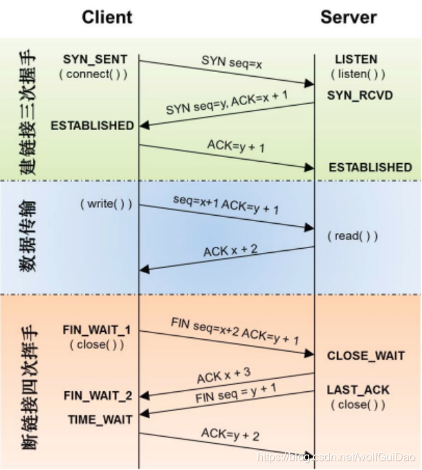
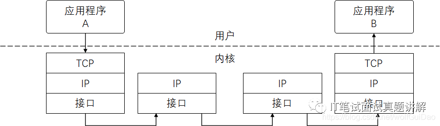

## TCP/IP四层模型

- 数据链路层（物理层）
- 网络层
- 传输层
- 应用层

## OSI 七层协议

- 物理层（电信号）
- 数据链路层（数据帧）
- 网络层（路由交换）
- 传输层（数据报文）
- 会话层（验证登录）
- 表示层（加密解密）
- 应用层（接口）

| **应用层**            | HTTP、FTP、TFTP、SMTP、SNMP、DNS |
| --------------------- | -------------------------------- |
| **传输层**            | **TCP、UDP**                     |
| **网络层**            | **ICMP、IGMP、IP、ARP、RARP**    |
| **数据链路层/物理层** | **由底层网络定义的协议**         |

## HTTP

> 应用层协议

特点：

- 支持C/S模式
- 使用简单快速，只需要请求方法 + 路径 + 请求体即可
- 传输数据类型很灵活，通过设置`Content-Type`加以标记
- 无连接：每次连接只处理一个请求，这种方式节省传输时间。响应头加上`Connection：Keep-Alive`开启长连接来节省资源
- 无状态：对于事务处理没有记忆能力。`Cookie`，`Session`，`token`，使请求带有状态信息。

概念：

- 长连接：没使用长连接之前，每个请求都需要建立 TCP 连接和断开 TCP 连接。而启用长连接后，建立 TCP 连接后，可以一次性发送请求！
- 管线化：没有管线化之前，下一个请求必须等待上一个请求的响应回来后再发出去。而管线化之后，可以不用等待就直接发送下一个请求！
- 影响 HTTP 网络请求的因素主要有两个：`带宽和延迟`

## HTTP1.1

- 加入了`Cache-Control` - 强缓存与配合协商缓存一起使用
- 加入`If-None-Match` - 协商缓存（内容唯一标识 hash 值）

较 HTTP1.0：

- `缓存处理`：强缓存/协商缓存，304 状态码
- `带宽优化以及网络连接的使用`：断点续传，206 状态码
- `错误通知的管理`
- `Host 头处理`
- `长连接`：开启长连接`Connection: keep-alive`

## HTTP2.0

较 HTTP1.x：

- `新的二进制格式`：HTTP1.x 的解析是基于文本。文本的表示形式多样性，对于文本协议的格式解析存在天然缺陷，做到健壮性需要考虑的场景也会很多。而二进制则不同，只认 0 和 1
- `多路复用`：连接共享，即每一个 request 都是用作连接共享机制的，每个连接可以有多个 request，接收方是根据 request id 将 request 归属到各自不同的服务端请求里面。
- `header 压缩`：使用 encoder 来减少需要传输的 header 大小，而且通讯双方各自缓存一份 header fields 表，避免 header 重复的传输，减小需要传输的数据大小
- `服务器端推送`：server push 功能。意思就是，当你请求 index.html 的时候，服务端可以帮你把 main.js 一起返回来给你，当客户端请求 main.js 的时候就可以去缓存里面找了，不用再发起请求

> 多路复用对比长连接：
>
> 长连接：若干个请求排队串行化单线程处理，阻塞型
>
> 多路复用：多个请求可同时在一个连接上并行执行，非阻塞型

> 刷新网页，浏览器和服务器会维持 TCP 链接一段时间，所以刷新之后 TCP 不需要重新连接，SSL 也是用之前的

> 浏览器对同一`Host`**最多允许建立 6 个 TCP 连接**
>
> 如果资源都是 HTTPS 连接并且在同一个域名下，那么浏览器在 SSL 握手之后会和服务器协商使用 HTTP2，如果用不了 HTTP2/HTTPS，那么就会建立多个 TCP 连接（根据浏览器而定），而这些连接会在空闲的时候被浏览器用来发送新的请求，**如果这些连接都被占用，那其他请求就只能等**

## HTTPS

- HTTP基础上加了个SSL/TLS
- 握手时（凭证交换和验证）
- 记录协议（数据进行加密）

较 HTTP：

- HTTPS 需要到 CA 申请证书
- HTTPS运行在SSL/TLS上，SSL/TLS运行在TCP之上，所有传输的内容都是经过加密的
- HTTPS 默认端口是 443
- HTTPS 可以防止运营商劫持

**对称加密算法**

特点：双方拥有同一个密钥

弊端：加密和解密都是同一个密钥，这样密钥是很容易被中间人获取到，对传输的信息进行窥视和篡改

**非对称加密算法**

特点：双方协商一对密钥，后台拥有唯一的密钥，每个人都可以有一个公钥。使用密钥加密的数据，只有对应的公钥能解密，使用公钥进行的加密也只有私钥能解密

弊端：算法很慢

> 加密只是为了保证传输过程不是明文传输，但不能防止中间人篡改
>
> 注意：无论使用哪种算法，都无法避免中间人攻击，获取公钥，这样中间人可以拦截你的公钥，并且给你发放一个假的公钥，让你后面跟中间人服务器进行通信，这就很有可能会暴露一些敏感信息

**确认身份 - 数字证书**

> 需为了确保客户端拿到的公钥是服务端发放的，而不是中间人篡改后的
>
> 客户端在收到公钥时，需要验证这个公钥是否合法
>
> 具体做法：后台与前端在握手时约定好的一个 hash 算法，消息摘要是后台通过这个 hash 算法对信息进行加密后得到的一串字符，数字签名是使用`CA 的私钥`对消息摘要进行加密后的结果，后台将`数字签名`+`包括后台公钥在内的其他信息`（这个称为数字证书）发放给客户端，客户端拿`CA 的公钥`对这个数字签名进行解密得到消息摘要①，使用 hash 算法对`其他信息`进行解密得到消息摘要②，如果两者相同，则认为这个公钥就是可信的

## TCP/IP

我们称之为`协议簇`。也就是 TCP/IP 协议簇不仅包括了 TCP 协议和 IP 协议，还有其他 UDP、ICMP、ARP 等，共同构成了一个复杂但有层次的协议栈。

TCP 协议的全称是`Transmission Control Protocol`，意思是`传输控制协议`，是一个靠谱的协议，保证数据不丢失。

IP 协议的全称是`Internet Protocol`，它主要解决的是通信双方寻址的问题。IP 协议使用`IP 地址`来标识互联网上每一台计算机，根据 IP 地址进行信息交换。

### TCP 真的靠谱吗？

`TCP 保证可靠性：`

- 序列号、确认应答、超时重传

  数据到达接收方，接收方需要发出一个`确认应答`，表示已经收到数据段，并且`告诉发送方下一次需要接收的数据序列号`

  如果超过一定时间`发送方仍未收到确认应答`，那么可能是发送数据丢失了，或者确认应答丢失了，这时发送方在`等待一定时间后进行重传`

- 窗口控制与高速重发控制/快速重传（重复确认应答）

  这种方式就是不需要一直等待确认应答再进行发送下一段数据

  在这个窗口大小内，不用等到应答才能发送下一段数据

  如果丢失了某一段 1001~2000 数据，后面数据每次传输，都会`不断地发送`序号为 1001 的应答，发送端如果`收到 3 次相同的应答就会立刻重发`

  即使应答丢失了，也没不会进行重发，因为`只要接收方发现丢失了某段数据，就会一直发应答`

- 拥塞控制

  `窗口不能定的太大，否则会造成网络拥堵`，TCP 在防止这种情况而使用了拥塞控制，严控窗口的大小

- 慢启动

- 拥塞避免

- 快速重传

- 连接机制

  

  **三次握手的原因**

  因为每次传输数据都会告诉对方序列号，数据到达接收方，接收方需要发出一个确认应答，表示已经收到该数据段，并且确认序号会说明它下一次需要接收的数据序列号，三次握手刚好可以互相确认序号，而两次握手只能确认一方的序列号

  **四次挥手**

  TCP 连接是双全工的，因此每个方向都需要单独进行关闭

  `TCP 并不能保证它所发数据的可靠传输`

  

- `TCP 只能保证端到端的通信上，但无法保证应用层的可靠`
- IP 协议是个不靠谱的协议
- TCP 已经 ACK 的数据包实际上不一定会抵达应用进程，虽然接收端 TCP 刚对数据进行 ACK，应用程序还没有读走，就崩溃了
  
  - 针对这种情况，我们采用的是应用层 ACK

## DNS

DNS 全称是`Domain Name System`，称之为域名系统

## URI/URL

URI 全称是`Uniform Resource Identifier`，称之为统一资源标识符。它能唯一地标识互联网上的资源

URL 全称是`Unitform Resource Location`，称之为统一资源定位符。实际上就是 URI 的一个子集

## 参考

[HTTP1.0、HTTP1.1 和 HTTP2.0 的区别](https://www.cnblogs.com/heluan/p/8620312.html )

[TCP 真的可靠吗](https://www.cnblogs.com/heluan/p/8620312.html)

[面试官问我：一个 TCP 连接可以发多少个 HTTP 请求？我竟然回答不上来...](https://www.jianshu.com/p/df793cd62cf3)