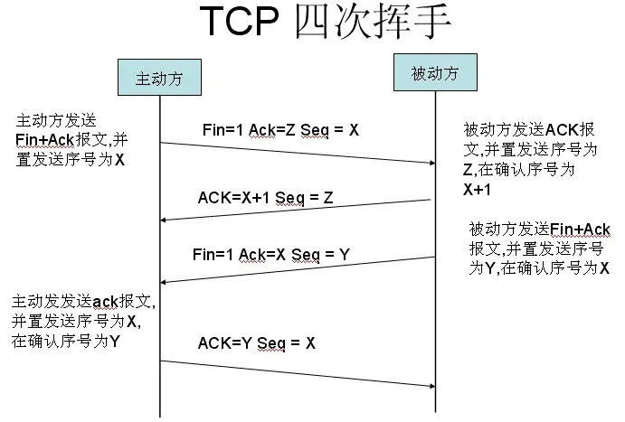

### 三次握手

A ==> B：我要跟你连接啦！

B ==> A：我已收到你的连接请求啦！你可以开始和我创建连接啦！（SYN 与 ACK 可以同时发送）

A ==> B：我已收到你的允许啦！我现在开始给你发数据啦！

> ACK 确认序号：接收者根据对方发过来的 Seq 的值 +1。回复报文时，告诉对方确认序号要从发过来的 Seq+1 开始计算
>
> 发送 SYN 报文时，需要把 SYN 置为 1
>
> Seq 的值不是固定的

### 四次挥手

A ==> B：我准备断开与你的连接啦！

B ==> A：我已收到你的断开请求啦！但我可能还有数据未发送完毕哦~

B ==> A：我的报文已经发完了，我准备断开与你的连接啦！

A ==> B：收到你的同意断开的信号，我们可以完全断开啦！

