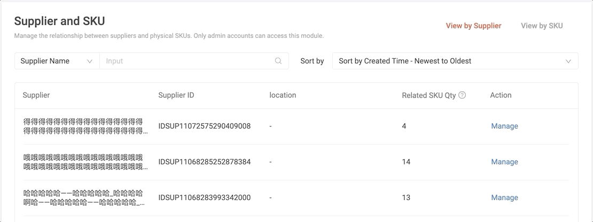

# 一次性解决完 ES 组件带来的隐藏问题

## 背景

模糊搜索组件是供应链团队一个十分常用的业务组件。几乎每一个列表页，都离不开搜索功能。然而，就算我们已经对这个业务组件做了尽可能完善的封装，却还是在组件繁多的回调以及复杂的业务要求中重复踩了很多的坑。

而这一次后，我再也不想听到 QA 因为 `ES` 搜索出现了前端的问题而找到我。

> 本次分享所需的代码，可配合文章一起服用：https://git.garena.com/shopee/bg-logistics/wms-lite/wms-lite-fe/-/tree/master/src/hooks

那么，在开始正文之前，需要大家对我们以前的回调代码有一个初步的认识。注意请不要看完所有代码，有个整体的了解即可。

> `EsSearch` 组件。

```tsx
// ES搜索1
<span style={{ marginRight: 8 }}>{translate('filtersku.product')}</span>
<EsSearch
  url={`/api/es/autocomplete/product_name?include_delete=${includeDelete}`}
  esDocName="product_name"
  onChange={(value: any) => {
    setSearchModel({
      ...searchModel,
      product_name: value,
      search_type: value ? 1 : undefined
    });
  }}
  onSelect={(value: any) => {
    const newPager = { pageno: 1 };
    const newSearchType = value ? 0 : lastSearchTypeSku;
    const newSearchModel = {
      product_name: value,
      search_type: newSearchType
    };
    lastSearchTypeProduct = newSearchType;
    beforeLoadList(newPager, newSearchModel);
  }}
  onPressEnter={(value: any) => {
    const pressLastSelected = searchModel.product_name === value && !searchModel.search_type;
    if (pressLastSelected) return;
    const newPager = { pageno: 1 };
    const newSearchType = value ? 1 : lastSearchTypeSku;
    const newSearchModel = {
      product_name: value,
      search_type: newSearchType
    };
    lastSearchTypeProduct = newSearchType;
    beforeLoadList(newPager, newSearchModel);
  }}
  />

// ES搜索2
<span style={{ marginRight: 8 }}>{translate('filtersku.variation')}</span>
<EsSearch
  url={`/api/es/autocomplete/sku_name?include_delete=${includeDelete}`}
  esDocName="sku_name"
  onChange={(value: any) => {
    setSearchModel({
      ...searchModel,
      sku_name: value,
      search_type: value ? 1 : undefined
    });
  }}
  onSelect={(value: any) => {
    const newPager = { pageno: 1 };
    const newSearchType = value ? 0 : lastSearchTypeProduct;
    const newSearchModel = {
      sku_name: value,
      search_type: newSearchType
    };
    lastSearchTypeSku = newSearchType;
    beforeLoadList(newPager, newSearchModel);
  }}
  onPressEnter={(value: any) => {
    const pressLastSelected = searchModel.sku_name === value && !searchModel.search_type;
    if (pressLastSelected) return;
    const newPager = { pageno: 1 };
    const newSearchType = value ? 1 : lastSearchTypeProduct;
    const newSearchModel = {
      sku_name: value,
      search_type: newSearchType
    };
    lastSearchTypeSku = newSearchType;
    beforeLoadList(newPager, newSearchModel);
  }}
  />
```

可以看到，只是为了实现页面上的两个 ES 功能，就要写到 100 行代码，这种代码如果嵌套在业务逻辑里面，有时会很让人摸不着头脑。

除此之外，细心的同学已经发现，虽然是两个 ES 功能，但是其 `onChange`、`onSelect`、`onPressEnter` 回调函数里面的处理逻辑却惊人地相似，而且惊人地难阅读。

> `SelectInput` 组件，一个可以配置支持 ES 搜索、或精确搜索的组件。

```tsx
<SelectInput
  customQuery={customQuery}
  onSelect={() => {
    const newPager = { ...pager, current: 1 };
    const newSearchModel = {
      ...searchModel,
      platform_product_name: null,
      physical_product_name: null,
      physical_sku_id_barcode: null,
    };
    setPager(newPager);
    setSearchModel(newSearchModel);
    getSalesOrderList(newPager, filterModel, sorterModel, newSearchModel);
  }}
  onEsSearchSelect={(value: any) => {
    const newPager = { ...pager, current: 1 };
    const newSearchModel = {
      ...searchModel,
      platform_product_name: null,
      physical_product_name: null,
      physical_sku_id_barcode: null,
      ...value,
      search_type: 0
    };
    setPager(newPager);
    setSearchModel(newSearchModel);
    getSalesOrderList(newPager, filterModel, sorterModel, newSearchModel);
  }}
  onPressEnter={(value: any) => {
    const newPager = { ...pager, current: 1 };
    const newSearchModel = {
      ...searchModel,
      platform_product_name: null,
      physical_product_name: null,
      physical_sku_id_barcode: null,
      ...value,
      search_type: 1
    };
    setPager(newPager);
    setSearchModel(newSearchModel);
    getSalesOrderList(newPager, filterModel, sorterModel, newSearchModel);
  }}
  onChange={(value: any) => {
    if (Object.keys(value).includes('physical_sku_id_barcode')) {
      const newPager = { ...pager, current: 1 };
      const newSearchModel = {
        ...searchModel,
        platform_product_name: null,
        physical_product_name: null,
        physical_sku_id_barcode: null,
        ...value
      };
      setPager(newPager);
      setSearchModel(newSearchModel);
      delayedFetch(newPager, filterModel, sorterModel, newSearchModel, activeKey);
    }
  }}
  />
```

简直可怕！这一段代码足足 100 余行，正常的 `VS Code` 编辑器中一个屏幕最多只能看 50 行左右，这意味着，你想一眼看清楚这里的计算逻辑，根本不可能。为了读懂这里面的逻辑，必须重复上下滚动，我想大部分开发者都已经望而却步。

如果没有人跟你解释 `onSelect`、`onEsSearchSelect`、`onPressEnter`、`onChange` 分别什么含义，以及回调具体的生命周期，我想你已经没有阅读下去的勇气了。

更何况让你每次写类似的功能，而这些隐藏逻辑都永远不会在你的 `checklist` 里，出现 bug 了就只能哭爹喊娘 [doge]。

当然，以上两个案例只是一个小小的缩影，要知道的是，通过检索 MyStock 项目的代码后发现，`EsSearch` 组件的使用次数已达到 25 次（20 个文件），`SelectInput` 组件的使用次数已达到 15 次（13 个文件）。

只要出现一个问题是与业务不对齐，就有可能修改 40 处，阅读至少 (25 * 50 + 15 * 100) 行的代码，在 33 个文件之间反复横跳。试问谁想做这样的优化需求呢？ 

“这下是不是有了需求被迫 delay 的好借口 [doge]”。

## 正文

当然，上面一句只是玩笑话，发现了问题，我们就需要寻求解决问题之道。

我想应该没有人喜欢在反反复复的修改中消耗时间，就像一个“美丽”的 `PRD` 一样能让人拥有一天“美丽”的“好”心情。

经过仔细统计，以及与业务和其他前端开发进行了对齐之后，我总结了以下目前几个需要统一解决的问题：

1. 统一的防抖策略。
2. 一种异常发起请求的场景：先选中再回车。
3. 一个向下兼容的处理：SelectInput 组件的一个不友好用法。
4. 输入就触发，实现系统交互操作的统一。
5. 空字符串、空白字符串的特殊处理。
6. 兼容多个 ES 组件存在的场景（以及 `EsSearch`、`SelectInput` 混用场景）。
7. 彻底地与业务逻辑解藕。
8. 对4、5个回调彻底说拜拜，极大降低 ES 组件的使用成本；独立的 `hooks` 使 ES查询逻辑具备了可维护性，而且极大提高了拓展性。

> 在开始一一阐述以上问题前，我想先让大家感受一下 2.0 重构后的 `demo` 代码：
>
> _注释：1.0 重构的代码是写了一个 `reducer` 去处理复杂的回调，但未实现与业务代码解藕以及使用自定义 `hook`_

```tsx
 // 由 hook 内部完成计算，并且更新到 esState 中 
const [esState, esProps] = useEsSearchOnChange(selectOptions); // selectOptions 为使用 SelectInput 组件应有的配置

<SelectInput
  selectOptions={selectOptions}
  {...esProps}
  selectProps={{
    defaultValue: 'product_name',
      style: { width: 160 },
        dropdownMatchSelectWidth: 336
  }}
  />
...
 <ProTable 
   searchModel={esState} // 结合Protable，自动完成请求
   ...
   />
```

有没有瞬间感觉幸福指数飙升？

再也不需要管理复杂的回调生命周期，再也不需要在每个业务需求中做额外的 `checklist`，再也不用为了阅读一段 100 行的代码而耗费了大量时间。。。

### 整体思路

问题已经整理完毕，重构后前端使用 ES 组件感受完毕。接下来来我先介绍一下重构的整体思路。

利用 `React.useReducer` 可以使用一个 `reducer` 函数作为 state 的特性，在函数内部对 ES 组件那几个复杂的回调函数进行整合处理。而外界（指使用方）只需要关心 `useReducer` 返回的状态即可。如上述 `demo` 代码的 `esState`。

我们使用 `useReducer` 返回的 `dispatch`，给外界（指使用方：ES 组件）提供一个更新 `state` 的方法对象，如上述 `demo` 代码的 `esProps`：

```tsx
{
      onChange: (value: any) =>
        debounceDispatch({ payload: value, type: 'onChange', isEsSearch }),
      onPressEnter: (value: any) =>
        debounceDispatch({ payload: value, type: 'onPressEnter', isEsSearch }),
      onEsSearchSelect: (value: any) =>
        debounceDispatch({ payload: value, type: 'onEsSearchSelect', isEsSearch }),
      onSelect: (key: any) =>
        debounceDispatch({ payload: key, type: 'onSelect', isEsSearch })
}
```

当 ES 组件的行为导致某个回调被触发时，会根据回调的类型 `type` 走到对应的计算逻辑，如 `onPressEnter` 回调对应  `onPressEnter` 类型。

接下来，我们要关注的点就是如何写这个 `reducer`。

### 统一的防抖策略

基于 `lodash/debounce`，我们团队已经封装过一个 `useDebounce` 的 `hook`。传入 **需要防抖的回调**、**防抖时效**、**防抖函数配置**、**需要关注的依赖**，即会返回一个支持防抖的函数。

关于这个 hook 使用后感，我们组内的小伙伴有总结过一篇文章，有兴趣可以学习一下：https://confluence.shopee.io/pages/viewpage.action?pageId=532416632

```tsx
import { DependencyList, useEffect, useRef } from 'react';
import debounce from 'lodash/debounce';
import { DebounceSettings } from 'lodash';

const useDebounce = (
  initialFn: any,
  delay = 200,
  options: DebounceSettings = { leading: true },
  deps: DependencyList = [delay, initialFn]
) => {
  const fnRef = useRef(debounce(initialFn, delay, options));
  useEffect(() => {
    fnRef.current = debounce(initialFn, delay, options);
    return fnRef.current.cancel;
  }, deps); // eslint-disable-line react-hooks/exhaustive-deps
  return fnRef.current;
};

export default useDebounce;
```

在 `useEsSearchOnChange` 中使用 `useDebounce` :

```tsx
const [state, dispatch] = useReducer(reducer, {});
  const debounceDispatch = useDebounce(
    dispatch, // 对 dispatch 进行防抖，实际上外界调用的是 debounceDispatch
    300,
    { trailing: true },
    []
  );
```

### 一种异常场景

异常场景的回顾：


具体的操作为：先选中 `ES` 结果中的一个，然后直接回车，可以看到列表被刷新了。

异常的地方就在于，本来选中的时候应该是`精确搜索`，但是如果用户无意中点击了回车，将触发了页面上的两件事：

1. ES 组件选择器展开；
2. 发起一个`模糊搜索`。

这导致了，用户想要`精确搜索`，却看到了`模糊搜索`的结果。

问题的根因就是，`ES` 业务组件内部对回车事件无法确定是想要模糊搜索还是想要展开选择器，`enter` 事件的职责从根本上是不确切的，所以要通过改 ES 业务组件来达到效果是不太科学的。

最后，为了不让用户对这里的功能存疑，我们的解决方案是：

如果上次用户未修改选中的结果，那么就认为用户还是希望看到精确搜索的结果。

对应的处理逻辑：

```tsx
const reducer = (state: any, action: ActionType) => {
  ...
  // 先精确搜索再模糊搜索：先选中再回车。不发起请求。
  if (type === 'onPressEnter') {
    const pressLastSelected =
      !state.search_type && state[key] && state[key] === value;
    if (pressLastSelected) return state;
  }
  ...
};
```

### 一个向下兼容的处理

由于 `SelectInput` 组件的作者在封装时，对 `EsSearch` 组件的 `onSelect` 回调手动触发了外层的 `onChange` 导致的一个问题：

```tsx
const handleValueChange = (value: any) => {
  ...
  onChange({ // 这个触发没有意义的，却给用户带来了很多麻烦
    [selectedOption.value]: value,
  });
};
<EsSearch
 ...
  onSelect={(value: string) => {
    ...
    handleValueChange(value);
    ...
  }}
  ...
  />
```

为了不导致网页出现 `Bug`，每个用户都要在 `SelectInput` 组件中加这样的一段代码，以修复 `onChange` 回调带来的隐患：

```tsx
<SelectInput
  ...
  onChange={(value: any) => {
    // 这段代码给业务代码增加了不必要的阅读困难
    if (Object.keys(value).includes('physical_sku_id_barcode')) {
      ...
    }
  }}
  ..
  />
```

基本没人能猜测到：这个判断是为了在 `onChange` 中只允许非 ES 的搜索而禁止 ES 的搜索。

所以，为了避免业务逻辑中额外的阅读成本，我在 `useEsSearchOnChange` 中做了这样的处理，解决这个向下兼容的问题：

```tsx
const reducer = (state: any, action: ActionType) => {
  ...
  // type:esSearch onChange事件不处理，不发起请求。
  if (typeof payload === 'object' && type === 'onChange') {
    if (isEsSearch(key)) return state;
  }
  ...
};
```

### 输入即请求

这是以前规范的交互示例：



这是现在规范的交互示例：


区别在于，用户停止输入后，是否发起一个请求（这是一个精确搜索的请求）。

通过阅读 `SelectInput`的代码发现，对 `EsSearch` 组件的 `onChange` 回调处理有提供一个 `onEsSearchChange` 的回调，使用 `SelectInput` 的用户可以监听此回调来实现输入即请求的功能。

既然是一次性解决 `ES` 组件带来的隐患，自然少不了为 `useEsSearchOnChange` 补上一段逻辑，以支持【输入即请求】：

```TSX
const reducer = (state: any, action: ActionType) => {
  ...
  // 每次触发 dispatch 都清空。
  const newState = {};
  switch (type) {
    ...
    case 'onEsSearchChange': // 输入就触发请求
      Object.assign(
        newState,
        payload,
        value && isEsSearch(key) ? { search_type: 1 } : {}
      );
      break;
    case 'onSelect':
      break;
    default:
  }
  return newState;
};
```

`reducer` 返回了一个新的对象，所以 `esState` 会被更新为新的状态，从而触发 `ProTable` 自动请求的逻辑，最终达到目的。

### 特殊字符的特殊处理

从后台的接口规范中得知，如果参数为空或空白字符，会被认为是一段无意义的传参。

实际上 `axios` 已经帮我们做了类似的事情，如我们传参 `{a: null}` 或者 `{a: undefined}`，参数 `a` 则不会被传到后台。

这里处理比较简单，没有什么技术含量，请直接看代码：

```tsx
const reducer = (state: any, action: ActionType) => {
  ...
  // 空、空白的字符不带到请求参数。
  if (!value || !value.trim()) {
    return {};
  }
  ...
};
```

### 兼容多个 ES 组件

多个ES组件存在几种组合：

1. `EsSearch + EsSearch`
2. `SelectInput + SelectInput`
3. `EsSearch + SelectInput`

为何需要做这样的兼容工作？还是从实际场景去看，注意观察右侧打印：


仔细的同学已经发现，`ES` 组件 1 与 ES 组件 2 同时参与查询的时候是没有问题的，使用模糊搜索或者精确搜索都以最后一次操作为准。

但是，在两个组件同时有值的同时，去清空其中一个组件的值，可以发现，一定发起了精确搜索。这是因为清空动作对应的回调是：`onEsSearchSelect`，可以从 `onEsSearchChange` 看到这个回调类型表示是精确搜索。

不得不说，`ES` 组件是非常复杂的，一部分是因为业务场景比较多，另一部分也表现在组件本身提供了很多职责不够清晰的回调。

再与业务方对齐，得到的结果是：

一定发起精确搜索的逻辑是不符合用户习惯的，应该改成，记忆用户对每个 ES 组件的操作，并且能够在清空其中一个时，能恢复另外一个组件最后一次操作的结果。

翻译过来的意思就是：如果组件 1 最后一次是精确搜索，组件 2 最后一次是模糊搜索，清空组件 1 的内容，这个时候应该以组件 2 的最后一次操作为准，发起一个模糊搜索而不是精确搜索。

可以解决的一种方案：

```tsx
// 在调用方合并 esState
const [esState1, esProps1] = useEsSearchOnChange(selectOptions1);
const [esState2, esProps2] = useEsSearchOnChange(selectOptions2);
// 合并的 esState
const [totalEsState, setTotalEsState] = React.useState({...esState1, ...esState2})

React.useEffect(() => {
  setTotalEsState({...esState1, ...esState2});
}, [esState1, esState2])
```

这样的优点是，search_type 是属于不同的 esState 的，符合记忆的功能，合并对象以后会采用有值的一方，符合满足用户习惯的功能。缺点是合并逻辑要耦合在业务代码中。

### 与业务逻辑解藕

自定义的 `hook`，可以很好地将非业务关心和稳定性高的逻辑封装起来，实现与业务逻辑的解藕，让业务代码专心负责页面核心的逻辑。

这也是为什么我从版本 `1.0` 重构到 `2.0` 的目的，在 `1.0` 里，复杂的 `reducer` 代码仍然内嵌在业务代码里，而每个相关的组件使用的 `reducer` 却十分相似。使得业务代码不得不臃肿起来，这是不能被接收的事情。

### 告别复杂的回调函数

可以看一下 `useEsSearchOnChange` 的返回：

1. `esState` 是结合 ES 组件的数据计算后的结果；
2. {`onChange`, `onPressEnter`, `onEsSearchSelect`, `onSelect`} 是传给 ES 组件的属性。

```tsx
const useEsSearchOnChange = (selectOptions: any[]) => {
  const isEsSearch = (key: any) =>
    selectOptions.some(
      (opt: any) => opt.type === 'esSearch' && opt.value === key
    );
  const [state, dispatch] = useReducer(reducer, {});
  const debounceDispatch = useDebounce(
    dispatch,
    300,
    { trailing: true },
    []
  );
  // 1.es state
  // 2.es props
  return [
    state,
    {
      onChange: (value: any) =>
        debounceDispatch({ payload: value, type: 'onChange', isEsSearch }),
      onPressEnter: (value: any) =>
        debounceDispatch({ payload: value, type: 'onPressEnter', isEsSearch }),
      onEsSearchSelect: (value: any) =>
        debounceDispatch({ payload: value, type: 'onEsSearchSelect', isEsSearch }),
      onSelect: (key: any) =>
        debounceDispatch({ payload: key, type: 'onSelect', isEsSearch })
    },
  ];
};
```

自定义 `hook：useEsSearchOnChange` 把复杂的回调函数的处理统一交给了 `reducer` 来做。大大解放了使用者做需求所需的时间。

## 其他解决方案

解决 `ES` 组件带来的问题以上并不是唯一解，这只是一种解决问题的思维。例如，为了让代码更加健壮，模块解藕是很好的方式；为了组件更加好用，二次封装是很好的方式；巧用 `hook` 让组件更易于维护，等等。

组件的迭代过程必然是不断出现问题和解决问题的过程，开发者在封装阶段一般很难做好覆盖，首先时间上也不允许，其次组件质量大多因人而异。所以针对封装公共组件，最好的方法就是“找到变化，封装变化”。

我还想到的其他解决方案：

1. 你也可以通过二次封装，把 `ES` 组件与 `Table` 组件组合到 `ProTable` 组件中，由 `ProTable` 组件内部去完成恶心的回调函数。

2. 对 `ES` 组件再封装一层，在这一层中完成恶心的回调函数。

3. 重构原有 `ES` 组件的回调，让回调函数更加直观明了且更好用。

等等...

## 最后

以上就是本次的所有分享，希望您看到这里能有所收获。

才疏学浅，如有讲述不清之处，还请指正，共同进步。

## 参考资料

- 洞察设计模式的底层逻辑 - https://mp.weixin.qq.com/s/qRjn_4xZdmuUPQFoWMBQ4Q
- https://zh-hans.reactjs.org/docs/hooks-reference.html#usereducer